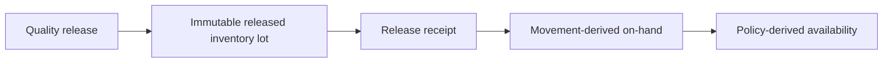
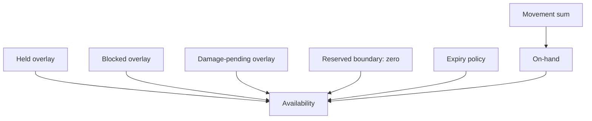
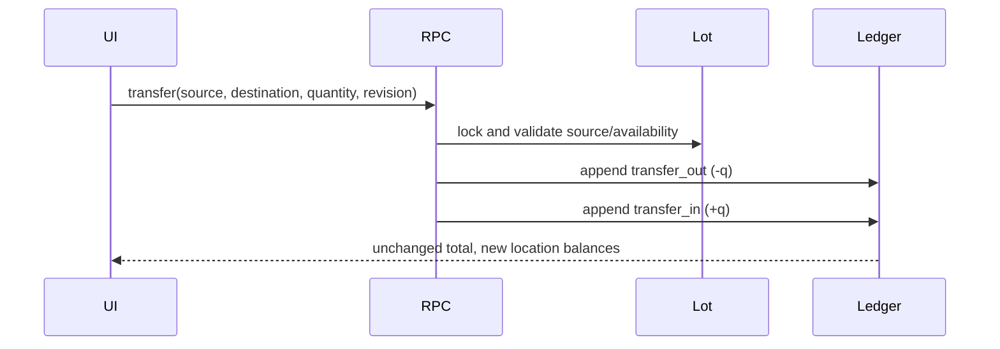
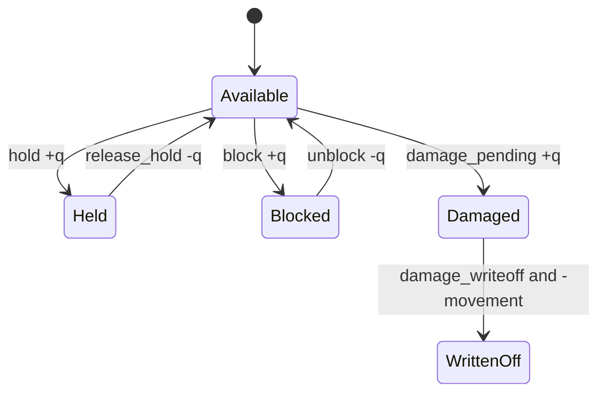
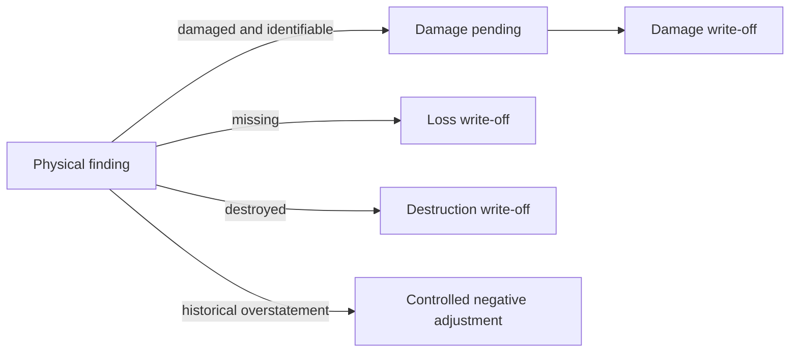
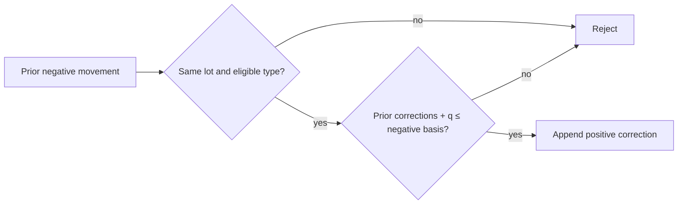
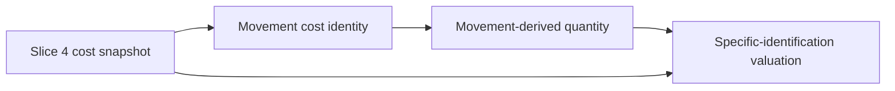
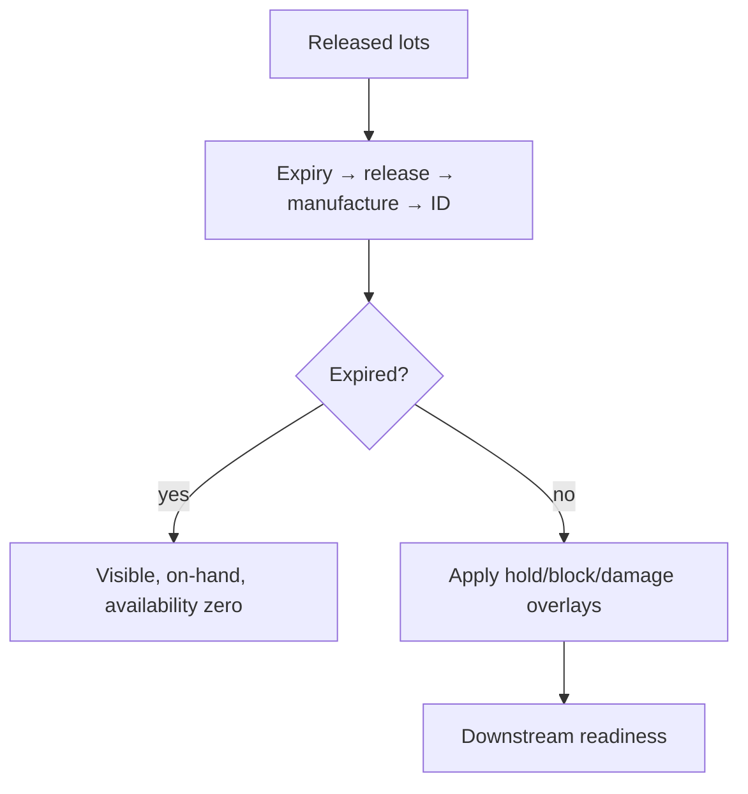
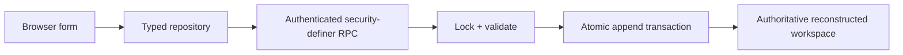

# Active Finished Goods Inventory Controls

## Scope and authority

Slice 5 turns a Slice 4 quality-release tranche into operational Finished Goods stock. PostgreSQL is authoritative. The browser uses authenticated, typed RPCs; direct writes to lots, movements, operations, states, and events are denied. This is inventory costing, not accounting. Sales, shipment, fulfilment, customer allocation, recall cases, returns, and journals remain outside scope.

## Balance and availability

`on hand = Σ normalized movement quantities`.

`available = max(on hand − held − blocked − damaged pending − reserved, 0)`, except expired stock has zero availability. Reserved is explicitly `0` because Slice 5 defines, but does not implement, downstream reservation. No quantity column is updated by an operation.

## Movement taxonomy and locations

Physical identities are `release_receipt`, paired `internal_transfer_out` / `internal_transfer_in`, `damage_writeoff`, `loss_writeoff`, `destruction_writeoff`, `controlled_negative_adjustment`, and `controlled_positive_correction`. A transfer locks the released lot and appends its equal-and-opposite pair in one transaction. Location balances group those movements; partial stock can therefore occupy several locations without a mutable current-location quantity.

## Operational state

Hold, block, and damage-pending are signed append-only overlays. Their release/clear actions append a negative delta and cannot exceed the active state. Hold and block do not fabricate physical movements. Damage write-off first clears damage pending, then appends its distinct negative movement.

Loss means no longer physically accountable. Destruction means documented physical removal. Negative adjustment corrects a demonstrated overstatement. They are not interchangeable.

## Positive corrections

A positive correction must reference a negative movement on the same released lot. The server sums all earlier corrections against that identity and rejects any request exceeding its absolute negative basis. This permits controlled restoration but prevents arbitrary stock creation.

## Valuation

Specific-identification valuation uses the immutable Slice 4 release unit-cost snapshot. Each new physical movement copies unit cost, currency, and confidence. `lot valuation = on hand × released unit cost`. Missing cost remains `Unknown`; provisional remains provisional. No current supplier price participates.

## FEFO, expiry, and readiness

FEFO orders by expiry date, release timestamp, manufacture date, then inventory-lot UUID. Expired lots remain visible and physical but unavailable. Unknown expiry is prevented upstream by Slice 4’s mandatory expiry snapshot. Readiness exposes eligibility, blockers, availability, and the explicit unimplemented reservation boundary.

## Idempotency, concurrency, rollback, and audit

Every mutation accepts an idempotency UUID and immutable request fingerprint. An identical retry returns the reconstructed workspace; reuse with changed content fails. The released lot row is locked before validating the derived revision and balances. A stale concurrent request fails. Operation, state, movement, and event writes share one transaction, so injected or ordinary errors roll back together. Events have workspace-unique keys and are server-created.

## Security, UI, tests, and performance

RLS limits reads to `(select auth.uid())`; authenticated users receive SELECT only on the new tables and EXECUTE only on RPCs. The UI gives non-colour labels, confirmation warnings, reason/evidence requirements, readable balances, location and valuation summaries, immutable history, and genealogy. Desktop and mobile use the same responsive workflow.

Focused pgTAP checks structure, grants, RLS, triggers, functions, and indexes. Local integration covers transfer conservation, hold/block overlays, damage, loss, correction caps, stale concurrency, reconstruction, and direct-write denial. Representative plans must be retained with the final validation record; indexes are limited to demonstrated lot history, active state, FEFO, product, event, and correction-basis access paths.

The reproducible performance harness is `supabase/tests/active_finished_goods_inventory_performance.sql`. It runs inside a rolled-back transaction with 100,000 lots, 1,000,000 movements, 250,000 state rows, and 500,000 audit events. It records `EXPLAIN (ANALYZE, BUFFERS)` for balance, state aggregation, FEFO, batch lookup, correction basis, and audit history. The schema mirrors the production composite access paths without polluting operational fixtures.

## Limitations and Slice 6 entry

No downstream reservation exists, so `reservedQuantity` is always zero and is labelled as a boundary, never inferred. There is no shipment, customer allocation, consumer return, recall-case workflow, or accounting posting. Slice 6 may begin only from these RPCs and must add a separate downstream commitment identity without rewriting movements, availability history, or cost snapshots.

Slice 6 is implemented as [Batch Genealogy and Traceability](BATCH_GENEALOGY_AND_TRACEABILITY.md). It reads this canonical movement-derived snapshot for current impact and adds no downstream commitment, recall, or inventory mutation.
# Recall Readiness snapshots

Recall Readiness captures the Slice 5 movement-derived state as immutable current-impact rows at assessment time. Its live comparison reads the current canonical inventory separately and cannot change the frozen scope or create an inventory operation. See [Recall Readiness V1](RECALL_READINESS_V1.md).
