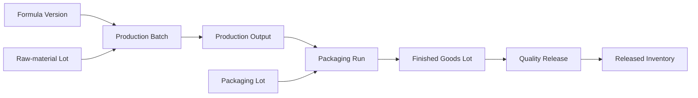
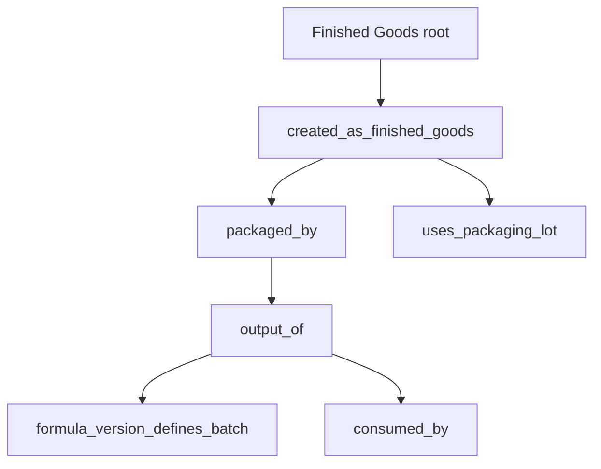
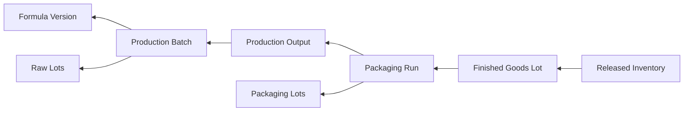
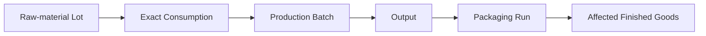
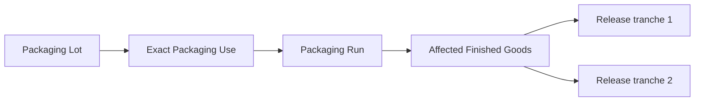
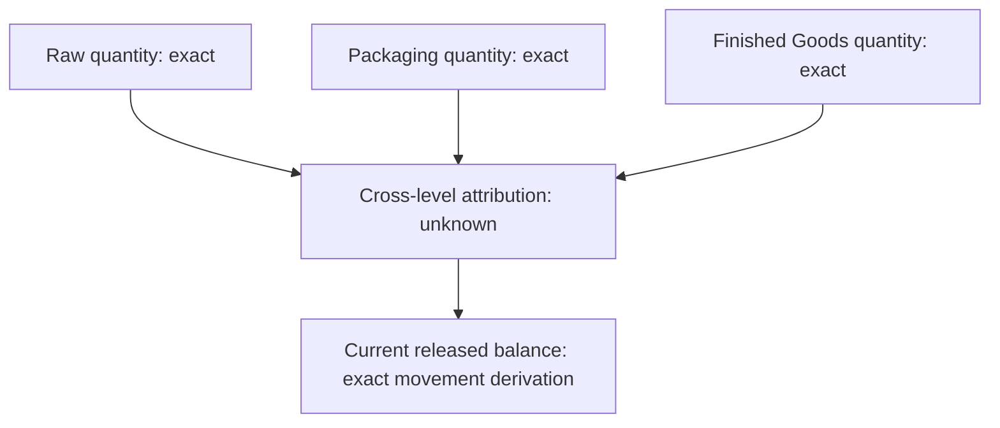
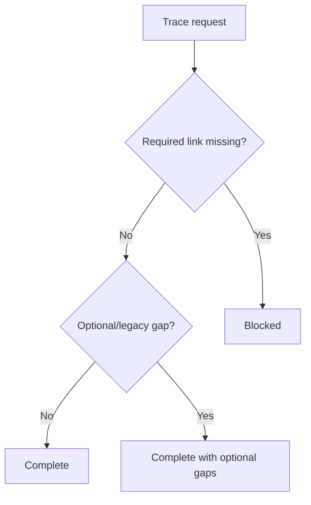
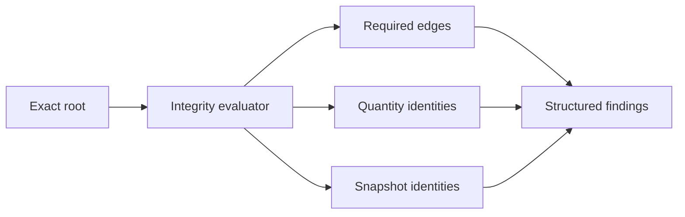
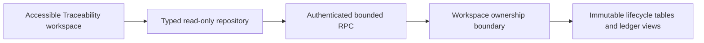

# Batch Genealogy and Traceability

Status: Finished Goods & Batch Genealogy V1, Slice 6
Policy and contract version: `1.0.0`

## Scope and systems of record

Slice 6 is a read-only reconstruction layer over existing immutable production, packaging, Finished Goods, quality, inventory, and procurement identities. It creates no recall, shipment, reservation, allocation, disposition, stock movement, or lifecycle mutation. Raw-material truth remains `inventory_lots` plus `inventory_movements`; packaging truth remains its separate lot and movement ledger; released Finished Goods truth remains release tranches plus the Slice 5 movement/state overlay.

## Node and edge model

Every node has a type, immutable ID, historical label, lifecycle and relationship state, optional exact quantity, snapshot, current-master comparison, actor/time, and structured metadata. Edges have a type, immutable endpoints, and relationship state. Ordering is fixed by lifecycle timestamp, type/code, and immutable ID. The server distinguishes `present`, `not_yet_applicable`, `not_applicable`, `missing_expected_link`, and `unavailable_legacy_data`.

## Backward genealogy

Finished Goods Lot and released-inventory entry points converge on one bounded reconstruction. The requested root identity is preserved. The result includes Formula Version, Production Batch, Production Output, Packaging Run, exact productive raw and packaging lot consumption, quarantine/inspection/release state, current released inventory, and available receiving/quality provenance.

## Forward traces

Raw-material and packaging forward RPCs start from an exact internal lot identity and deduplicate affected Finished Goods by immutable lot ID. Partial releases remain current-state children of one affected Finished Goods identity.

Production Batch and Packaging Run trace RPCs expose bounded technical reconstruction for those operational entry points. No general recursive graph endpoint exists.

## Quantity attribution and current state

Direct raw consumption, packaging use, Finished Goods quantity, and release-tranche balances are exact in their own units. Cross-level mass-to-pack attribution is `unknown_attribution`; it is never inferred by division.

Current impact delegates to the Slice 5 canonical inventory snapshot. It reports on-hand, available, held, blocked, damaged, lost, destroyed, expiry, valuation, and locations at query time while leaving historical identities unchanged.

## Historical snapshots, confidence, and integrity

Historical labels and execution snapshots are authoritative. Current master labels are comparison data only; `currentMasterDiffers` exposes drift without rewriting history. Confidence is server-authored as `complete`, `complete_with_optional_gaps`, `partial`, `blocked`, or `legacy_incomplete`.

The readiness RPC returns backward, forward, and recall-scope-input readiness; it does not create recall state. The integrity RPC returns deterministic structured findings. Missing required productive raw or packaging consumption blocks readiness. Absence before a lifecycle stage is `not_yet_applicable`, not corruption.

## Search, security, and application boundary

Search accepts exact and controlled-prefix matches for consumer batch, released lot, Packaging Run, Production Output, Production Batch, raw lot/supplier lot, and packaging lot/supplier lot. Exact matches rank first; results are capped at 50 and deterministically ordered.

All public RPCs require authentication, resolve the caller's active workspace, use `security definer` with an empty `search_path`, and have explicit grants. `anon` has no execute privilege. No browser component writes genealogy or forges confidence.

The workspace supports URL-restorable search and trace roots, keyboard forms, textual states, focusable status/error output, wrapping technical IDs, expandable audit detail, and non-colour-only meaning. Existing Finished Goods Lot and active inventory pages link directly to their canonical roots.

## Tests and performance

`batch_genealogy_traceability.sql` verifies the eight public RPCs, authenticated/anonymous privileges, return types, and measured trace indexes. Integration covers exact search, both backward entry roots, Formula Version identity, blocked legacy/missing consumption, readiness, integrity, snapshot reconstruction, and existing inventory behavior. The production browser fixture covers the complete raw-material → production → packaging → Finished Goods → quality release → active inventory chain on desktop and mobile, including refresh reconstruction.

Performance plans are maintained in `scripts/performance/batch-genealogy-traceability-plans.sql`. Its rollback-only fixture creates 100,000 Finished Goods lots, 100,000 release tranches, 100,000 run identities, 500,000 raw consumptions, 500,000 packaging consumptions, 1,000,000 movements, 1,000,000 events, and 250,000 supplier-lot identities. On the 2026-07-29 local Docker database, exact batch search completed in 1.733 ms, backward/current impact in 0.865 ms, raw forward trace in 0.336 ms, packaging forward trace in 0.295 ms, Production Batch/Packaging Run lookup in 0.098 ms, event/integrity history in 0.152 ms, and supplier-lot search in 0.070 ms. These paths used their targeted indexes with 25 kB in-memory sorts and no temporary files. The intentionally broad Product aggregation scanned 100,000 workspace rows and completed in 62.942 ms; pagination caps result materialization but does not remove aggregation cost. RLS adds the same workspace predicate represented in every plan. No additional production index was justified.

## Limitations and Slice 7 entry conditions

- Supplier shipment ancestry is returned only where the existing Inventory Lot quarantine/release links preserve it; legacy gaps remain explicit.
- Cross-level quantity allocation is unknown.
- Traceability is recall-scope input only. There is no recall case, shipment, customer, sales, reservation, or accounting workflow.
- Search is intentionally bounded and is not fuzzy.

Slice 7 may begin only from this immutable, workspace-isolated snapshot contract and must not turn traceability queries into lifecycle mutations.
