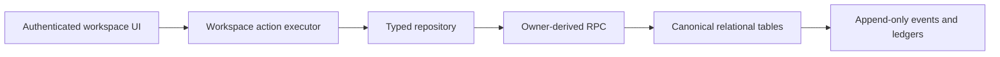
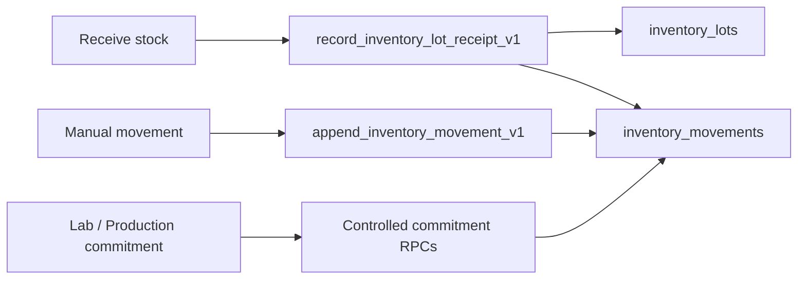
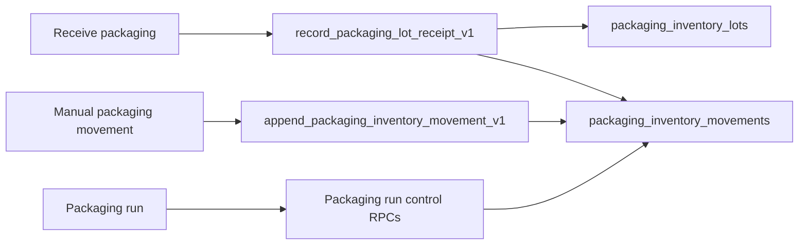
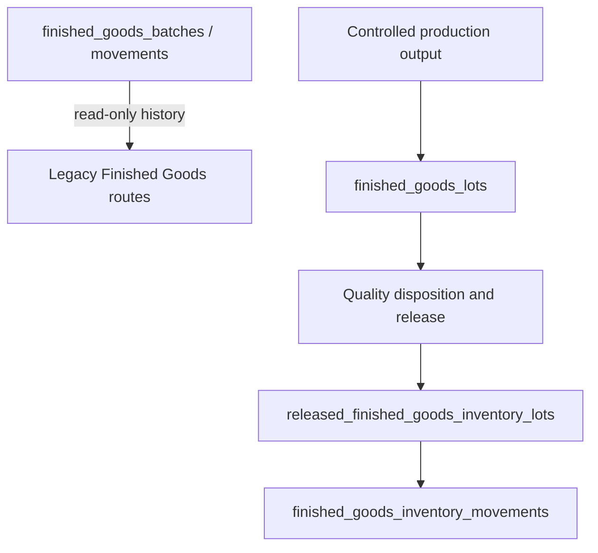
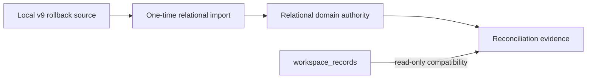
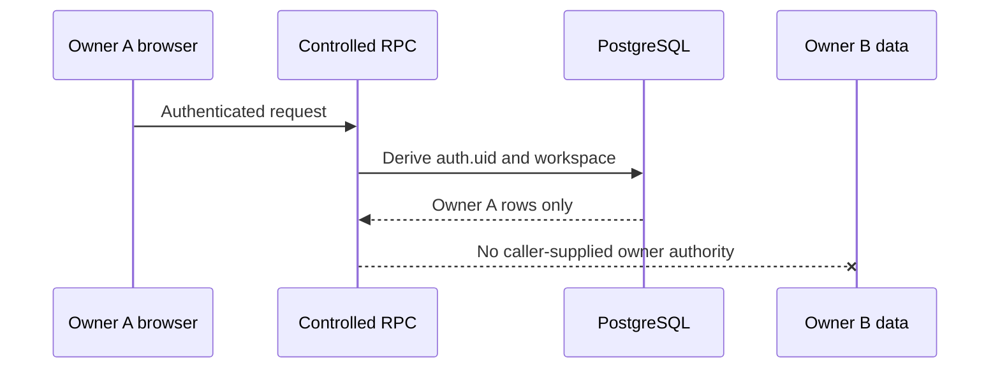
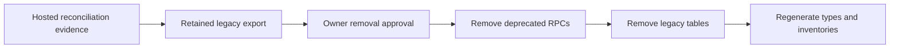
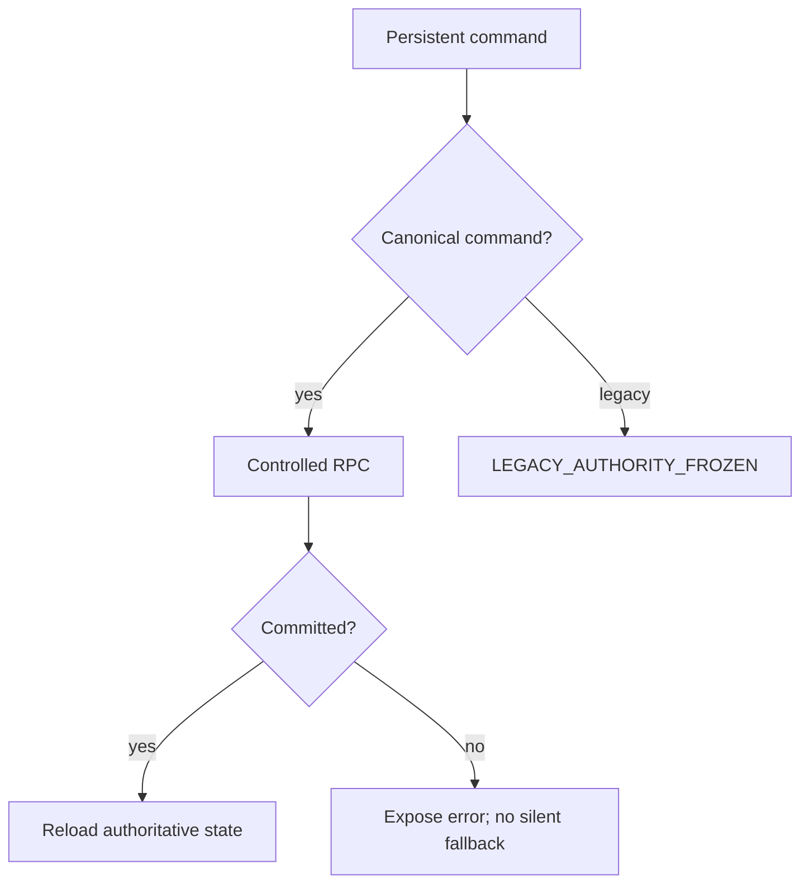

# Compatibility and legacy authority

Authority metadata version: `1.0.0`.

This document classifies the remaining compatibility structures. The machine-readable source is [platform-audit-config.mjs](../scripts/platform-audit-config.mjs); generated proof is in [platform-authority-inventory.json](generated/platform-authority-inventory.json).

## Platform authority

## Raw-material inventory

Authenticated clients may select `inventory_movements`; they cannot insert, update, or delete it directly.

## Packaging inventory

The packaging ledger remains separate from the raw-material ledger.

## Finished Goods transition

The legacy tables are frozen. `register_finished_goods_output` and `commit_packaging_consumption` are service-only compatibility functions pending removal.

## Workspace v9 transition

No new domain write may target `workspace_records`.

## Ownership boundary

RLS remains defence in depth; security-definer functions must derive the actor and workspace internally.

## Removal sequence

Removal is not authorized by this milestone. It requires a separate, reviewed migration after hosted cutover evidence exists.

## Failure handling

The Supabase repository never falls back to browser storage or a legacy write after a controlled command fails.
