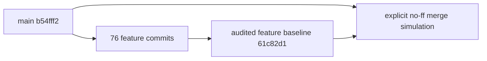
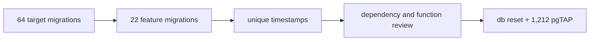
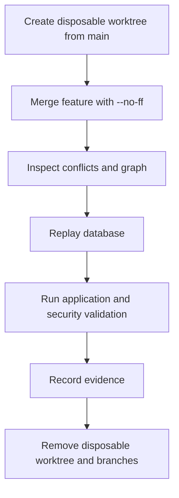
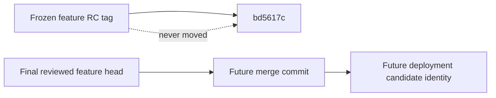
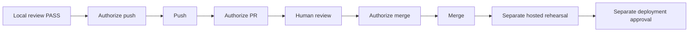
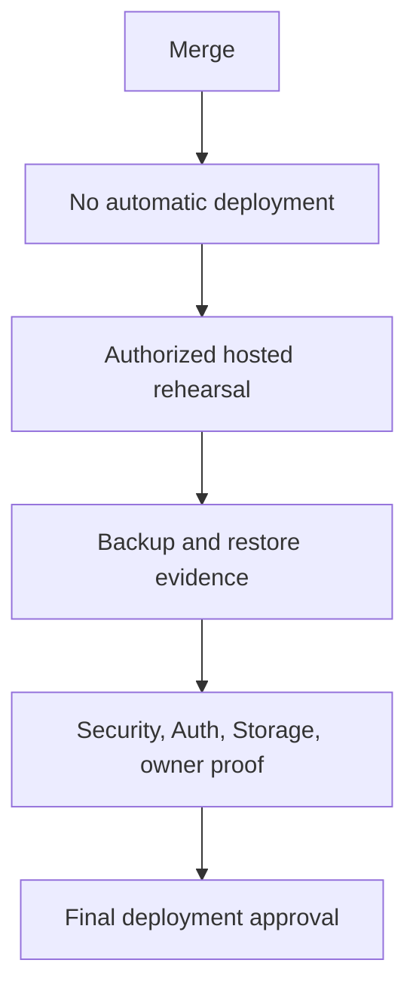
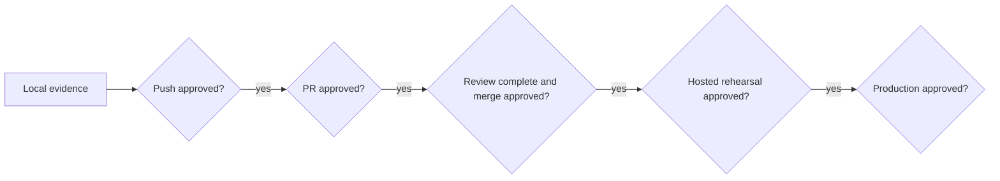

# Controlled Merge Review & Branch Integration V1

Local Review and Integration Preparation  
Status: PASS

## 1. Executive verdict

The audited feature baseline can be integrated into local `main` without textual or detected semantic conflict. `main` is the exact merge base and has no target-only commits. A disposable explicit merge commit passed the complete critical validation story. The recommended method is a normal non-squash merge with `--no-ff`, after human review and separate merge authorization.

## 2. Scope

This review covers 76 feature commits, 22 feature-only migrations, application and database authority, generated evidence, dependencies, configuration, documentation, local merge/rebase simulations, review packaging, and authorization boundaries.

## 3. Authorization boundary

Only local inspection, disposable simulation, evidence generation, validation, and feature-branch documentation are authorized. No push, PR, real merge, deployment, hosted migration, hosted Auth/Storage/environment change, or hosted mutation occurred.

## 4. Feature branch identity

Audited branch: `feature/finished-goods-batch-genealogy-v1`. Audited implementation/deployment baseline: `61c82d1cf47c8c1a57eddab04261e63a55848bb3`. Later commits in this milestone contain review tooling and evidence only.

## 5. RC identity

`finished-goods-traceability-recall-v1-rc1` remains frozen at `bd5617c70dd8ca21611f63750f2293e40a83c8b4`. It is historical feature-RC evidence and must never be moved to a merge commit.

## 6. Target branch

Local `main` is canonical because it exists locally, tracks `origin/main`, is the repository’s conventional default integration branch, and is the base of the audited feature history. Reviewed target HEAD: `b54fff20d07658185b8ccd8d9d47559036e2c73f`.

## 7. Merge base

The exact merge base is `b54fff20d07658185b8ccd8d9d47559036e2c73f`, equal to reviewed `main`.

## 8. Divergence

At review time: target-only `0`; feature-only `76`. The feature changes hundreds of domain, migration, test, documentation, and generated-evidence files. There is no competing target implementation or target migration inserted into the feature sequence.

## 9. Commit-line review

Every feature-only commit is recorded in [controlled-merge-commit-review.json](generated/controlled-merge-commit-review.json), including author/date, subject, category, domain, migrations, tests, evidence, review risk, revert dependency, distinctness, unrelated status, and RC inclusion. All commits remain distinct to preserve auditability and bisectability.

## 10. Unrelated-change review

No unexplained commit or personal/debug configuration was detected. Procurement changes are legitimate shared prerequisites for Production Inventory Control. The Beard Studio mobile stabilization is a legitimate incidental regression fix required for the validated mobile baseline. No local machine path, scratch asset, or personal note belongs in the reviewed range.

## 11. Migration integration

`main` contains 64 migrations; the integrated branch contains 86. All timestamps are globally unique and lexically ordered. The 22 feature-only migrations extend the existing head without insertion or ambiguity. Detailed hashes, predecessors, function replacements, destructive statements, and security sensitivity are in [controlled-merge-migration-review.json](generated/controlled-merge-migration-review.json).

## 12. Schema semantic conflicts

No duplicate authority, incompatible signature, reintroduced direct write, compatibility-write regression, event collision, or unknown-state coercion was detected. This conclusion is supported by migration review, a fresh schema replay, privilege and browser-write audits, legacy guards, pgTAP, and authenticated integrations—not merely Git conflict detection.

## 13. Dependencies

`package.json` and `package-lock.json` are feature-only relative to the target; there is no target-side lock conflict. Added scripts use Node built-ins and existing dependencies. No online upgrade or registry lookup was performed. Runtime/dev dependency separation remains unchanged.

## 14. Configuration

Vite, Playwright, Cloudflare, Supabase, TypeScript, lint, environment templates, and test/deployment scripts integrate without target overwrite. Auth and Storage remain hosted-configuration review items, not merge-time mutations. No PWA/service-worker deployment coupling was found.

## 15. Generated artifacts

Platform, privilege, FK, RPC, module, route, browser-write, event, environment, migration, RC, deployment, and controlled-merge evidence are checked deterministically. PostgreSQL row estimates and ACL order were removed as evidence-churn sources during this review.

## 16. Documentation review

Milestone conclusions remain accurate. Merge Review Ready is not described as pushed, reviewed, merged, rehearsed, or deployed. Relative links are audited. Generated files contain no developer-specific absolute path.

## 17. Review hotspots

Highest priority: migration ordering; movement ledgers; opening balances; release/disposition authority; operational overlays; positive corrections; trace traversal; affected-goods deduplication; Recall fingerprints and non-execution; evidence privacy; RLS; security-definer functions; grants; compatibility freezes; environment classification; deployment and recovery tooling. Exact files, risk, invariants, evidence, and reviewer roles are in the review manifest and PR package.

## 18. Merge simulation

A disposable branch `review/finished-goods-rc1-merge-simulation` was created from reviewed `main`, then merged using `git merge --no-ff feature/finished-goods-batch-genealogy-v1`. Simulation merge commit: `7fb924bca1887f496c154a2d2dc1f985a4044575`; parents are the reviewed target and feature baselines.

## 19. Conflict resolutions

Git conflicts: zero. Manual or automatic content resolutions: none. Therefore no simulation-only resolution was copied to the real feature branch.

## 20. Simulated validation

PASS: database reset; 1,212 pgTAP; lint; build; 895 unit/component; 53 authenticated Supabase integrations after one established proxy retry; 14 desktop E2E; 9 mobile E2E; accessibility; Cloudflare; secret scan; documentation; environment/deployment tooling; bundle analysis; and local restore verification.

## 21. Rebase simulation

A separate disposable branch rebased onto `main`. Git reported it already up to date: zero conflicts, zero rewritten commits, resulting HEAD unchanged at `61c82d1`. Rebase currently adds no value; if target later advances it would rewrite feature history, invalidate reviewed commit identities, and increase evidence burden.

## 22. Strategy comparison

| Strategy | Auditability | RC continuity | Revert/bisect | Recommendation |
|---|---|---|---|---|
| Explicit non-squash merge | Preserves all commits and integration boundary | Preserves frozen feature RC | Strong | Recommended |
| Rebase and merge | Rewrites when target advances | Weakens reviewed identities | Moderate | Reject |
| Squash merge | Erases commit structure | Disconnects detailed history | Weak | Reject |
| Cherry-pick sequence | High omission/order risk | Duplicates identities | Complex | Reject |

## 23. Recommended integration method

Use a normal non-squash merge with an explicit merge commit. Because the current graph is fast-forwardable, require `--no-ff` or the platform-equivalent “create a merge commit” option.

## 24. RC and post-merge identity

The feature RC remains historical. The actual merge commit becomes integration evidence. A future `finished-goods-traceability-recall-v1-rc1-merged`-style tag may be considered only after merge validation and separate approval; no tag is created here.

## 25. PR package

[CONTROLLED_MERGE_PR_PACKAGE.md](CONTROLLED_MERGE_PR_PACKAGE.md) contains the title, branches, scope, architecture/database/security changes, validation, warnings, reviewer checklist, and deployment exclusion. [CONTROLLED_MERGE_PR_BODY.md](CONTROLLED_MERGE_PR_BODY.md) is ready for GitHub.

## 26. Reviewer model

Database/migration, security/RLS, domain architecture, frontend, testing, deployment, and business-owner responsibilities require acknowledgement. A single person may hold multiple roles but cannot silently omit a responsibility.

## 27. Merge checklist

[CONTROLLED_MERGE_CHECKLIST.md](CONTROLLED_MERGE_CHECKLIST.md) separates pre-push, pre-PR, pre-merge, post-merge, and remote-command gates.

## 28. Push readiness

Technically ready subject to final clean-tree verification. Exact branch: `feature/finished-goods-batch-genealogy-v1`. The frozen RC tag must not be pushed implicitly with the branch. Push remains unauthorized.

## 29. PR readiness

The base, compare branch, title, body, evidence, migration inventory, hotspots, reviewer model, method, and deployment exclusion are prepared. PR creation remains unauthorized.

## 30. Merge readiness

Locally ready after required human review and approvals, provided target HEAD has not changed. Any target change makes the simulation stale and requires divergence review and proportional rerun.

## 31. Deployment boundary

Merge must not apply remote migrations, alter Auth/Storage/environment variables, deploy Cloudflare, create hosted users/data, send notifications, or trigger production workflows. No hidden CI deployment workflow was found locally.

## 32. Current blockers

Push: explicit authorization only. PR: branch push and explicit PR authorization. Merge: human review, required approvals, and fresh target check. Deployment: all hosted rehearsal and final production gates.

## 33. Required authorizations

Push, tag publication, PR creation, PR merge, hosted rehearsal, and production deployment are separate approvals. None is inferred from another.

## 34. Exact next action

Obtain explicit authorization to push the feature branch and create a Pull Request. Before executing either action, recheck remote target identity using an authorized read-only command and rerun the stale-target guard.

## 35. Stop conditions

Stop for RC drift, rewritten audited history, unknown target/base, target advancement without renewed simulation, unexplained commits, migration ambiguity, semantic authority conflict, secret exposure, failed deterministic evidence, failed required validation, hidden merge-triggered deployment, or any requirement for unauthorized remote mutation.

