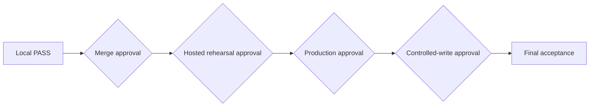

# Deployment approval model

One person may hold several roles, but each responsibility is recorded separately.

| Decision | Required roles |
|---|---|
| merge | release owner, code/schema reviewer |
| push/tag push | release owner |
| hosted backup | database operator, security reviewer |
| isolated restore | database operator, recovery reviewer |
| migration rehearsal | release owner, database operator, security reviewer |
| production migration | final approver, database operator |
| frontend deployment | final approver, application operator |
| controlled-write smoke | business owner, security reviewer |
| rollback | release owner plus surface owner |
| forward-fix | database/application owner and final approver |
| final acceptance | business owner and final approver |

Every approval records scope, target, RC/tag, commands, operator, start/end window, stop conditions, evidence location, and expiry. Approval for one phase does not imply another. A local prompt, successful test, merge, or tag is not hosted authorization.

