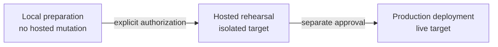
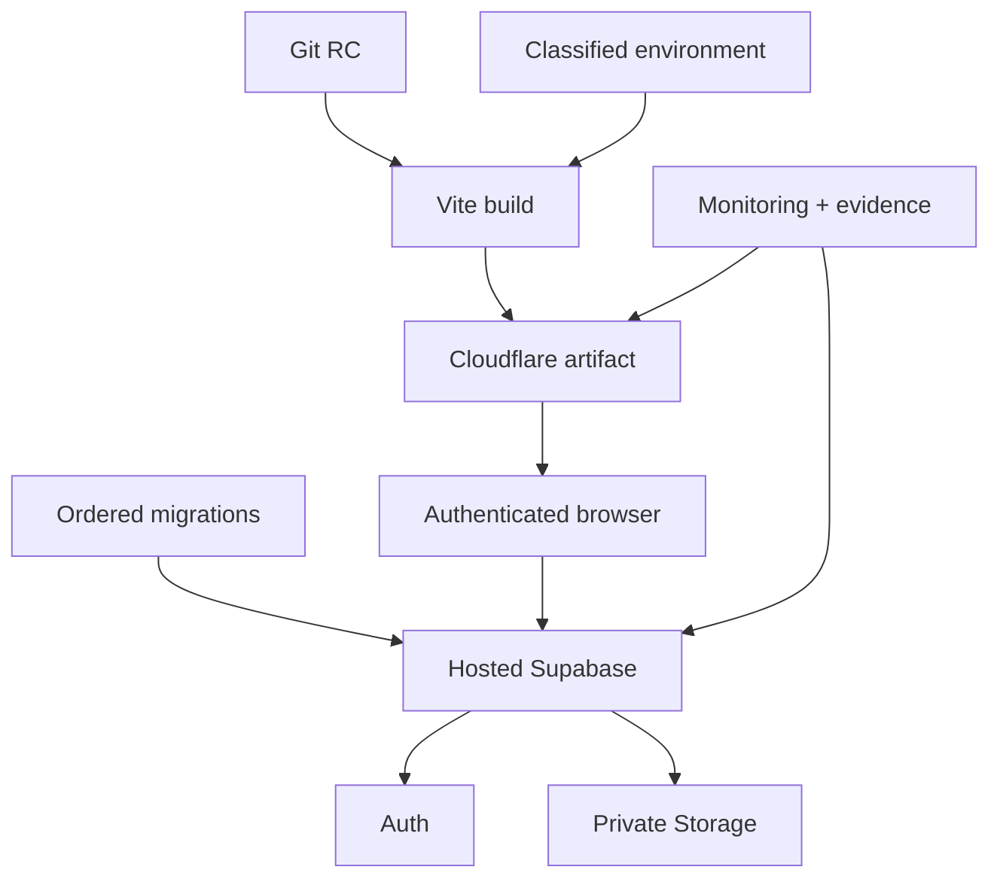
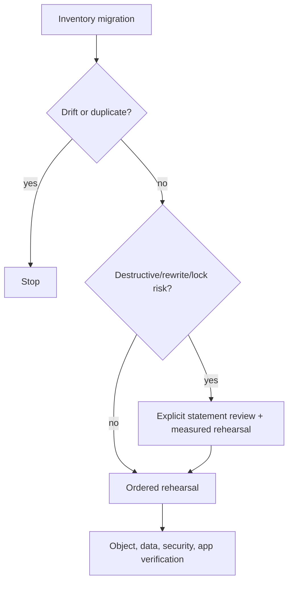
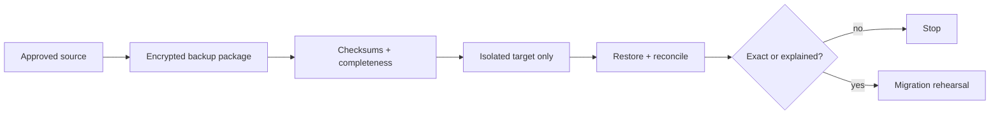
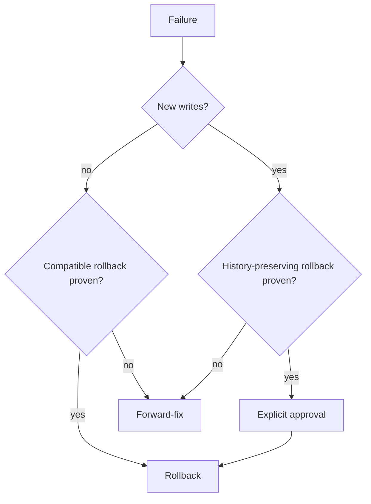
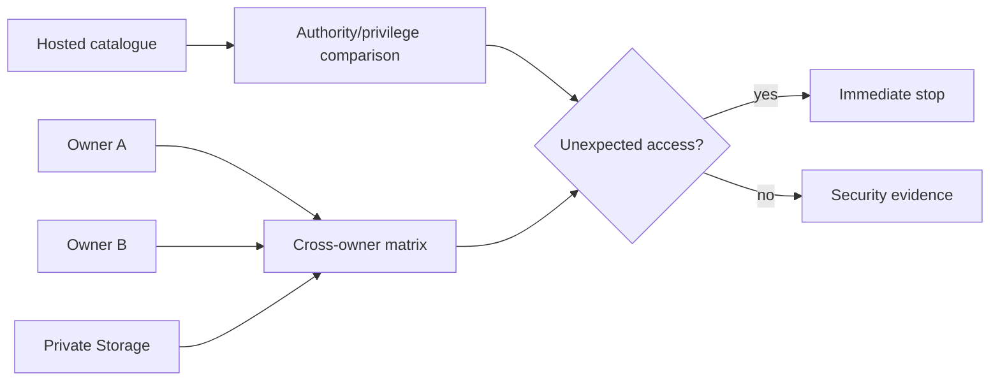
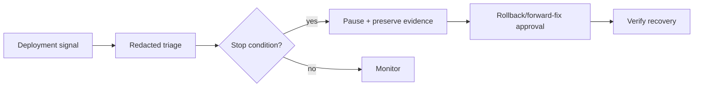
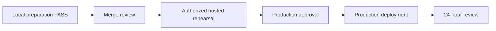
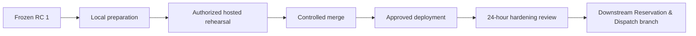

# Release Candidate & Deployment Hardening V1 — Local Preparation

## 1. Executive verdict

Release Candidate & Deployment Hardening V1
Local Preparation
Status: PASS

The repository contains a deterministic, executable, local-only preparation package for a later authorized hosted backup, restore, migration, security, and smoke rehearsal. No hosted fact is claimed verified.

## 2. Scope and RC identity

Frozen baseline: `finished-goods-traceability-recall-v1-rc1` → `bd5617c70dd8ca21611f63750f2293e40a83c8b4`. The existing tag is unchanged. This milestone adds preparation after that commit; it does not alter the tagged application/schema baseline.

## 3. Deployment architecture

| Component | Owner/source | Local configuration | Hosted verification/mutation | Rollback/evidence |
|---|---|---|---|---|
| Git source | release owner/Git | feature branch + frozen RC tag | approved push/merge only | revert merge; commit/tag evidence |
| Build | application operator/package lock + Vite | Node/npm, `npm run build`, `dist` | Cloudflare artifact/config | prior immutable artifact and hashes |
| Runtime | Cloudflare Pages target, currently unverified | Vite preview and SPA checks | authorized Pages deployment | artifact rollback if schema-compatible |
| Database | database operator/migrations | local Supabase PG15 | approved hosted project/version/extensions | backup, isolated restore, forward migration |
| Auth | security reviewer/Supabase Auth | local test owners | redirects, sessions, providers, owner proof | reviewed config rollback |
| Storage | storage operator/migrations | local private buckets | bucket/policy/object verification | metadata/binary restore or policy fix |
| Environment | release/security owners | `.env.example`, local harness | preview/production secret manager | prior version references |
| CI/manual gates | release owner | no repository CI workflow; scripts are authoritative | future protected pipeline/manual approval | recorded gate evidence |
| Monitoring | operations owner | local logs/tests | hosted logs, uptime, query/error signals | stop and rollback/forward-fix |

## 4. Environment and secret inventory

[Environment inventory](generated/deployment-environment-inventory.json) classifies 22 variables by public/secret, build/runtime, local/test/preview/production, ownership, validation, rotation, failure behavior, and deployment gate.

The only browser variables are Supabase URL, publishable/legacy anon key, and repository selection. No service-role or server secret is permitted under `VITE_`. Test service-role credentials are local harness-only. Supabase-provided Edge variables and optional OpenAI/procurement variables remain server-only.

`npm run audit:environment` detects used-but-unclassified variables, secret-like Vite exposure, duplicate migrations, and generated drift without printing values. `npm run test:secrets` scans repository content; future operator must additionally scan authorized evidence/logs and Git history without committing output.

Migration provenance deliberately avoids a self-referential commit hash. The
committed manifest identifies every migration by ordered index, version,
filename, and SHA-256 checksum. During `--check`, the audit derives the
introducing commit from Git history and compares each current migration with
the same path at `HEAD`. `deploy:preflight` first requires a clean tree, binding
that dynamic verification to the exact checkout without storing a stale,
placeholder, or impossible same-commit hash.

## 5. Migration manifest and risks

[Hosted migration manifest](generated/hosted-migration-rehearsal-manifest.json) records the ordered migration tree, stable identity and checksums, dependencies, extensions, object/data changes, locks/rewrite/destructive classification, rollback decision, verification, stop condition, and rehearsal status. Introducing commits are verified dynamically from Git history rather than persisted in self-referential evidence.

Classifications are additive-safe, controlled/authority change, compatibility freeze, data backfill, potentially locking, or destructive-requires-review. Destructive syntax never becomes an automatic failure or approval: the exact statement and historical intent must be reviewed against restored data in rehearsal.

## 6. Backup and isolated restore

[Backup strategy](HOSTED_BACKUP_STRATEGY.md) distinguishes managed backup, logical/schema/data exports, Auth, Storage metadata/binaries, application artifact, environment, Git, and external configuration. Backup creation is not restore proof.

[Restore runbook](ISOLATED_RESTORE_REHEARSAL_RUNBOOK.md) forbids a live target and reconciles object counts, rows, immutable checksums, Auth, Storage, migration state, authority, and application behavior.

Local schema recovery was previously proven by the platform-hardening rehearsal. This milestone retains that evidence and adds a future [restore reconciliation schema](templates/restore-reconciliation-evidence.json); it does not fabricate a new hosted restore.

## 7. Rollback and forward-fix

[Rollback strategy](DEPLOYMENT_ROLLBACK_AND_FORWARD_FIX.md) separates artifact, environment, Auth, Storage, grants/functions, schema, data/history, and compatibility surfaces.

Append-only business history is never destructively rewritten. After new-schema writes, forward-fix is normally safer than a down migration.

## 8. Auth, Storage, and hosted security

[Auth readiness](AUTH_DEPLOYMENT_READINESS.md), [Storage readiness](STORAGE_DEPLOYMENT_READINESS.md), and [two-owner proof](HOSTED_TWO_OWNER_VALIDATION.md) define exact future checks.

Hosted security verification must compare local authority/privilege inventories with hosted RLS, policies, table/view grants, PUBLIC/anon/authenticated function execution, security-definer ownership/search paths, direct ledger writes, legacy write access, and cost/supplier/trace/Recall/evidence leakage.

Advisor review does not require zero warnings. It requires zero unexplained critical findings. Existing FK and RLS-init-plan recommendations, two database lint warnings, and intentional authenticated security-definer workflows must be compared, explained, owned, and remediated where evidence warrants.

The authorized isolated rehearsal discovered two internal `SECURITY DEFINER` helpers retaining PostgreSQL's default `PUBLIC` execute privilege. The focused rehearsal hardening migration revokes that unintended access without changing either helper's body or any domain workflow. The fix is validated locally and was applied only to isolated rehearsal targets. A subsequent supported physical restore to `koalafrog-hq-rc1-auth-rehearsal` (`jaghoxoaqzpiowzyfcnf`) preserved managed Auth identity, password hash, provider identity, confirmation state, and workspace ownership. The original production password was not tested; login validation used a rehearsal-only temporary password against the preserved UUID.

## 9. Application artifact, cache, and version strategy

Current artifact facts: Node/npm lockfile exists; build command is `npm run build`; output is `dist`; Vite injects application version `0.13.0`; route chunks are content-hashed; the largest measured chunk is about 665 kB; source maps are not intentionally published; no service worker is registered although a web manifest exists; offline operation is not promised; Cloudflare SPA/deep-link readiness is tested.

There is no dedicated public health endpoint. Local preparation deliberately avoids exposing project IDs, schema details, or internal security state. Reachability is checked by HTTP, artifact identity by hashes/tag evidence, API/schema compatibility by authenticated smoke and migration head. A future non-sensitive health contract may expose app version, build commit, RC tag, environment label, API reachable, and compatibility boolean only after security review.

Cache strategy: immutable hashed assets, short/revalidated HTML, no stale service worker, refresh prompt/reload guidance for long-lived tabs, compatibility checks before code rollback, and a clear unsupported state for old clients against incompatible schemas. Test deep-link refresh and missing chunks after every frontend deployment.

## 10. Observability, logging, and smoke tests

[Observability plan](PRODUCTION_OBSERVABILITY_PLAN.md) covers frontend, RPC, Auth/RLS, migration, performance, integrity, Recall, Storage, background, uptime, build, and migration signals with privacy guidance.

[Smoke test](POST_DEPLOYMENT_SMOKE_TEST.md) separates no-write verification from independently approved low-risk controlled writes and defines immediate/24-hour checks.

## 11. Stop-condition matrix

| Detection | Severity | Immediate action | Decision/escalation |
|---|---|---|---|
| target/authorization ambiguity | critical | run nothing | release owner |
| incomplete backup or failed restore | critical | stop before migration | recovery + final approver |
| migration/head/object/signature drift | critical | stop session, preserve logs | database operator |
| RLS disabled or unexpected PUBLIC/anon grant | critical | deny exposure; stop | security reviewer |
| Owner A sees Owner B or sensitive leakage | critical | isolate target | incident + security owner |
| balance, availability, or opening movement mismatch | critical | prohibit writes | business/database owner |
| Auth redirect/session or private Storage failure | high | stop application acceptance | security/storage owner |
| smoke workflow or integrity failure | high | pause release | release owner |
| unexplained query regression/lock | high | cancel within safe boundary | database operator |
| monitoring unavailable | high | do not deploy | operations owner |
| unclassified variable or secret exposure | critical | rotate out-of-band and stop | security reviewer |

## 12. Evidence, approvals, merge, and commands

Templates under [deployment evidence package](templates/deployment-evidence-package/README.md) cover authorization, backup, restore, migration, security, advisors, two-owner, Auth/Storage, smoke, rollback, approval, and post-deployment review.

[Approval model](DEPLOYMENT_APPROVAL_MODEL.md) keeps merge, push/tag, backup, restore, rehearsal, production migration, deployment, controlled-write, rollback, forward-fix, and final acceptance distinct.

[Merge plan](RC_MERGE_REVIEW_PLAN.md) preserves the frozen RC tag. [Command catalogue](DEPLOYMENT_COMMAND_CATALOGUE.md) classifies local, remote read, remote mutation, production, and prohibited commands. The machine-readable inventory proves remote mutation commands are absent from `deploy:preflight`.

## 13. Executable local preflight

`npm run deploy:preflight`:

1. verifies exact RC tag target;
2. requires a clean tree;
3. checks deterministic environment/migration/command evidence;
4. runs deployment-tool tests, secret scan, Cloudflare and documentation checks;
5. runs the authority drift audit;
6. builds the production artifact;
7. reports `remoteActionsPerformed: false`.

It never links a hosted project, pushes Git, applies migrations, deploys functions, sets secrets, or contacts production.

## 14. Current blockers and entry conditions

Local preparation is merge-ready. **Authorized Hosted Backup, Restore & Migration Rehearsal V1 is PASS:** the 87-migration head, hosted authority controls, restored Auth identity, two-owner isolation, private Storage reconstruction, authenticated Cloudflare preview, no-write application routes, controlled-write cleanup, and performance smoke were verified on `jaghoxoaqzpiowzyfcnf`. Production deployment is not authorized or ready; it retains its independent environment, backup, approval, and production-smoke gates.

Hosted rehearsal entry requires:

- explicit written scope/target/commands/window;
- approved isolated project and operators;
- out-of-band credentials and evidence destination;
- backup completeness and restore owners;
- frozen RC checkout and clean local preflight;
- reviewed migration risk/stop thresholds;
- Auth/Storage/two-owner fixture plan;
- monitoring and rollback/forward-fix decision authority.

Production deployment additionally requires successful rehearsal evidence, resolved critical findings, hosted backup/restore proof, security/two-owner PASS, application/performance smoke, rollback capability, environment confirmation, and final approval.

## 15. Recommended release sequence

Exact next deployment milestone: **Authorized Hosted Backup, Restore & Migration Rehearsal V1**.

Exact next local product milestone: **Downstream Reservation & Controlled Dispatch V1**, on a separate branch without moving or rewriting the frozen RC tag.
