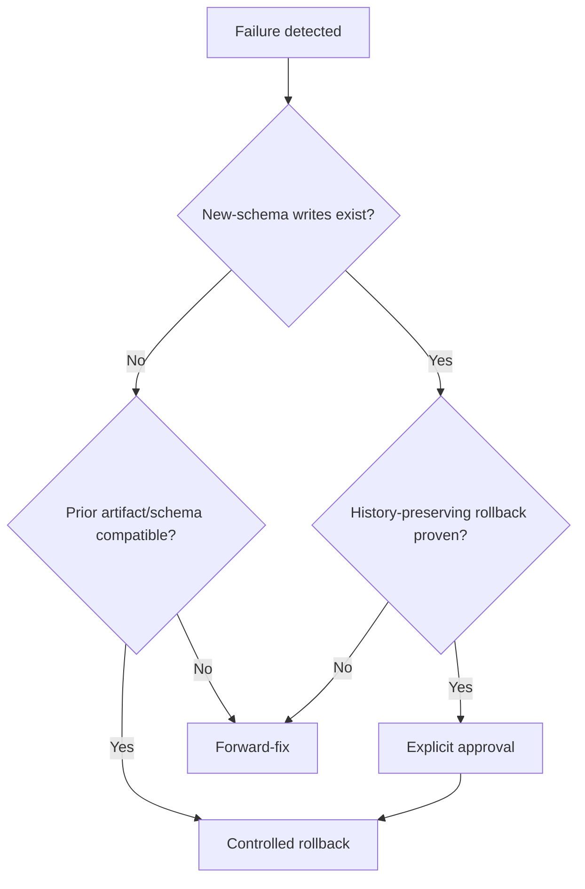

# Deployment rollback and forward-fix

| Surface | Safe rollback | Unsafe boundary | Preferred response | Approval/evidence |
|---|---|---|---|---|
| Frontend artifact | redeploy prior immutable artifact while schema remains compatible | old client cannot understand migrated schema | compatible artifact rollback or forward deploy | application operator + release owner |
| Environment | restore recorded prior variable versions | secret value unknown or contract changed | rotate/fix forward | security reviewer |
| Auth configuration | restore reviewed redirects/settings | identity/session loss | config forward-fix and session handling | security reviewer |
| Storage policy | restore reviewed policy migration | orphan/delete private objects | policy forward-fix; preserve objects | database/storage operator |
| Function/grant | additive corrective migration | revoke breaks active clients or exposes data | immediate deny-first forward-fix | security reviewer |
| Database migration | replace isolated target before writes | destructive down-migration after new writes | reviewed forward migration | database operator + final approver |
| Business data | restore only before environment acceptance and without later writes | rewriting append-only history | compensating record/movement | business owner |
| Compatibility | retain frozen structures | early removal | restore artifact or additive compatibility fix | release owner |

Code rollback does not automatically roll back schema. Database backup does not prove usable restore. New immutable/history records must survive rollback; never delete them to make old code appear consistent.

Decision flow:

Immediate stop precedes either choice. Record incident time, detection, affected surface, last known good identities, backup, writes since change, decision owner, commands, verification, and final approval.
