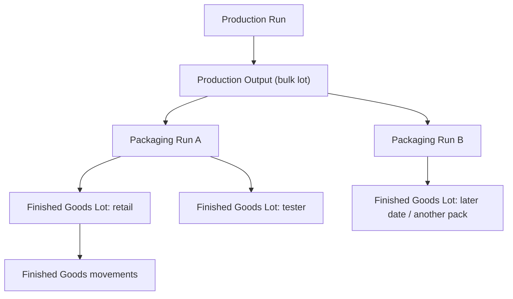
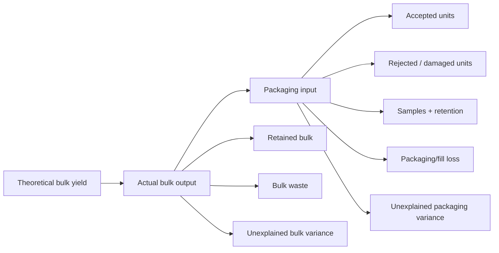
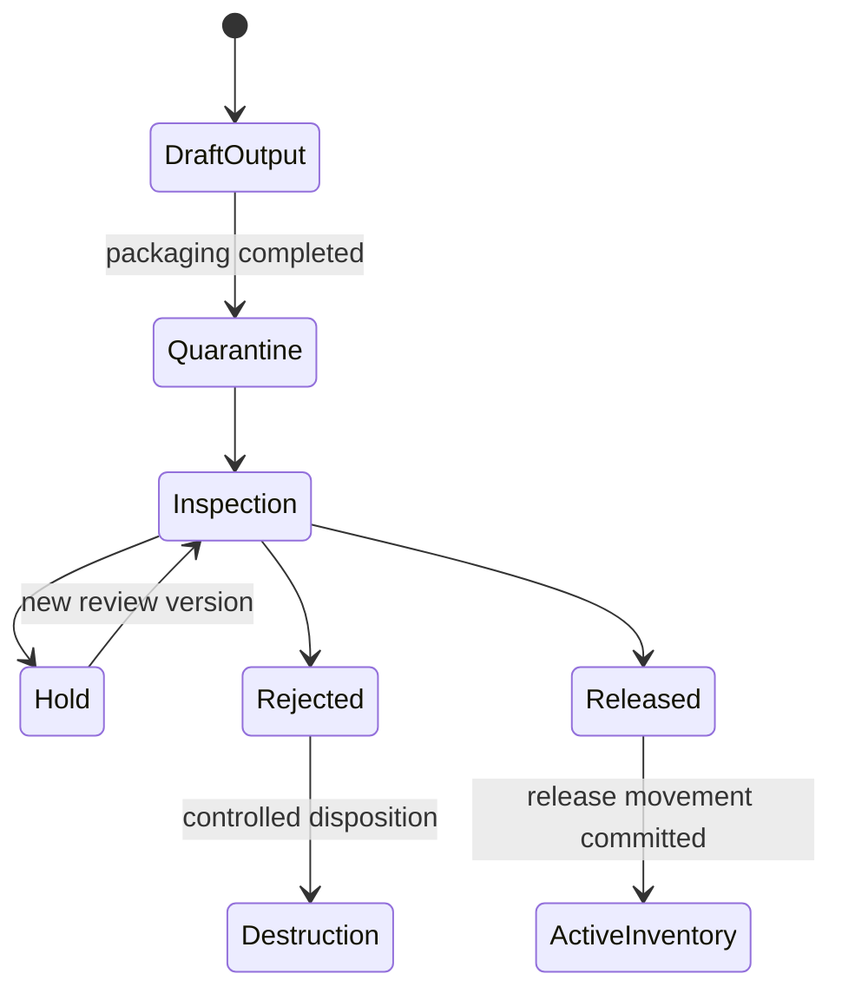
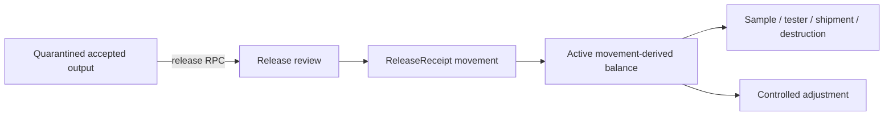
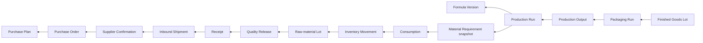
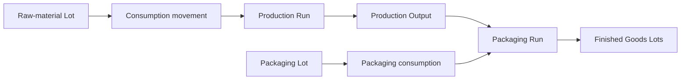
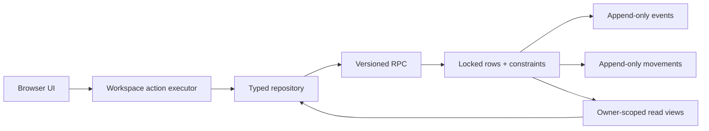

# Finished Goods & Batch Genealogy V1 — Architecture Audit

Status: architecture and contract-gap mapping only  
Baseline: annotated tag `production-inventory-control-v1-rc` at `f1cc783`  
Audit branch: `feature/finished-goods-batch-genealogy-v1`  
Audit date: 2026-07-28

## 1. Executive verdict

Koalafrog already has a useful but legacy Finished Goods skeleton: relational `finished_goods_batches` and `finished_goods_movements`, packaging lots and movements, immutable packaging-specification versions, Production-to-Finished-Goods foreign keys, lot-cost snapshots, application routes, balance logic, and transactional RPCs for output registration and packaging consumption.

It is not a safe Finished Goods lifecycle. The current `commit_packaging_consumption` RPC atomically consumes packaging, creates a `ProductionReceipt`, and changes the batch from `Quarantined` to `Active`. There is no finished-product inspection, quality-release review, expiry assignment, packaging run, bulk-output identity, yield reconciliation, recall snapshot, controlled destruction, reservation/shipment model, or authoritative genealogy query. Unpackaged output is registered directly as `Active`. Browser users also retain direct insert/update/delete grants on legacy Finished Goods and packaging tables.

Production currently terminates at **Production Material Completion**. A Production Run can become `Completed` only after actual bulk yield exists, each material requirement has planned and actual weighing, productive consumption and reconciliation, and no active reservations or unresolved variance. `actual_units_produced` is not part of the server completion policy. Completion creates no output, packaging, Finished Goods, release, or inventory record.

The smallest safe V1 is a hybrid model:

- derive provenance through immutable foreign keys and append-only movements/events;
- snapshot only mutable execution and presentation facts;
- introduce `production_outputs` (bulk identity), `packaging_runs`, and controlled `finished_goods_lots`;
- retain and harden the separate Finished Goods movement ledger rather than generalising raw-material inventory;
- keep all produced units quarantined until an explicit, versioned release RPC creates the active opening movement;
- embed **Minimum safe Packaging Control V1 in Slice 2**, including durable allocations and reservations, reservation-aware availability, concurrency-safe bulk and component allocation, release, safe staged return, exactly-once consumption, waste/damage, reconciliation, cost provenance and genealogy.

Legacy Finished Goods records must not be silently treated as quality-released. They require explicit classification and backfill provenance before the controlled cutover.

## 2. Audit evidence and existing capability map

Primary evidence:

- schema: `20260715090000_relational_domain.sql`;
- legacy actions: `20260715120000_application_action_rpcs.sql`;
- receiving/release: `20260728110000_physical_receiving_inspection_quarantine.sql` and `20260728120000_controlled_quality_release_inventory_commitment.sql`;
- controlled production material lifecycle: migrations `20260728140000` through `20260728160000`;
- domain contracts: `src/types/domain.ts`;
- repository boundary: `src/platform/repository/supabaseWorkspaceRepository.ts`;
- UI/domain logic: `src/features/production`, `src/features/packaging`, and `src/features/finished-goods`;
- tests: `supabase/tests/production_inventory_control.sql`, `src/platform/repository/relationalMigration.integration.test.ts`, and `e2e/productionInventoryControl.e2e.ts`;
- documentation: `PRODUCTION_INVENTORY_CONTROL.md`, `RELATIONAL_SCHEMA.md`, `DATA_MODEL.md`, and `APPLICATION_ACTIONS_AND_REPOSITORIES.md`.

Legend: **implemented** is durable and usable; **partial** is reusable but incomplete; **legacy** exists but violates the target contract; **placeholder** is seed/UI-only; **missing** has no durable contract.

| Capability | Existing | Partial | Missing | Reusable source | Notes |
| --- | --- | --- | --- | --- | --- |
| Production completion | Implemented |  |  | completion readiness v1 + trigger | Ends at reconciled material execution and actual bulk yield. |
| Actual batch yield | Implemented |  |  | `production_runs.actual_yield` | Mutable before completion; unit stored separately. |
| Yield reconciliation |  | Partial |  | material reconciliation, `productionYieldVariance` | No bulk/output equation, tolerance approval, waste or retained bulk. |
| Bulk/intermediate output |  |  | Missing | `actual_yield` only | A quantity is not an output lot identity. |
| Finished-goods lot creation |  | Legacy |  | `register_finished_goods_output` | Called “batch”; trusts broad JSON and client-generated code; no revision/idempotency. |
| Finished-goods quarantine |  | Legacy |  | status value `Quarantined` | Packaging commit bypasses it by setting `Active`. No quarantine ledger. |
| Finished-product inspection |  |  | Missing | receiving inspection patterns | Receiving review is procurement-specific and must not be reused as-is. |
| Quality release |  |  | Missing | versioned inventory quality-review pattern | No Finished Goods policy, evidence, checklist or decision history. |
| Shelf-life assignment |  |  | Missing | supplier shelf-life metadata | No finished-lot shelf-life basis. |
| Expiry assignment |  |  | Missing | raw-lot expiry checks | No finished-lot expiry or controlled correction. |
| Packaging-spec snapshot |  | Partial |  | immutable packaging version FK | Version and lines are immutable by convention, but execution presentation is not snapshotted. |
| Label snapshot |  | Partial |  | dossier and label-artwork version FKs | Finished Goods has no bound label/artwork snapshot. |
| Packaging consumption |  | Legacy |  | `commit_packaging_consumption` | Atomic balance check and unit cost, but conflates consumption with FG release. |
| Packaging reservation |  | Partial |  | packaging commitment locks/balance checks + raw-material contract pattern | Existing safeguards are reusable, but durable reservation identity and reservation-aware availability are required extensions in Slice 2. |
| Packaging staged return |  | Partial |  | lot allocation identity + raw-material staged-return pattern | Slice 2 must release or return unused staged packaging only while lot identity and condition remain reliable; unrestricted post-consumption positive return remains deferred. |
| Packaging-lot provenance |  | Partial |  | allocations → movement → lot | Derivable, but no packaging-run identity or authoritative trace RPC. |
| Finished-goods inventory lot |  | Legacy |  | `finished_goods_batches` | Mixes identity, quarantine and active inventory. Rename/extend in place where safe. |
| Opening movement |  | Legacy |  | `ProductionReceipt` | Exactly-once only by existence check; created before quality release. |
| Adjustments |  | Legacy |  | manual movement UI | Direct client write, mutable/deletable and no review authority. |
| Destruction |  | Partial |  | `Waste` movement | No controlled destruction decision/evidence or distinct rejected/quarantined ownership. |
| Reservation |  |  | Missing | raw-material reservation architecture | Do not reuse raw inventory tables; reuse contract pattern. |
| Shipment |  |  | Missing | procurement shipments are inbound only | Sales/customer allocation is outside V1. |
| Batch-code generation |  | Legacy |  | client `generateFinishedGoodsNumber` | Race-prone, not workspace-transactional, no override/audit policy. |
| Recall search |  |  | Missing | relational links | No consumer-code lookup, affected-quantity computation or snapshot. |
| Forward traceability |  | Partial |  | movement/allocation FKs | Can be hand-joined; no secured stable query. |
| Backward traceability |  | Partial |  | Production and packaging allocation links | Supplier/procurement chain is strong for raw lots; packaging receipt history is weaker. |
| Cost snapshot |  | Partial |  | allocation unit-cost snapshots | Raw productive and packaging consumption are historical; incomplete cost propagation and no adjustments. |
| Batch genealogy |  | Partial |  | immutable links + material events | No bulk/packaging run/release nodes or canonical projection. |
| Audit history |  | Partial |  | batch material events, procurement events, ledgers | Legacy Finished Goods rows and movements are directly mutable/deletable. |
| Tenant isolation | Implemented | Partial |  | owner/workspace FKs and RLS | RLS isolates owners, but broad authenticated DML and some text FKs weaken authority. |
| Application UI |  | Placeholder |  | Finished Goods list/detail | Prompt-driven, desktop-first, no inspection/release/genealogy/recall workspaces. |

Unsafe to reuse unchanged: current `register_finished_goods_output`, current `commit_packaging_consumption`, direct Finished Goods movement writes, client batch-code generation as authority, `Active` as a quality claim, and generic `owner_all` mutation policies.

## 3. Current lifecycle terminal state

The exact terminal state is a completed Production Run with immutable material execution records and snapshots. The completion transition:

- requires `actual_yield`, but not `actual_units_produced`;
- does not reconcile actual bulk output to filling or unit counts;
- prevents mutation of controlled material records after completion;
- creates no Finished Goods record automatically;
- consumes no packaging;
- keeps output quantity and inventory quantity conceptually separate only because registration is a later action;
- calculates raw-material production cost from committed allocations plus generic cost lines;
- does not include packaging in Production cost;
- does not assume Finished Goods exists, although the legacy UI can register it later.

## 4. Reusable architecture

Reuse these patterns, not necessarily their tables:

1. Active-workspace selection and owner checks from the controlled procurement/production RPCs.
2. `security definer`, fixed `search_path=public, pg_temp`, explicit revoke/grant, and internal invoker evaluator pattern.
3. Revisions, idempotency keys, payload fingerprints, row locks, stable retry responses and append-only event keys from Production Inventory Control.
4. Movement-derived balance and immutable opening-movement pattern from raw and packaging inventory.
5. Lot acquisition-cost snapshots. Unknown remains `NULL`.
6. Immutable Formula and Packaging Specification Versions.
7. Repository action executor and startup-selected repository. Components must not call Supabase.
8. Structured readiness responses shared by UI and database transition guards.
9. Receiving quality review’s versioned decision/evidence shape as a design reference, not a polymorphic table.
10. Procurement’s lot → receipt → shipment → supplier confirmation → order → plan chain.

## 5. Contract gaps

Missing domain contracts are:

- `ProductionOutput`, `ProductionOutputReconciliation`, `PackagingRun`, `PackagingRunComponent`, `FinishedGoodsLot`, `FinishedGoodsQualityReview`, `FinishedGoodsRelease`, `FinishedGoodsInventoryMovement`, `FinishedGoodsRecallScope`, `GenealogyNode`, and `GenealogyEdge`;
- explicit quantity categories and units for bulk, filling and unit disposition;
- immutable product, packaging, label, market/language and compliance-reference snapshots;
- revision, event, idempotency and correction contracts;
- readiness and error-code contracts for output, packaging, release and recall;
- a distinction among physical completion, quarantine, release and inventory availability.

Generated database types currently do not provide a milestone-specific typed repository. The generic workspace state mapping is reusable for reads during transition, but mutation actions require explicit repository methods and typed RPC results.

## 6. Output identity model

V1 hierarchy:

- **Production Run**: manufacturing event against one exact Approved Formula Version.
- **Production Output**: immutable bulk/intermediate lot identity and actual bulk quantity. One run may create one or more output lots only when explicitly recorded.
- **Packaging Run**: filling/packaging execution against one output and one Approved Packaging Specification Version. One output may feed several runs; V1 does not permit one packaging run to mix several bulk outputs.
- **Finished Goods Lot**: one traceable product/SKU, packaging configuration, consumer batch code and quality disposition. One packaging run may create multiple lots for sale, tester/sample or operational separation.
- **Finished Goods inventory**: movements owned by a Finished Goods Lot; it is not a second lot identity.

Support split production output, packaging on different days, multiple packaging types, sample/tester/retention/rejected units and partial destruction. V1 records rework as a new Production Output with an explicit `derived_from_output_id` and reviewed reason; it must never rewrite the source. Partial release is supported by released quantity and movements, but a released and rejected quantity must remain auditable within the same lot.

Do not create `finished_goods_lot_units` in V1. Unit serialization is absent and unnecessary. Add it only when individual serialization becomes a real requirement.

## 7. Yield and quantity model

Canonical quantities:

- theoretical batch yield: planned Production mass/volume;
- actual bulk yield: measured output at Production completion;
- output-lot quantity: quantity assigned to a bulk identity;
- filling input: bulk quantity charged to a packaging run;
- filled, accepted, rejected, damaged, sample, retention and destroyed unit counts;
- retained bulk and bulk waste;
- quarantined quantity: accepted units awaiting release;
- released quantity: quantity approved and posted to active inventory;
- active inventory: movement-derived released balance;
- unexplained bulk and packaging variance: persisted, never coerced to zero.

Equations:

`actual bulk output = packaging input + retained bulk + bulk waste + unexplained bulk variance`

`filled unit count = accepted units + rejected units + damaged units + sample units + retention units + unexplained unit variance`

Mass/volume filling reconciliation is separate:

`packaging input = net filled quantity + fill loss + retained fill material + unexplained fill variance`

Unit count cannot be equated to mass without a snapshotted nominal/actual fill-weight basis. Tolerances are versioned policies. Variance outside tolerance requires reason, evidence where applicable and actor approval. A result can be completed with an approved non-zero variance; it cannot be silently normalised.

## 8. Packaging boundary

Decision: **Minimum safe Packaging Control V1 is embedded in Slice 2.**

Existing packaging commitments are the preferred system of record to evolve. They already provide partial safeguards: separate packaging lots and movements, movement-derived balances, allocation and lot locking, balance checks, exactly-once consumption, transactional rollback and unit-cost snapshots. They do not provide the complete lifecycle required for safe Packaging Runs: durable reservation identity, reservation-aware available quantity, concurrency-safe allocation across runs, explicit reservation release, controlled staged return, waste/damage lifecycle, complete reconciliation or persistent operator workflow.

Slice 2 must extend or wrap the existing commitment model additively where safe. It must not create a second competing packaging reservation system. If the existing commitment records cannot safely carry durable reservation semantics, a minimal additive reservation layer is authorised, with a documented backward-compatible migration path. Packaging inventory remains authoritative only in its existing separate lot and movement ledger; it must never be merged into raw-material requirement, reservation or movement tables.

Required in Slice 2:

- controlled Packaging Run identity and server-authoritative Production Output availability;
- concurrency-safe bulk allocation and explicit bulk transfer;
- an immutable Approved Packaging Specification Version snapshot and immutable component requirements;
- active, released, eligible, non-expired/non-disposed packaging lots;
- durable packaging-component allocations and durable reservations;
- available packaging quantity derived from movement balance less active reservations;
- deterministic locking and atomic multi-component reservation where the existing model can support it safely;
- explicit release of unused reservations;
- staged unused packaging return only while original lot identity and condition remain reliable;
- exactly-once explicit consumption and distinct waste/damage movements;
- robust idempotency/fingerprint checks, balance locks and atomic rollback;
- authoritative reconciliation and completion readiness;
- lot cost snapshots, unknown-cost propagation and packaging genealogy.

Packaging Runs must never treat planned quantities or client state as reservation truth. Still deferred are unrestricted post-consumption positive returns, a general packaging adjustment engine, broad packaging quality-release parity unrelated to safe component use, advanced warehouse reservations, serialization, customer/distribution handling and Finished Goods release.

## 9. Finished-goods quality model

Use a separate versioned `finished_goods_quality_reviews` table. Receiving quality review has similar mechanics but different evidence, policy and consequences.

Inspection supports appearance, odour, fill weight/volume, packaging integrity, label verification, batch-record completeness, microbiology references, specification results, deviations, checklist answers and evidence references. Release readiness may reference the exact dossier, CPSR, PIF/CPNP evidence and label version, but must describe internal workflow readiness—not fabricate legal approval.

Release requires:

- completed Packaging Run and quarantined accepted quantity;
- exact formula, packaging and label snapshots;
- expiry/shelf-life basis;
- no blocking hold or unresolved deviation;
- versioned review decision and evidence;
- requested release quantity not exceeding quarantined balance.

Partial release and partial rejection are allowed. Each decision is append-only. Corrections are new review versions and, after inventory posting, compensating movements—not updates to history.

## 10. Finished-goods inventory model

Retain a separate Finished Goods ledger. Raw materials, packaging and Finished Goods have different identities, units, release semantics and movement authorities.

Extend/rename `finished_goods_batches` toward `finished_goods_lots` without duplicating truth. Prefer an additive new canonical table plus legacy mapping view if renaming would destabilise the rollback path. Replace `ProductionReceipt` semantics with `ReleaseReceipt`; packaging completion increases quarantined quantity but not active balance.

Movement types: `ReleaseReceipt`, `Sample`, `Tester`, `InternalUse`, `Reservation`, `ReservationRelease`, `Shipment`, `Destruction`, `Adjustment`. V1 can reserve schema values for shipment while excluding customer distribution UI. Every movement is append-only, carries location, actor, event/idempotency key and reason, and derives balance. Adjustments and destruction require controlled RPCs.

## 11. Genealogy model

Use a hybrid: derive edges from immutable relational links and append-only movements/events; snapshot mutable names, codes, quantities, specifications and cost bases at execution. Do not store a mutable provenance JSON graph.

Backward trace returns every raw and packaging lot, quantities, release provenance and procurement ancestry. Forward trace starts from either lot and returns affected Production Outputs, Packaging Runs, Finished Goods Lots and quantities. Recall scope freezes the query result plus inputs, policy/query version and a deterministic fingerprint. Audit reconstruction uses historical snapshots and never current supplier prices or mutable product text.

Packaging procurement ancestry is available only where its quarantine intake is linked to an inbound receipt. Legacy/manual packaging lots must be reported as provenance gaps, not inferred.

## 12. Product and packaging snapshots

At Production Output creation snapshot product/formula identity, formula version and production batch number. At Packaging Run start snapshot:

- product name/version and SKU;
- packaging specification/version and every component requirement;
- container, closure, label, carton, fill volume, nominal quantity and units;
- market/language, INCI, warnings, directions and Responsible Person;
- period-after-opening and expiry model;
- barcode, claims and approved artwork/document references.

Snapshot stable IDs and display facts. Keep immutable foreign keys for navigation. Document references store metadata and private-storage object paths only—never public URLs or Base64. After release, code, expiry and snapshots are immutable. A controlled correction creates a reviewed append-only correction record and, if needed, superseding lot identity.

## 13. Cost model

Required snapshots:

- productive raw-material consumption;
- raw-material waste;
- packaging component consumption;
- packaging waste/damage;
- labour and direct overhead where explicit cost lines exist;
- provisional and final landed cost;
- Finished Goods unit cost;
- rejected and destroyed-unit cost.

Committed lot allocations and their acquisition-cost snapshots remain authoritative. Current supplier prices are planning-only. If any required component cost is unknown, the aggregate that depends on it is unknown, never zero. Store cost currency and basis/version.

Costs attach append-only to Production Output, Packaging Run and Finished Goods Lot. Late freight or corrected acquisition cost creates a `finished_goods_cost_adjustments` row with reason, actor and effective time; it does not rewrite the released cost snapshot. V1 need not implement accounting valuation methods.

## 14. Recall boundary

V1 searches by Finished Goods Lot UUID/code, consumer batch code, Production Run number/ID, raw-material lot and packaging lot. It reports affected quantities by quarantined, released/current location, consumed internally, destroyed and shipped-when-present status.

`finished_goods_recall_scopes` stores immutable input, generated-at, query version, result fingerprint, actor and a frozen result document. The result is an audit artefact, not the live truth; UI shows both generated snapshot and current movement state.

Production genealogy and Finished Goods stock are in scope. Customer identity, order fulfilment and downstream distribution tracing are not, because no outbound commerce domain exists. Shipment movement support may record a reference, but must not claim customer traceability.

## 15. Security model

All lifecycle mutations use versioned RPCs. The browser must not directly create lots/outputs, release inventory, create opening movements, alter genealogy/codes/expiry, fabricate yields/packaging consumption, create recall scopes or rewrite reviews.

Requirements:

- select active workspace from `auth.uid()`; verify owner and workspace on every root;
- composite workspace foreign keys for every relationship;
- RLS owner/workspace read policies; revoke insert/update/delete from `authenticated` on controlled tables;
- `security definer` public RPC wrappers with fixed search paths and internal invoker evaluators;
- explicit `revoke all` from `public, anon, authenticated`, then narrowly grant execute;
- revision guards on mutable drafts and status roots;
- UUID idempotency key plus canonical payload fingerprint and stable retry result;
- `FOR UPDATE` locks on Production Output, Packaging Run, lots and balance owners;
- one transaction for decision, event and all movements;
- unique event keys and movement source keys;
- append-only review, event, genealogy and movement triggers;
- service-role access only where a documented operational process requires it.

The current generic `owner_all` policies and authenticated CRUD grants are insufficient and must be tightened during the controlled cutover.

## 16. Proposed schema

All tables include `workspace_id`, `owner_id`, timestamps and composite workspace FKs. Controlled roots include `revision`; commands include idempotency/fingerprint fields. RLS is owner-select plus RPC-only mutation.

| Table/view | Decision and purpose | Key columns and relationships | Snapshots/status/ledger | Indexes |
| --- | --- | --- | --- | --- |
| `production_outputs` | New canonical bulk output identity | `production_run_id`, optional `derived_from_output_id`, output code, quantity/unit | product/formula/run snapshots; `draft`, `recorded`, `reconciled`, `depleted`, `cancelled` | run, output code unique, status |
| `production_output_reconciliations` | New append-only yield reconciliation versions | output/run, quantities, tolerance, decision, revision/idempotency | equation inputs, variance, evidence, actor | output + version; state |
| `packaging_runs` | New filling/packaging execution root | output, packaging-spec version, run code, filling input | full packaging/product snapshot; `draft`, `in_progress`, `completed`, `cancelled` | output, code unique, status/date |
| `packaging_run_components` | New immutable requirement execution rows | run, spec line and component | requirement snapshot; required/allocated/reserved/consumed/waste/returned quantities | run, component |
| `packaging_allocations` | Reuse and evolve additively where safe | run component, packaging lot and reservation/source commitment | durable lot identity and allocation state; no second ledger | run, lot, state |
| `packaging_reservations` | Add only if existing commitments cannot safely carry reservation identity | run component/allocation, packaging lot, quantity, state and source keys | active/released/consumed/staged-returned lifecycle; append-only events | lot/state, run, unique source |
| `finished_goods_lots` | New canonical table; migrate legacy batches | packaging run, output, product, exact formula/packaging/label/dossier refs, internal and consumer codes | product/label/packaging snapshots; `draft`, `quarantined`, `on_hold`, `partially_released`, `released`, `rejected`, `depleted`, `archived` | both codes unique/workspace, run, release status, expiry |
| `finished_goods_quality_reviews` | New append-only review versions | lot, version, decision, disposition qty, policy version, evidence | checklist/results/deviation snapshots; `hold`, `reject`, `release` | lot/version unique, decision |
| `finished_goods_release_events` | New immutable release authority | lot, review, quantity, expiry, actor, idempotency | exact readiness/result snapshot | lot, review unique, event key unique |
| `finished_goods_movements` | Reuse and harden | lot FK, type, quantity/unit, location, source event | append-only; opening `ReleaseReceipt` exactly once per release event | lot/date, type, source unique |
| `finished_goods_cost_adjustments` | New append-only late cost changes | lot/run/output, category, amount/currency, reason | provisional/final basis and actor | lot/date |
| `finished_goods_recall_scopes` | New immutable frozen trace result | input type/value, query version, fingerprint | result JSON is a snapshot artefact, status `generated`/`superseded` | input, generated time, fingerprint |
| `finished_goods_genealogy_v1` | Secured derived view/function result, not a writable table | relational edges across outputs, runs, consumption and procurement | IDs plus historical display snapshots | supporting source indexes |
| `finished_goods_inventory_balances_v1` | Derived view | lot/location and signed movement sum | active released balance only | movement lot/location/type |
| `finished_goods_completion_readiness_v1` | Function/result contract, not stored truth | lot/run/revisions | blockers and policy version | source indexes |

No `finished_goods_lot_units` or writable `finished_goods_genealogy` table in V1.

## 17. Proposed RPCs

Every mutation takes an idempotency UUID and expected revision, locks its root and affected lots, validates active owner/workspace, compares a canonical fingerprint, writes events atomically and returns IDs/revisions/readiness. Any failure rolls back the entire transaction. Read RPCs are stable, versioned, owner-scoped and side-effect free.

| RPC | Actor/payload and validation | Writes and output |
| --- | --- | --- |
| `record_production_output_v1` | owner; completed run, yield/output quantities, code request, snapshots; sum cannot exceed measured output | output + event; output ID/code/revision |
| `reconcile_production_output_yield_v1` | owner; equation terms, tolerance, variance reason/evidence/approval | reconciliation + event; readiness |
| `start_packaging_run_v1` | owner; reconciled available output, Approved packaging version, filling quantity, snapshot inputs | packaging run/components + event |
| `reserve_packaging_run_components_v1` | owner; complete component plan, eligible lots, expected revisions | deterministic locks; atomic durable allocations/reservations and events where supported |
| `release_packaging_run_reservations_v1` | owner; unused reservations, reason and expected revisions | released reservation state + exactly-once events; no inventory movement |
| `return_staged_packaging_v1` | owner; unused staged quantity whose lot identity/condition remain reliable | controlled staged-return state + event; no fabricated positive inventory |
| `commit_packaging_run_consumption_v1` | owner; reserved component lots, productive consumption, waste/damage, expected revisions | exactly-once locked packaging movements, cost snapshots, reservation state and component events |
| `complete_packaging_run_v1` | owner; accepted/rejected/damaged/sample/retention counts and fill reconciliation | completed run + events; no active FG inventory |
| `create_finished_goods_lot_v1` | owner; completed packaging run, disposition split, code inputs, expiry basis | quarantined lot + event; no opening movement |
| `inspect_finished_goods_lot_v1` | owner; review version, tests/checklist/evidence/deviation payload | append-only review + event/readiness |
| `review_finished_goods_release_v1` | owner; decision and quantity against latest inspection/revisions | release/hold/reject event; no direct client status write |
| `release_finished_goods_inventory_v1` | normally combined with release review in one transaction; exact review and quantity | exactly-once `ReleaseReceipt`, status/revision, cost snapshot |
| `destroy_finished_goods_quantity_v1` | owner; quarantined or active quantity, authority/reason/evidence | controlled destruction event and movement/disposition |
| `adjust_finished_goods_inventory_v1` | owner; delta, location, reason and approval | adjustment event/movement |
| `get_finished_goods_completion_readiness_v1` | owner; lot ID | structured blockers, counts, revisions, policy version |
| `get_finished_goods_genealogy_v1` | owner; lot ID | immutable backward graph/provenance gaps |
| `get_forward_traceability_v1` | owner; raw/packaging lot ID | affected runs/outputs/FG lots and quantities |
| `get_backward_traceability_v1` | owner; FG lot/code | raw/packaging lots and procurement/release chain |
| `get_finished_goods_recall_scope_v1` | owner; search key; read-only preview | live scope, quantities and gaps |
| `create_finished_goods_recall_scope_v1` | owner; exact preview fingerprint/revisions | immutable scope snapshot + event |

Unrestricted post-consumption positive packaging return remains deferred. `reject_finished_goods_quantity_v1` may be folded into release review; do not create a redundant RPC if the transaction already owns the disposition.

## 18. Application integration

- Generate Supabase types after migrations and add domain models independent of React/Supabase.
- Add a typed Finished Goods repository with explicit methods/results and normalized stable error codes.
- Keep one repository selected at startup and all commands in the workspace action executor.
- Query/cache keys include workspace, root ID and revision. Invalidate output, packaging run, FG lot, balances and genealogy after commands; never optimistic-update immutable ledger facts.
- Production completion shows a handoff to record/reconcile output, never automatic output creation.
- Add focused workspaces for Production Output, Packaging Run, Finished Goods Lot, inspection/release, genealogy/traceability, recall scope, inventory and cost.
- The Packaging Run workspace persists allocation/reservation state, shows reservation-aware availability, and provides explicit reserve, release, staged-return, consumption and waste/damage actions through the typed RPC-only repository.
- Replace prompts with accessible forms, confirmation summaries and useful empty/loading/error states.
- Mobile flow prioritises scanning/selecting lots, recording counts/evidence, readiness blockers and review confirmation at 390 × 844.
- Legacy records are visibly labelled until classified/backfilled.

## 19. Test strategy

Database tests:

- constraints, composite FKs, status transitions and snapshot immutability;
- output/yield equations including approved non-zero variance;
- exactly-once events, packaging consumption and release movements;
- partial release/rejection/destruction and no negative balances;
- code uniqueness under concurrency;
- owner/workspace isolation, anonymous denial, forged-ID denial and direct-write denial;
- idempotent retry, fingerprint conflict, stale revision and concurrent lot consumption;
- expiry/shelf-life policy and review-version rules;
- genealogy integrity and historical snapshot preservation;
- unknown cost propagation and append-only adjustment.
- packaging reservation-aware availability, atomic multi-component reservation, release, safe staged return, exactly-once consumption, waste/damage and concurrent Packaging Run oversubscription denial.

Integration tests:

- completed Production → split output → reconcile;
- one output packaged in separate runs/configurations;
- packaging consumption/waste → quarantined FG lot;
- inspection → hold → new review → partial release → opening movement;
- refresh reconstruction from Supabase;
- raw and packaging backward/forward trace and recall snapshot;
- legacy record classification/backfill behavior.

E2E desktop and mobile:

- complete controlled batch, record yield/output, package, create lot, inspect, release, verify inventory and genealogy;
- blocking paths for missing cost/evidence, variance, expiry, insufficient packaging and stale revision;
- traceability search and immutable recall view.
- Slice 2 reservation, release, staged-return, consumption, waste/damage, reconciliation and completion on desktop and at 390 × 844.

No test may infer legal sale readiness from a Finished Goods status.

## 20. Performance strategy

- Index every workspace-scoped FK used in traversal: Production run/output, output/packaging run, run/FG lot, movement/lot, allocation/raw or packaging lot, release review/lot.
- Add btree unique indexes for normalised internal/consumer batch codes.
- Use movement aggregate views or indexed SQL functions first. Materialise only after measured need.
- Genealogy RPCs use bounded, explicit joins rather than unbounded recursive JSON traversal; paginate movement/event history.
- Recall computation resolves affected roots in sets and aggregates quantities in SQL.
- Readiness evaluators share indexed predicates with transition guards.
- Establish `EXPLAIN (ANALYZE, BUFFERS)` fixtures at 10k FG lots, 100k movements and 1k affected lots; target interactive reads below 300 ms locally for a single-lot genealogy and below 2 s for a broad recall scope.
- Cache UI read results by revision, not time alone. Recall snapshots are immutable and cacheable.

## 21. Migration and rollout strategy

1. Add tables, columns and event structures without changing legacy behavior.
2. Add checks, composite FKs, unique source/event keys and indexes as `NOT VALID` where existing data may fail; validate after classification.
3. Add internal evaluators, read views and versioned RPCs.
4. Enable RLS, add owner-select policies, revoke direct DML and grant RPC execution.
5. Backfill legacy Finished Goods into canonical lots with `legacy_unverified` classification, preserved IDs/codes/timestamps and explicit provenance-gap records. Do not invent inspections, release evidence or expiry. Existing `Active` records become `legacy_active_unverified`, not released.
6. Regenerate types and implement the repository.
7. Add UI behind an explicit repository/capability gate.
8. Run SQL, integration, desktop/mobile E2E, RLS and concurrency tests.
9. Reconcile local v9 and Supabase counts/fingerprints. Preserve v9 as rollback source.
10. Activate the new workflow only after reconciliation and operator acceptance. No dual writes, silent fallback, remote migration or deployment during local implementation.

Do not destructively rewrite historical production rows or reuse existing `ProductionReceipt` as proof of quality release.

## 22. Recommended implementation slices

### Slice 1 — Production Output & Yield Reconciliation

Status: **PASS**.

Implementation reference: [Production Output & Yield Reconciliation](PRODUCTION_OUTPUT_AND_YIELD_RECONCILIATION.md).

Objective: create immutable bulk-output identity and authoritative reconciliation after Production material completion.

Dependencies: completed Production Inventory Control V1. Schema: `production_outputs`, reconciliation/event structures and supporting constraints/indexes. RPCs: record output, reconcile yield and readiness. UI: Production completion handoff and output workspace. Tests: equations, splits, idempotency, concurrency, RLS and refresh. Excludes packaging, Finished Goods lots, release and recall. Exit: a completed run can produce reconciled, traceable output lots without stock or packaging side effects.

### Slice 2 — Packaging Run Planning, Bulk Allocation & Packaging Control

Implementation reference: [Packaging Run Planning, Bulk Allocation & Packaging Control](PACKAGING_RUN_PLANNING_AND_CONTROL.md).

Objective: plan and complete a controlled Packaging Run against reconciled output using Minimum safe Packaging Control V1. Dependencies: Slice 1. Schema: packaging runs, immutable requirements, evolved durable allocations/commitments and a minimal additive reservation layer only if required. RPCs: start, reserve atomically where supported, release, safely return staged unused packaging, consume/waste and complete. UI: accessible mobile-capable reservation and execution workspace. Tests: eligibility, deterministic locks, reservation-aware balances, multi-run concurrency, idempotency, release/return, cost unknowns, reconciliation and splits.

Slice 2 excludes Finished Goods Lot creation, finished-product quarantine, inspection and quality release, Finished Goods opening movements and shipment, customer allocation, persistent recall scopes, sales, accounting, landed-cost reconciliation, serialization and consumer label printing.

Slice 2 PASS requires all of:

- controlled Packaging Run identity;
- authoritative Production Output availability;
- concurrency-safe bulk allocation;
- immutable packaging specification snapshot and immutable packaging requirements;
- safe packaging-lot eligibility;
- durable packaging reservations and reservation-aware availability;
- explicit bulk transfer;
- exactly-once packaging consumption;
- distinct packaging waste/damage;
- reservation release and controlled staged packaging return where safe;
- authoritative reconciliation and authoritative completion readiness;
- Packaging Run completion with no automatic Finished Goods Lot creation;
- typed RPC-only repository integration;
- desktop and mobile E2E;
- representative performance plans;
- full validation and clean commits.

### Slice 3 — Finished Goods Lot Creation & Quarantine

Objective: create traceable quarantined lots and server-generated codes/snapshots. Dependencies: Slice 2. Schema: canonical FG lot and code controls. RPCs: create lot/read readiness. UI: lot workspace. Tests: code concurrency, snapshots and split dispositions. Excludes release/opening movement. Exit: accepted units exist only as quarantined output.

### Slice 4 — Finished Goods Inspection & Quality Release

Objective: versioned inspection, hold/reject/partial release and evidence. Dependencies: Slice 3 and compliance references. Schema: reviews/releases. RPCs: inspect/review/release. UI: inspection and release workspace. Tests: policy, expiry, evidence, direct-write denial and exactly-once release. Exit: active inventory is possible only from an explicit release.

### Slice 5 — Finished Goods Inventory & Cost

Objective: harden the movement ledger, destruction/adjustment, locations and historical unit cost. Dependencies: Slice 4. Schema: movement hardening and cost adjustments. RPCs: destroy/adjust. UI: balances, movement and cost views. Tests: no negative balance, unknown cost and append-only history. Excludes customer fulfilment. Exit: released stock and costs reconstruct from immutable facts.

### Slice 6 — Batch Genealogy & Traceability

Objective: authoritative backward and forward trace across raw and packaging supply chains. Dependencies: Slices 1–5. Schema: read views/indexes only where possible. RPCs: genealogy and trace queries. UI: graph/table trace workspace. Tests: split chains, provenance gaps, isolation and performance. Exit: every canonical FG lot traces to consumed raw and packaging lots.

### Slice 7 — Recall Readiness

Objective: scope searches and immutable recall snapshots. Dependencies: Slice 6. Schema: recall scopes. RPCs: preview/create. UI: search and scope view. Tests: quantities/status/current location and snapshot immutability. Excludes customer distribution. Exit: operator can freeze and later reproduce a production-level recall scope.

### Slice 8 — Release-Candidate Hardening

Objective: classify legacy records, reconcile repositories and prove operational readiness. Dependencies: all slices. Schema: backfill/validation only. UI: legacy warnings and gaps. Tests: full matrix, desktop/mobile E2E, migration fingerprints and performance. Excludes remote cutover/deployment unless separately authorised. Exit: clean local validation, documented rollback and no unclassified legacy rows.

## 23. Risks

- Existing `Active` records can be mistaken for quality-released stock.
- Broad JSON RPC payloads and direct DML allow authority bypass.
- Client-generated batch codes race.
- Text IDs and incomplete composite constraints complicate migration.
- Packaging receipt/procurement links may be absent for legacy lots.
- `actual_units_produced` and bulk yield currently conflate different dimensions.
- Cost-line categories can overlap physical consumption.
- Compliance references can be misconstrued as legal approval.
- Large recall traversals can become expensive without indexes and bounded joins.

## 24. Explicit stop conditions

Stop an implementation slice and do not broaden scope when:

- the baseline tag/commit or clean branch prerequisite differs;
- a remote push, deployment, migration, secret, service-role credential or production mutation would be required without explicit authority;
- legacy data cannot be classified without inventing release, expiry, inspection, cost or provenance facts;
- local v9/Supabase reconciliation fails or would require destructive rewriting;
- a proposed change permits direct browser lifecycle writes, dual writes or silent repository fallback;
- a Finished Goods release could occur without explicit review and an exactly-once movement;
- packaging must be merged into raw-material tables;
- unknown cost would be coerced to zero;
- Formula/Packaging Version or completed material history would be mutated;
- current packaging commitments conflict with the intended system of record;
- reservations would require a second competing packaging ledger;
- reservation-aware availability cannot be made authoritative;
- concurrent Packaging Runs can oversubscribe packaging stock;
- exactly-once packaging consumption cannot be preserved;
- controlled staged return would fabricate inventory;
- destructive historical rewrites are required;
- customer/distribution traceability, unit serialization or advanced warehouse reservations become necessary for acceptance; create a separately approved milestone instead;
- database concurrency/RLS/idempotency tests cannot prove the authority boundary;
- requirements would imply legal compliance or market approval unsupported by external evidence.

## 25. Exact Slice 1 implementation prompt

> Start from the completed local architecture-audit commit on branch `feature/finished-goods-batch-genealogy-v1`. Implement **Finished Goods & Batch Genealogy V1 — Slice 1: Production Output & Yield Reconciliation only**.
>
> Preserve all Koalafrog architectural rules and the completed Production Inventory Control V1 contracts. Do not implement packaging runs, packaging consumption changes, Finished Goods lot creation, inspection, quality release, Finished Goods inventory, genealogy UI, recall, deployment, remote migration, push or merge.
>
> Add an additive Supabase model for immutable `production_outputs` and versioned/append-only production-output yield reconciliations and events. A Production Output must belong to the active owner/workspace and one completed Production Run using its exact Product, Formula and Formula Version. Support one Production Run split into multiple output lots without allowing recorded output quantity to exceed the run’s measured actual bulk yield. Keep quantity/unit dimensions explicit. Do not treat `actual_units_produced` as bulk yield or active inventory.
>
> Implement versioned RPC contracts:
>
> 1. `record_production_output_v1`
> 2. `reconcile_production_output_yield_v1`
> 3. `get_production_output_readiness_v1`
>
> Each mutation must use an expected revision, UUID idempotency key, canonical payload fingerprint, active-workspace owner validation, fixed `search_path`, explicit grants, row locks, stable retry response, append-only exactly-once event and atomic rollback. Revoke direct authenticated insert/update/delete on the new controlled tables while preserving owner-scoped reads. Server-generate a unique, human-readable workspace-scoped bulk output code; do not expose internal UUIDs as printed codes.
>
> Model and validate:
>
> `actual bulk output = assigned output lots + retained bulk + bulk waste + unexplained bulk variance`
>
> Never force variance to zero. Persist tolerance and policy version. Out-of-tolerance reconciliation requires a reason and explicit approval metadata. Unknown cost remains unknown. Snapshot mutable Product/Production display facts and retain immutable FKs.
>
> Add domain models independent of React/Supabase, generated database types, a typed repository boundary, normalized errors, query invalidation by revision, a Production completion handoff, and an accessible/mobile Production Output workspace. All persistent UI commands must use the workspace action executor and the startup-selected repository.
>
> Add database tests for constraints, split output, unit compatibility, equations, non-zero variance approval, owner/workspace isolation, forged IDs, direct-write denial, idempotent retry, fingerprint conflict, stale revision and concurrency. Add repository integration tests, refresh reconstruction, and desktop plus 390 × 844 E2E for completed Production → record output → reconcile. Confirm no packaging or Finished Goods movement is created.
>
> Update documentation for Slice 1. Run `npm run lint`, `npm run build`, `npm test`, `git diff --check`, relevant Supabase tests, desktop/mobile focused E2E, `git status --short --branch`, and `git diff --stat`. Stop on any authority, reconciliation or destructive-migration condition listed in the architecture audit. Produce a narrowly scoped implementation commit; do not push.

Slice 3 implements the approved next boundary in [Finished Goods Lot Creation and Quarantine](FINISHED_GOODS_LOT_CREATION_AND_QUARANTINE.md): append-only packaged-output reconciliation, immutable split lot conversion, snapshot authority, and explicit quarantine without active stock.
Slice 4 implements the audit’s additive released-lot recommendation; see [Finished-Product Inspection, Disposition & Controlled Quality Release](FINISHED_PRODUCT_INSPECTION_AND_QUALITY_RELEASE.md). Legacy `finished_goods_batches` remains rollback-era history and is not the new active-stock authority.
# Slice 5 implementation reference

The audited active-inventory boundary is implemented in [ACTIVE_FINISHED_GOODS_INVENTORY_CONTROLS.md](ACTIVE_FINISHED_GOODS_INVENTORY_CONTROLS.md): Finished Goods retain a separate movement ledger, movement-derived balance, append-only operational overlays, immutable release cost, and RPC-only writes.

Slice 6 closes the audit's read-model gap with [Batch Genealogy and Traceability](BATCH_GENEALOGY_AND_TRACEABILITY.md): exact backward and forward lot reconstruction, deterministic search, integrity/readiness, and current inventory impact without recall or lifecycle mutation.
