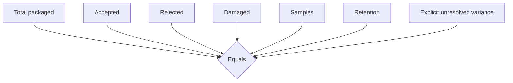
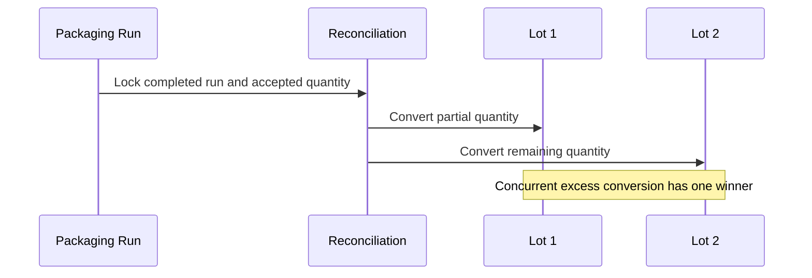
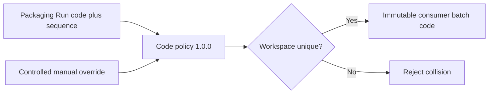
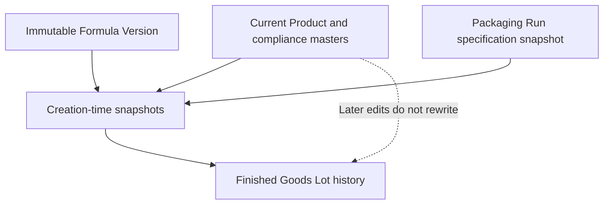
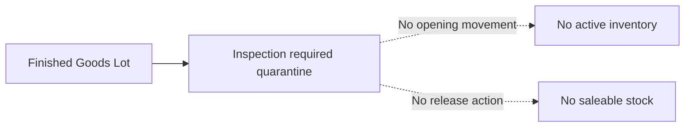
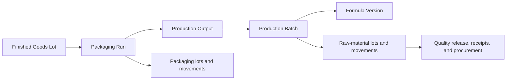

# Finished Goods Lot Creation and Quarantine

Status: Finished Goods & Batch Genealogy V1, Slice 3

## Scope and system of record

Slice 3 converts reconciled packaged output from one completed Packaging Run into one or more immutable Finished Goods Lot identities. `finished_goods_lots` and `finished_goods_quarantines` are authoritative for this boundary. The older `finished_goods_batches` and `finished_goods_movements` remain historical active-stock bookkeeping and are not written by this workflow.

No active inventory movement, quality release, saleable stock, shipment, or recall case is created.

## Reconciliation and equations

Policy `1.0.0` records append-only reconciliation versions.

`accepted = converted lots + remaining accepted`. The server locks the Packaging Run and latest reconciliation before conversion. Reconciliation cannot be superseded after the first lot exists.

## Identity and partial conversion

Internal UUID, internal lot code, consumer batch code, Packaging Run code, Production Output code, and Production Batch code remain distinct. Code policy `1.0.0` generates workspace-unique human-readable codes. Manual codes require reason, evidence, actor, and explicit acknowledgement.

## Snapshots, shelf life, and cost

Each lot stores targeted Product, Formula, Packaging, intended Label, cost, and genealogy snapshots. Unknown compliance, label, shelf-life, expiry, or PAO values remain `Unknown`; no approval or durability claim is invented.

Shelf-life policy `1.0.0` derives expiry server-side only when an explicit duration and unit exist. An expiry override requires reason and evidence. PAO is separate. Cost is allocated pro rata by accepted quantity from historical bulk and productive packaging snapshots; incomplete inputs remain provisional.

## Quarantine boundary

The entire created quantity enters one immutable quarantine identity with zero released, rejected, or held quantity. Slice 4 will add inspection decisions and release additively.

## Genealogy

`get_finished_goods_lot_genealogy_v1` reconstructs the immutable backward chain and exposes foundations for raw-material and packaging-lot forward tracing.

## Authority, security, and idempotency

Browser access is read-only under owner/workspace RLS. Fixed-path RPCs derive `auth.uid()`, validate the active workspace, guard revisions, lock conversion state, and enforce unique idempotency keys/fingerprints. Identical retry returns the original lot/quarantine; changed payload fails.

## Operator UI, tests, and performance

Completed Packaging Runs show reconciliation quantities, blockers, converted and remaining accepted quantity, cost state, quarantine notice, and controlled lot creation. The lot workspace shows snapshots, quarantine, audit history, and backward genealogy. Status is explicit, long codes wrap, number/date controls are labelled, irreversible creation requires acknowledgement, and the workflow collapses at narrow widths.

pgTAP covers schema, RLS, grants, API shape, append-only triggers, uniqueness, and indexes. Integration covers partial/multi-lot conversion, retry identity, concurrency, code collision, snapshot drift, direct-write denial, isolation, quarantine, no legacy movement, and reconstruction. Desktop and 390 × 844 browser coverage extends the real Production → Output → Packaging → Finished Goods flow.

The rollback-only performance fixture loads 10,000 Packaging Runs, 25,000 lots/quarantines, and 50,000 events. On the 2026-07-28 local Docker database, all representative reads used indexes: latest reconciliation 0.460 ms, converted-quantity aggregate 0.309 ms, lots by Packaging Run 0.246 ms, batch-code uniqueness 0.022 ms, lot/quarantine detail 0.041 ms, and two-event audit history 1.288 ms. No query required a sequential scan or explicit sort.

## Accepted limitations and Slice 4 entry

- Missing approved label/compliance values and shelf life remain Unknown.
- Quarantine supports creation-time `inspection_required` only.
- No inspection, release, active ledger, saleability, shipment, or recall persistence exists.
- Legacy active Finished Goods bookkeeping remains separate and is not migrated destructively.

Slice 4 begins with immutable quarantined lots and adds finished-product inspection, evidence, disposition, and controlled release without rewriting Slice 3 history.
The downstream controlled inspection and release boundary is implemented in [Finished-Product Inspection, Disposition & Controlled Quality Release](FINISHED_PRODUCT_INSPECTION_AND_QUALITY_RELEASE.md). Slice 3 lot identity, snapshots, batch code, expiry, cost, and genealogy remain immutable through partial disposition.

The canonical Slice 6 workspace reconstructs this lot's full backward chain and preserves snapshot authority; see [Batch Genealogy and Traceability](BATCH_GENEALOGY_AND_TRACEABILITY.md).
