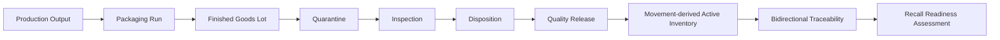
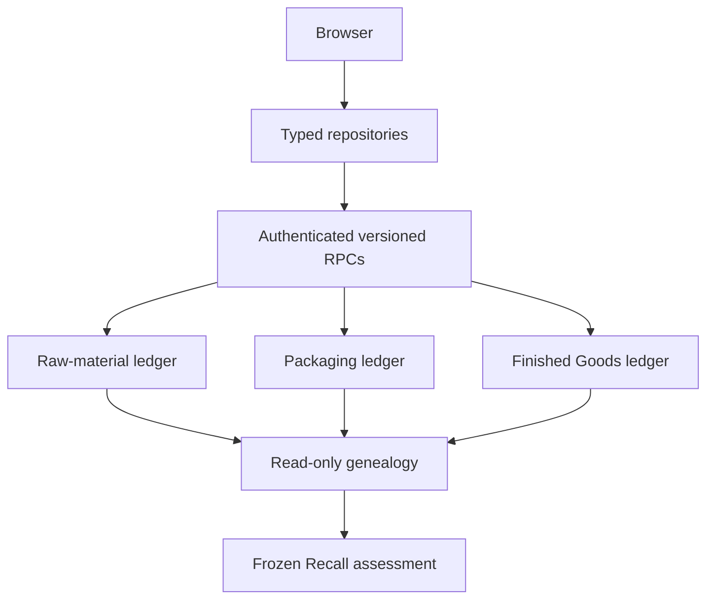
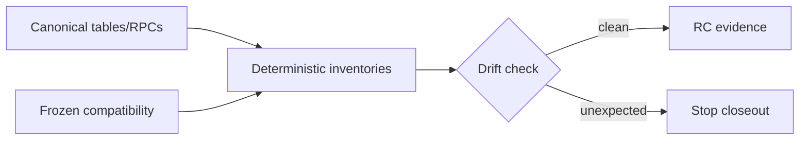
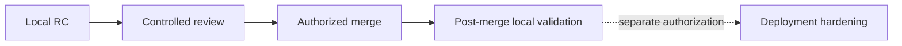
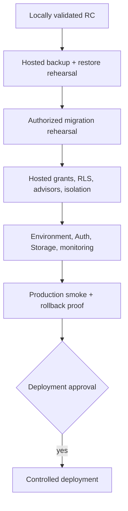
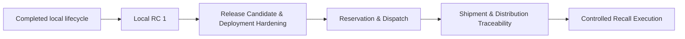

# Finished Goods, Traceability & Recall Readiness — milestone closeout

## 1. Executive verdict

Finished Goods, Traceability & Recall Readiness  
Milestone Closeout and Release-Candidate Baseline  
Status: PASS

The completed line is internally coherent, locally validated, documented, and suitable for controlled merge review. It is not authorized or ready for hosted deployment.

## 2. Milestone scope

Included: Finished Goods & Batch Genealogy V1, its six implementation slices, Platform Architecture Review, Platform Hardening & Legacy Authority Classification V1, and Recall Readiness V1. Production Inventory Control V1 at `f1cc783` is the prerequisite baseline. Downstream reservation, dispatch, shipment, distribution tracing, Recall Execution, and hosted cutover are excluded.

## 3. Starting point

Baseline tag `production-inventory-control-v1-rc` at `f1cc783`.

## 4. Ending point

Pre-closeout implementation HEAD `15c8db0`; the final annotated RC tag identifies the final closeout evidence commit.

## 5. Completed slices

| Milestone | Purpose | Start | End | Migration | Repository/route | Evidence | Limitation |
|---|---|---|---|---|---|---|---|
| Architecture Audit | Map existing authority and safe sequence | `61e825c` | `61e825c` | — | — | Architecture audit | Design only |
| Slice 1 | Bulk identity and yield reconciliation | `e80fabf` | `c529347` | `20260728154754` | Production Output repository/workspace | pgTAP, integration, E2E, plans | No packaging |
| Slice 2 | Packaging planning and controlled use | `2fbf943` | `f18ed35` | `20260728170000` | Packaging Run repository/workspace | pgTAP, concurrency, E2E, plans | No FG release |
| Slice 3 | FG Lot identity and quarantine | `21b3c3d` | `4581f69` | `20260728203257` | FG Lot repository/route | pgTAP, integration, E2E, plans | Quarantine only |
| Slice 4 | Inspection, disposition, release | `f802fbb` | `dd8199b` | `20260729043721` | Quality repository/workspace | pgTAP, integration, E2E, plans | No dispatch |
| Slice 5 | Active inventory and valuation | `941d768` | `e3e1adf` | `20260729054425` | FG Inventory repository/route | pgTAP, integration, E2E, 1m-row plans | Reserved = 0 |
| Slice 6 | Canonical genealogy | `0460e4f` | `6f53694` | `20260729065048` | Traceability repository/route | pgTAP, integration, E2E, 1m-edge plans | No distribution trace |
| Architecture Review | Reconcile platform line | `eea06d2` | `eea06d2` | — | — | Review document | Documentation |
| Platform Hardening | Freeze legacy and inventory writes | `984b19a` | `c6cbde0` | `20260729083226` | Platform audits | 11 inventories, security tests | Compatibility retained |
| Recall Readiness | Freeze internal assessment package | `8c3dbd8` | `15c8db0` | `20260729094510` | Recall repository/route | 87 focused pgTAP, integration, desktop/mobile | No execution |

## 6. Architecture reconciliation

Output ≠ Finished Goods Lot; Finished Goods Lot ≠ released inventory; inspection ≠ disposition; disposition ≠ movement; release ≠ dispatch; on-hand ≠ available; genealogy ≠ recall assessment; assessment ≠ execution; approval ≠ block/notification; frozen impact ≠ live inventory; valuation ≠ accounting; internal scope ≠ distribution completeness.

## 7. System-of-record map

| Authority | Canonical record/read model | Mutation path | History | Browser authority | Compatibility |
|---|---|---|---|---|---|
| Production Output | output tables and readiness/genealogy RPCs | versioned output RPCs | append-only histories | RPC | none |
| Packaging Run | run, requirements, allocations, reservations, uses | versioned run RPCs | append-only use/events | RPC | legacy allocations frozen |
| Finished Goods Lot/quarantine | lot and quarantine tables | versioned creation RPC | immutable snapshots/events | RPC | legacy FG read-only |
| Inspection/disposition/release | inspections, deviations, reviews, release tranches | quality RPCs | versioned/append-only | RPC | none |
| Opening/physical inventory | Finished Goods movements | release/operation RPCs | append-only ledger | RPC | legacy movements read-only |
| Active balance/state/valuation | snapshot and FEFO RPCs | movement/state operations | derived plus append-only | RPC | none |
| Genealogy/confidence | bounded trace RPCs | none | reconstruction only | read-only RPC | explicit legacy gaps |
| Recall case/revision/scope/impact | Recall tables and RPCs | versioned Recall RPCs | immutable/append-only | RPC only | none |

## 8. Database object summary

The final local authority inventory records 198 tables, 0 views, 0 materialized views, 206 functions, 59 triggers, 186 policies, 637 indexes, and 625 foreign keys. Application inventory records 16 repositories, 63 routes, and 5 providers.

## 9. Commit inventory

The deterministic [commit inventory](generated/finished-goods-rc-commit-inventory.json) contains all 36 commits in `f1cc783..15c8db0`, including author/date/subject, milestone, change type, migrations, application domains, tests, documentation, and release classification. History is preserved; no squash, rebase, or rewrite occurred.

## 10. Migration inventory

The deterministic [migration inventory](generated/finished-goods-rc-migration-inventory.json) contains all eight ordered migrations from `20260728154754` through `20260729094510`, including objects, grants, compatibility effects, source hash, dependencies, and rollback considerations. None is claimed remotely applied by this closeout.

## 11. Authority inventory

The platform audit regenerates database objects, privileges, foreign-key indexes, functions/RPCs, modules, routes/providers, browser mutations, events, policies, and legacy dependencies.

## 12. Security evidence

Locally proven: RLS presence, owner/workspace predicates, two-owner denial, forged workspace/root denial, direct-write denial, fixed search paths, controlled grants, private evidence metadata, no client service role, no public/anon Recall helpers, immutable-history guards, and service-only legacy write RPCs. Hosted grants/RLS, leaked-password protection, Auth redirects, Storage policies, and remote isolation remain unproven until authorized deployment work.

## 13. Validation matrix

| Gate | Command/evidence | Closeout policy | Expected result |
|---|---|---|---|
| Database reconstruction | `npx supabase db reset --local` | rerun | PASS |
| pgTAP aggregate/focused | `npm run test:supabase` and focused SQL | rerun | 1,212 aggregate; Recall 87 |
| Auth integrations/concurrency | integration harnesses | rerun | 53 |
| Unit/component/Cloudflare | `npm test` | rerun | 895 pass, 53 established skips |
| Desktop/mobile | E2E commands | rerun | 14/14 and 9/9 |
| Static quality | lint, build, accessibility, docs, secrets | rerun | PASS |
| Authority/security | platform audit suite | rerun | PASS, 11 artifacts |
| Database diagnostics | lint, advisors, migration list | rerun | PASS with registered baseline warnings |
| Performance | representative existing large-fixture plans | verify/rerun critical | PASS |
| Production preview | local HTTP smoke | rerun | PASS |
| Recovery | prior schema restore rehearsal | referenced | schema restore proven; hosted full restore pending |
| Git | diff/status checks | rerun | clean |

No new required test is skipped. Conditional integration skips in the general Vitest run are exercised by the authenticated integration harness.

## 14. Performance summary

| Path | Fixture/evidence | Status | 10× / 100× risk |
|---|---|---|---|
| Output/release/opening | focused plans and lifecycle integrations | indexed/bounded | low / review |
| Active balance, availability, FEFO, transfer/state | 100k lots, 1m movements, 250k state, 500k events | PASS | review partitions/caching only with evidence |
| Search/backward/raw+packaging forward | 100k lots, 500k uses, 1m movements/events | targeted indexes, sub-2ms representative paths | low / Product aggregation watch |
| Product-wide affected lots | 100k workspace rows, ~63ms prior evidence | accepted | medium / high |
| Recall scope/affected/impact/readiness/list | up to 1.5m edges and 500k domain rows | ten contracts PASS | review batching / capacity test |

No speculative index is added during closeout.

## 15. Compatibility retention

Compatibility objects remain frozen according to [Compatibility and legacy authority](COMPATIBILITY_AND_LEGACY_AUTHORITY.md). Removal requires hosted reconciliation, retained export, dependency-free evidence, owner approval, a reviewed removal migration, regenerated types/inventories, and rollback proof.

## 16. Technical debt

The [technical-debt register](TECHNICAL_DEBT_REGISTER.md) retains provider breadth, bundle size, evidence-led FK indexing, frozen legacy structures, `workspace_records`, accessibility depth, hosted restore proof, and Product-wide trace scaling. Closeout adds no business-feature debt.

## 17. Warning register

| Warning | Classification | Merge | Deployment |
|---|---|---|---|
| Main JS chunk >500 kB | baseline/future optimization | non-blocking | monitor |
| Ineffective `PlatformPage` dynamic import | baseline | non-blocking | non-blocking |
| v9 text-to-JSONB lint warning | baseline | non-blocking | review |
| unused supplier-candidate idempotency parameter | baseline | non-blocking | review |
| local advisor FK/RLS-init-plan findings | baseline/evidence-led | non-blocking | rerun hosted |
| Supabase CLI update notice | tooling | non-blocking | pin/review |
| Playwright colour notice | false-positive environment notice | non-blocking | none |
| occasional local proxy upstream response | local flake | rerun required | monitor |
| full Auth-data restore not portable through plain `pg_restore` | accepted local limitation | non-blocking | blocker until supported rehearsal |
| hosted-only configuration/security findings | requires hosted validation | non-blocking | blocker |

## 18. Merge readiness

`merge_ready = true`; `merge_blockers = []`. History is coherent, migrations are uniquely ordered, generated evidence is reproducible, tests are not focused/disabled, no debug or secret material exists, and the tree is clean after closeout.

Review order: migration/schema authority → security/grants/RLS → repository/browser boundary → lifecycle workflows → tests/performance → documentation/evidence.

Suggested strategy: preserve the branch’s audited commits with a normal merge or equivalent strategy that retains commit identity. After merge, rerun reset, authority audit, lint/build, unit tests, and focused Supabase integration. Do not deploy as part of merge.

## 19. Deployment readiness

`deploy_ready_now = false`.

## 20. Deployment blockers

No authorized hosted backup/restore evidence, remote migration rehearsal, remote grants/RLS/advisors, remote two-owner proof, production Auth/Storage/environment confirmation, rollback exercise, monitoring plan, production smoke evidence, or deployment approval exists.

## 21. Required authorization

Push, merge, tag push, hosted backup/restore, remote migrations, environment changes, deployment, and remote mutation each require explicit authorization.

## 22. Rollback and recovery prerequisites

Use a supported hosted backup, verify restore into an isolated target, record checksums and object counts, confirm Auth/Storage inclusion, document migration reversibility and forward-fix boundaries, identify stop/go owners, and rehearse application rollback. Never delete or rewrite immutable lifecycle history as rollback.

## 23. Exact next local milestone

Release Candidate & Deployment Hardening: package hosted runbooks, environment inventory, backup/restore rehearsal plan, migration dry-run evidence, monitoring, and post-deploy checks without adding business features.

## 24. Exact next deployment milestone

An explicitly authorized isolated hosted backup/restore and migration rehearsal, followed by hosted security/advisor/two-owner validation.

## 25. Future Recall Execution entry conditions

Customer/distributor/shipment authorities, responsible-person and legal governance, controlled notification evidence, canonical inventory block/return/destruction operations, idempotency/concurrency/rollback proof, privacy controls, and separate deployment authorization must exist first.

## 26. Final closeout statement

The local line is frozen as a reviewable RC. No push, merge, deployment, remote migration, hosted mutation, or Recall Execution action is part of this closeout.
