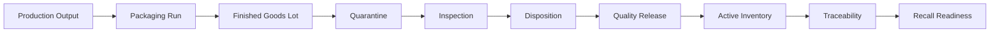

# Finished Goods, Traceability & Recall Readiness V1 — Local RC 1

Version: `1.0.0-rc.1`  
Branch: `feature/finished-goods-batch-genealogy-v1`  
Pre-closeout HEAD: `15c8db0`  
Local tag: `finished-goods-traceability-recall-v1-rc1`  
Environment: local only

## 1. Executive summary

This release candidate freezes the completed Finished Goods lifecycle, platform-authority hardening, canonical traceability, and Recall Readiness line as one locally reproducible review package. It is merge-ready after controlled review. It is not deployment-ready.

## 2. Scope

The baseline begins after Production Inventory Control V1 at `f1cc783` and includes the architecture audit, Finished Goods Slices 1–6, the Platform Architecture Review, Platform Hardening, and Recall Readiness. Production Inventory Control is a prerequisite, not part of this closeout.

## 3. Completed milestones

| Milestone | Status | Commit range | Migration |
|---|---|---|---|
| Architecture Audit | PASS | `61e825c` | None |
| Slice 1 — Production Output | PASS | `e80fabf..c529347` | `20260728154754` |
| Slice 2 — Packaging Run | PASS | `2fbf943..f18ed35` | `20260728170000` |
| Slice 3 — Finished Goods Lot | PASS | `21b3c3d..4581f69` | `20260728203257` |
| Slice 4 — Quality Release | PASS | `f802fbb..dd8199b` | `20260729043721` |
| Slice 5 — Active Inventory | PASS | `941d768..e3e1adf` | `20260729054425` |
| Slice 6 — Traceability | PASS | `0460e4f..6f53694` | `20260729065048` |
| Platform Architecture Review | PASS | `eea06d2` | None |
| Platform Hardening | PASS | `984b19a..c6cbde0` | `20260729083226` |
| Recall Readiness | PASS | `8c3dbd8..15c8db0` | `20260729094510` |

The complete machine-readable inventories are [commits](generated/finished-goods-rc-commit-inventory.json) and [migrations](generated/finished-goods-rc-migration-inventory.json).

## 4. Lifecycle now supported

Each arrow crosses an explicit identity or controlled transition. Output is not a Finished Goods Lot; release is not dispatch; Recall Readiness is not Recall Execution.

## 5. Major architectural decisions

- Physical raw material, packaging, and Finished Goods remain three separate movement ledgers.
- Production intent, physical output, packaging execution, quality review, released stock, genealogy, and recall assessment remain separate authorities.
- Historical labels, costs, quantities, relationships, and decisions are snapshotted or append-only.
- Browser mutations use typed repositories and controlled RPCs.
- Unknown cost and unknown cross-level attribution remain unknown.

## 6. Systems of record

| Concern | Authority |
|---|---|
| Production output | `production_outputs` and output history |
| Packaging execution | `packaging_runs` and run-scoped requirements/reservations/uses |
| Finished Goods identity | `finished_goods_lots` |
| Quarantine | `finished_goods_quarantines` |
| Inspection and disposition | inspection, deviation, and disposition-review histories |
| Released stock | `released_finished_goods_inventory_lots` |
| Physical Finished Goods quantity | `finished_goods_inventory_movements` |
| Operational state | `finished_goods_inventory_state_history` |
| Genealogy | bounded Slice 6 reconstruction RPCs |
| Recall assessment | Recall case, revision, frozen scope, impact, review, approval, and event tables |

## 7. Security model

Owner and workspace identity are derived from authentication. RLS protects exposed relations, controlled tables deny direct writes, privileged functions use fixed search paths, and PUBLIC/anon execution is revoked. Local two-owner integration evidence covers cross-owner and forged-identity denial. Hosted grants, RLS, advisors, and two-owner proof remain deployment prerequisites.

## 8. Traceability model

Traceability is a read-only DAG reconstructed from immutable lifecycle identities. It supports backward Finished Goods genealogy and forward raw-material or packaging-lot impact. Historical facts are authoritative; live inventory is a separate current-state read.

## 9. Recall Readiness model

Recall Readiness freezes an internal assessment revision, canonical trace snapshot, affected goods, current inventory impact, gaps, evidence, readiness, review, and approval fingerprint. Approval means only “frozen internal assessment and decision package.”

## 10. Compatibility and legacy boundary

Legacy `finished_goods_batches`, `finished_goods_movements`, `packaging_allocations`, `workspace_records`, old route adapters, and service-only legacy RPCs remain retained and frozen. They are not canonical write authorities and are not removed in this release candidate.

## 11. Validation

The closeout reruns the clean database reset, aggregate and focused database tests, authenticated integrations, unit/component tests, desktop/mobile E2E, accessibility, documentation, secrets, Cloudflare, authority drift, database lint/advisors, bundle analysis, migration listing, production preview, performance evidence, and Git checks. Exact results are recorded in the closeout document.

## 12. Performance

Representative large-fixture evidence covers Production Output, Packaging Run, Finished Goods creation/release, active balances and FEFO, traceability, affected-goods aggregation, Recall scope and readiness. Existing query plans use bounded, workspace-scoped access paths. Product-wide aggregation remains the principal scale watchpoint.

## 13. Known warnings

- Largest JavaScript chunk remains above 500 kB.
- `PlatformPage` has an ineffective dynamic import because another path imports it statically.
- Two established database lint findings remain.
- Local advisors retain broad baseline RLS-init-plan and FK recommendations.
- Local Playwright/Supabase tooling may emit colour/update notices.
- Local Supabase proxy tests have occasionally required a clean rerun.

## 14. Accepted limitations

No downstream reservation, customer allocation, dispatch, shipment, distribution/customer trace, notification, return/refund, destruction execution, accounting, authority submission, or legal conclusion exists. Cross-level mass-to-unit attribution remains unknown.

## 15. Merge readiness

`merge_ready = true`. Review hotspots are the eight ordered migrations, privileged RPC/grant boundaries, ledger separation, quality-release opening movement, traceability confidence, and Recall approval non-execution. Prefer a normal non-squashing merge that preserves the audited commit line.

## 16. Deployment readiness

`deploy_ready_now = false`. Local validation cannot establish hosted backup/restore, remote migration order and grants, hosted RLS/advisors, production Auth redirects, Storage configuration, remote two-owner isolation, rollback, monitoring, or smoke behavior.

## 17. Required authorization

Explicit authorization is required for merge, push, tag push, hosted backup/restore rehearsal, remote migration, environment changes, deployment, or any hosted mutation.

## 18. Rollback prerequisites

Before hosted migration: capture and verify a supported backup, rehearse restoration in an isolated target, record schema/data checksums, confirm migration ordering, and define rollback owners and stop conditions. Immutable history must never be repaired through destructive rewriting.

## 19. Future milestone sequence

1. Release Candidate & Deployment Hardening.
2. Downstream Reservation & Controlled Dispatch.
3. Shipment and Distribution Traceability.
4. Controlled Recall Execution.

Recall Execution cannot start until distribution/customer authorities, governance, notification evidence, canonical operational actions, rollback, concurrency, and deployment authorization exist.

## 20. Tag and commit identity

The annotated local tag `finished-goods-traceability-recall-v1-rc1` is created only after final validation and points to the final evidence commit. It is not pushed. The deterministic [RC manifest](generated/finished-goods-traceability-recall-rc.json) records the closeout identity.
