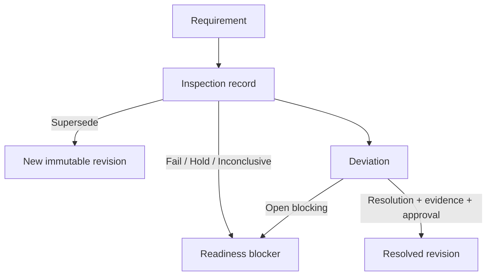
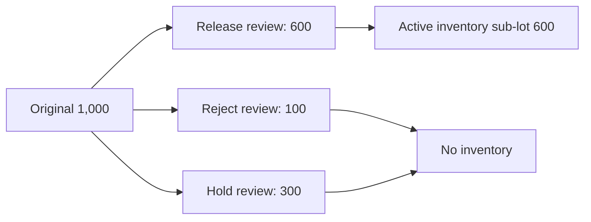
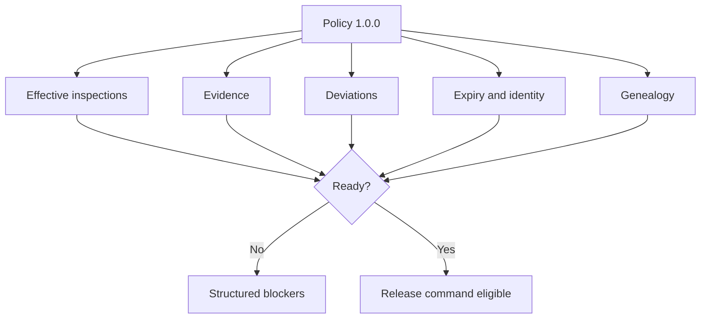
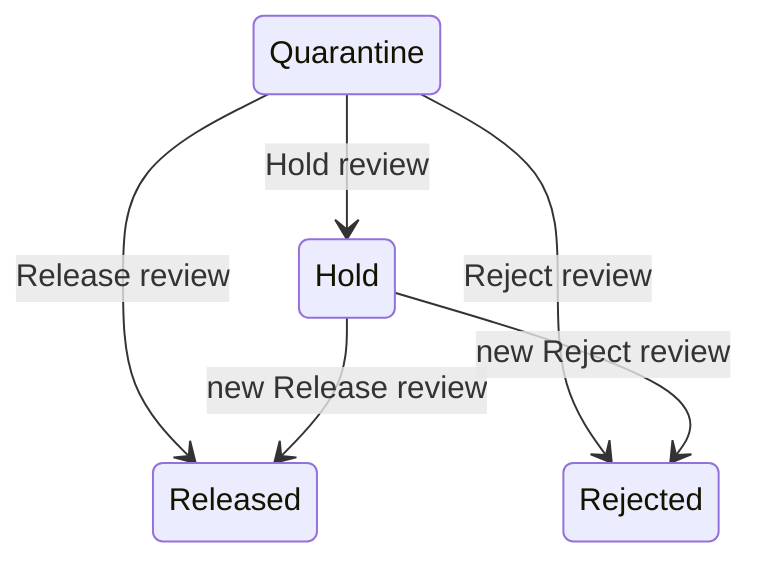
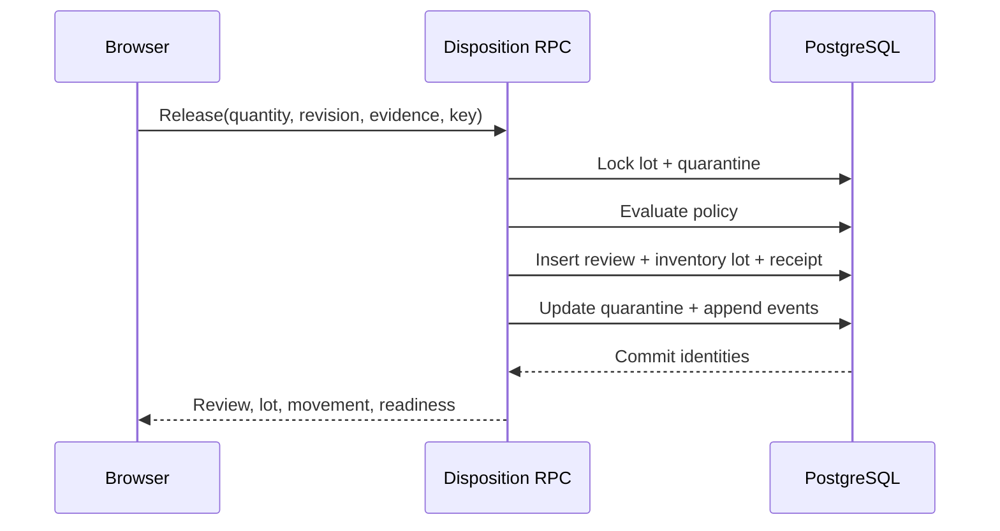
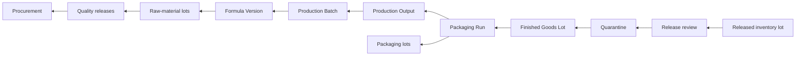
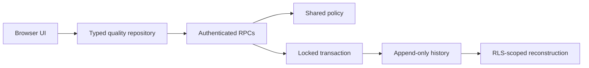

# Finished-Product Inspection, Disposition & Controlled Quality Release

## Scope and verdict boundary

Slice 4 moves an immutable Slice 3 Finished Goods Lot from quarantine through inspection and explicit quantity disposition. It creates active inventory only for Release. It creates no shipment, allocation, sales, recall-case, destruction-execution, return, or accounting workflow.

The canonical policy version is `1.0.0`. Unknown data remains Unknown. Product, Formula, Packaging, Label, cost, expiry, consumer batch code, and genealogy snapshots are never re-read from mutable master data during release.

## System of record

| Concept | Authority | Decision |
| --- | --- | --- |
| Produced packaged identity | `finished_goods_lots` | Reuse Slice 3 unchanged except guarded lifecycle status |
| Quarantine quantity | `finished_goods_quarantines` | One locked aggregate; identity fields immutable |
| Inspection | `finished_goods_inspections` | Append-only revisions linked by `supersedes_inspection_id` |
| Deviation | `finished_goods_deviations` | Append-only resolution revision; blocking current records block release |
| Disposition | `finished_goods_disposition_reviews` | Immutable Hold, Reject, or Release review |
| Active inventory | `released_finished_goods_inventory_lots` | One released sub-lot per Release review |
| Active balance | `finished_goods_inventory_movements` | Sum of immutable normalized movements |
| Audit | `finished_goods_quality_events` | Server-created, exactly-once event identities |
| Legacy Finished Goods | `finished_goods_batches` / `finished_goods_movements` | Rollback-era history only; not Slice 4 stock truth |

The legacy ledger activates stock during packaging and cannot represent quarantine release provenance. Reusing it would create a competing current truth. The additive released-lot layer is therefore the minimum safe canonical ledger.


## Inspection plan, records, and evidence

`get_finished_goods_inspection_plan_v1` derives requirements from immutable lot snapshots. Required V1 checks are identity, batch code, Packaging Specification, label, nominal content, packaging integrity, appearance, genealogy, expiry, and final release evidence. Microbiology is explicitly `unknown_non_blocking`; the system does not invent a lab specification.

Results distinguish `not_tested`, `pass`, `fail`, `hold`, `not_applicable`, and `inconclusive`. A correction inserts a revision that supersedes the current record. Evidence is structured JSON containing type, reference, and description; Slice 4 does not add file-upload infrastructure.



## Deviations

Deviations retain lot, quarantine, optional inspection, Packaging Run, Production Batch, affected quantity, severity, evidence, investigation, disposition impact, actor, timestamps, and approval. Blocking or critical deviations in `open` or `under_review` block Release. Resolution is a new row linked to the prior deviation; prior evidence is not rewritten.

## Quantity accounting and partial disposition

The canonical equations are:

```text
original = released + rejected + remaining quarantine
remaining quarantine = held + undecided
```

Hold is current quarantined quantity reserved for further review. A later Release or Reject inserts a new review and consumes held quantity before undecided quantity; it never edits the Hold review. Reject is terminal for that quantity and creates no destruction record. Every partial Release creates a separate active inventory sub-lot and one opening movement.



## Authoritative readiness and policy

`kf_finished_goods_release_readiness_v1` is the single policy source used by the read RPC, mutation RPC, repository, UI, and tests. It evaluates current effective inspection revisions, required evidence, blocking deviations, expiry, genealogy, and remaining quantity. The browser displays returned blockers and never calculates release authority.





## Controlled release and active inventory

`record_finished_goods_disposition_v1` authenticates the actor, resolves the single active workspace, locks the lot and quarantine, validates revision and quantity, runs the shared policy, and commits the complete transaction. Hold and Reject create reviews and events only. Release creates a review, released inventory lot, positive `release_receipt`, aggregate transition, and events.

The review pre-allocates inventory and movement identities. Its two circular provenance foreign keys are transaction-deferred; uniqueness on review, movement idempotency, and event keys remains immediate. Any failure rolls the transaction back.




## Cost and genealogy

Release allocates Slice 3’s historical unit-cost basis to the released quantity. Currency, confidence, provisional/Unknown state, unresolved count, method, and source snapshot remain embedded. Unknown never becomes zero.

Backward genealogy is:



`get_released_finished_goods_genealogy_v1` also returns the opening movement and movement-derived balance. `get_finished_goods_quality_workspace_v1` reconstructs all quality state after refresh or relogin.

## Security, RLS, idempotency, and concurrency

All six Slice 4 tables enable RLS and grant browser users SELECT only through owner policies. Lifecycle writes are RPC-only. Security-definer functions use fixed search paths, derive `auth.uid()`, resolve the owner workspace, reject cross-workspace identities, and revoke PUBLIC/anon execution. Append-only triggers deny update/delete. The two Slice 3 aggregate rows use a transaction-local, field-level guard that permits only cumulative state and revision changes from the controlled RPC.

Stable UUID idempotency keys and normalized fingerprints return original identities for identical retries and reject changed retries. Lot and quarantine row locks serialize final-quantity decisions, making one concurrent contender deterministic and preventing over-disposition.



## Operator workflow and accessibility

The Finished Goods Lot page shows immutable snapshots, quantity equation, exact readiness blockers, ten required checks, revision history, deviations, separate Hold/Reject/Release actions, consequences, acknowledgements, reviews, active sub-lots, opening movements, and genealogy. Status is textual, form controls are labelled, errors use alerts and focus restoration, IDs wrap, and the 390 × 844 layout uses single-column forms and 44 px action targets.

## Tests and performance

The Slice 4 pgTAP suite checks tables, keys, grants, RLS, append-only triggers, RPC signatures, and indexes. The local integration suite exercises incomplete/inconclusive inspection, supersession, blocking deviation, resolution, partial Release, retry identity/conflict, movement-derived genealogy, Hold/Reject inventory exclusion, direct-write denial, and concurrent final quantity.

The browser lifecycle covers real inspection and disposition on desktop and mobile. Representative `EXPLAIN (ANALYZE, BUFFERS)` statements live in `scripts/performance/finished-product-quality-release-plans.sql`; indexes follow lot-effective inspection, deviation state, review sequence, consumer batch lookup, movement balance, and event history paths.

## Limitations and Slice 5 entry

V1 does not model destructive execution, shipment, reservations, customer allocation, sales, recalls, unit serialization, returns, or accounting. Microbiological requirements remain unknown/non-blocking until an authoritative Product specification exists. Slice 5 may extend adjustments, inventory controls, valuation reconciliation, and operational availability without changing Release review or opening-movement identity.
# Active inventory handoff

A release tranche hands off to the Slice 5 active inventory workspace without changing its release review, opening movement, cost snapshot, or genealogy. Operational controls are documented in [ACTIVE_FINISHED_GOODS_INVENTORY_CONTROLS.md](ACTIVE_FINISHED_GOODS_INVENTORY_CONTROLS.md).

Both the quarantined Finished Goods Lot and each released tranche are supported roots for the Slice 6 read-only reconstruction described in [Batch Genealogy and Traceability](BATCH_GENEALOGY_AND_TRACEABILITY.md).
