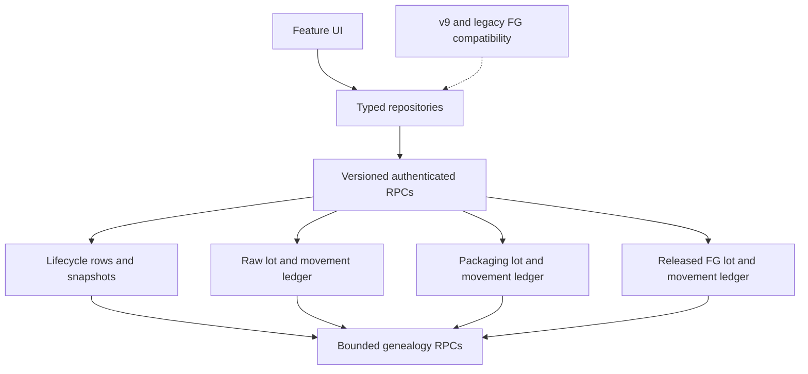
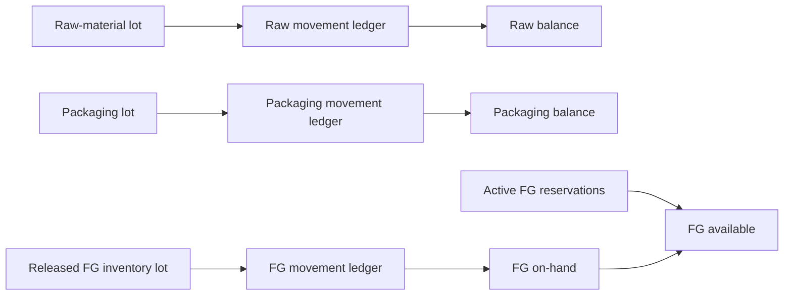
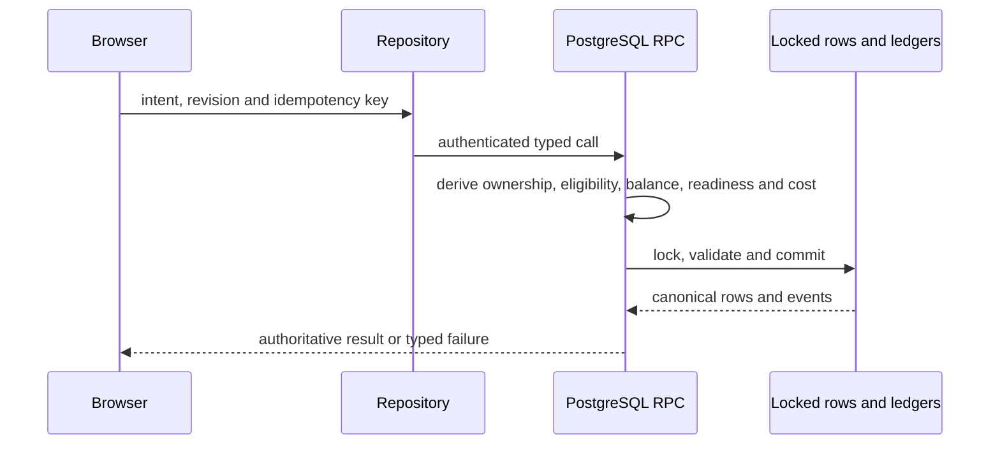
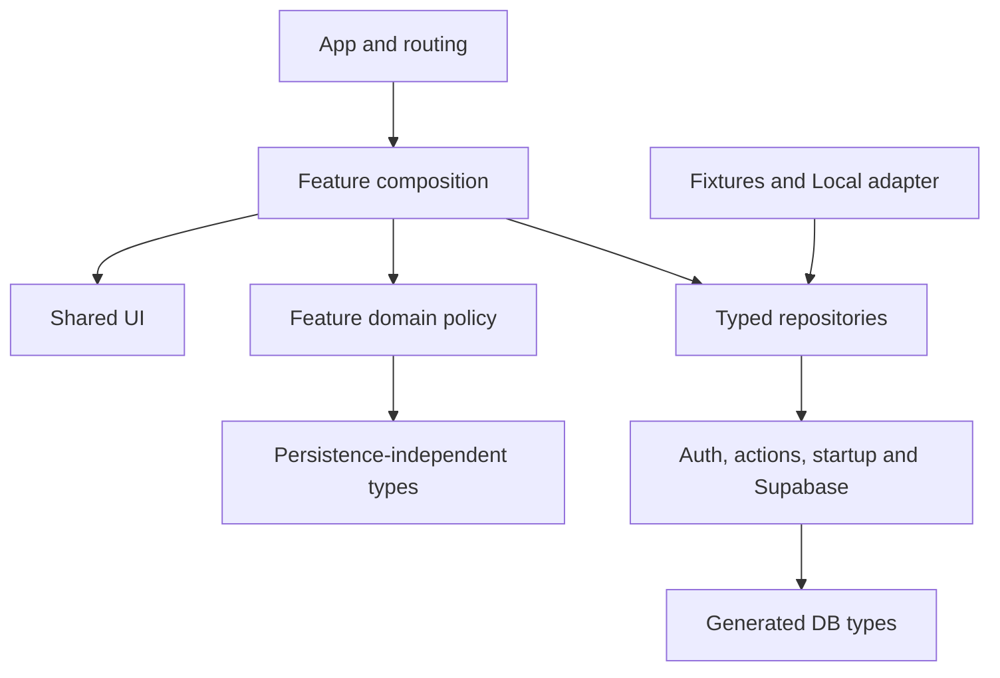
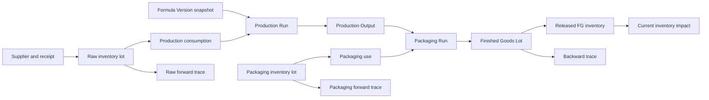
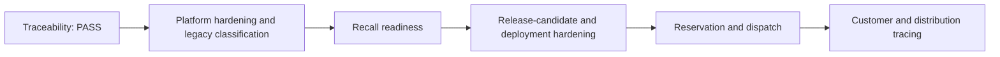

# Koalafrog Platform Architecture Review — 2026-07-29

## Hardening follow-up

Platform Hardening & Legacy Authority Classification V1 converted this review’s qualitative inventory into deterministic database, RPC, privilege, foreign-key, module, browser-write, legacy-dependency, event, policy, accessibility, documentation, release, and bundle artifacts under `docs/generated`.

Authenticated direct writes to the raw-material and packaging movement ledgers are now denied. Owner-derived receipt and append RPCs preserve the existing UI commands, while legacy Finished Goods and `workspace_records` authority is read-only. The compatibility boundary and removal sequence are documented in [Compatibility and legacy authority](COMPATIBILITY_AND_LEGACY_AUTHORITY.md).

Route-level lazy loading reduced the largest JavaScript chunk from 1,590,270 bytes to 664,699 bytes (gzip from approximately 407 kB to 185,081 bytes). The remaining chunk warning and broad Formula provider are retained in the [technical debt register](TECHNICAL_DEBT_REGISTER.md); they are not hidden or represented as resolved.

## 1. Executive verdict

**Status: PASS.**

Koalafrog remains suitable as a professional, private cosmetics-manufacturing operating system. Its strongest property is that operational state is not inferred from screens: immutable snapshots, separate physical ledgers, explicit lifecycle reviews, versioned RPCs, owner/workspace checks, revisions, idempotency identities, and server-side readiness evaluators preserve the chain from research through released Finished Goods and traceability.

No critical correctness or security defect was found that requires feature work to stop. The platform is not deployment-ready without hosted-cutover evidence, backup/restore rehearsal, advisor recheck, and release-candidate hardening. The exact next implementation slice should be **Platform Hardening & Legacy Authority Classification V1**, followed by Recall Readiness, then downstream reservation and dispatch.

Principal controlled debt:

- the v9 compatibility aggregate and legacy Finished Goods path coexist with newer relational workflows;
- the 1,978-line `FormulaDataContext` remains a broad command/composition root;
- procurement and some feature pages are oversized;
- 187 public tables and 156 public functions make ownership, privilege, and migration review costly;
- audit events have consistent intent but no platform-wide event envelope;
- the established Vite large-chunk warning remains;
- broad Product trace aggregation is the first measured traceability read cliff.

## 2. Review scope and evidence

The review covered application code, 84 migrations, generated schema, RPCs, repositories, browser mutations, domain types, tests, E2E fixtures, scripts, and authoritative documents through commit `6f53694`.

| Item | Evidence |
|---|---|
| Branch / starting tree | `feature/finished-goods-batch-genealogy-v1`; clean |
| Public schema | 187 tables, 0 generated views, 156 functions |
| Historical DDL | 217 function definitions/replacements, 48 trigger and 71 policy definitions |
| Tests | 17 pgTAP files / 892 planned assertions; 62 discovered Vitest cases; 23 discovered Playwright cases |
| Known warnings | legacy text-to-JSONB lint; unused `convert_supplier_candidate.idempotency`; Vite large chunk; historic broad auth init-plan findings; CLI update notice |
| Scale evidence | rollback-only trace fixture: 100k FG lots, 1m movements and 1m events; exact traces below 2 ms; Product aggregation about 63 ms |

DDL counts distinguish current generated schema from repeated historical definitions. No remote advisor result, migration, or validation timestamp was invented.

## 3. Platform lifecycle map

Plan ≠ Order; Order ≠ Placement; Confirmation ≠ Shipment; Receipt ≠ Inventory; Quarantine ≠ Active stock; Inspection ≠ Disposition; Release ≠ Shipment; on-hand ≠ available; available ≠ reserved; Hold ≠ Block; Damage ≠ Loss ≠ Destruction; genealogy ≠ recall; valuation ≠ accounting.

## 4. Systems of record

| Domain | Authoritative record/function | Derived/client form | Duplicate truth |
|---|---|---|---|
| Ingredient Knowledge | `ingredient_knowledge_*`; save aggregate RPC | typed profile aggregate | No |
| Supplier Research | procurement research/candidate tables and publish/accept RPCs | procurement panels | No; candidates are evidence |
| Supplier Products | `supplier_products`, mappings/preference RPC | workspace types | No |
| Scenarios | production procurement scenario/basket/line tables | rankings | No; persisted snapshots |
| Plans / checkout | purchase plan, basket, line, verification, event tables | plan workspace | No |
| Orders / placements | purchase order, line and audit tables; placement RPC | execution workspace | No |
| Confirmations / shipments | confirmation, shipment and event tables | repository DTOs | No |
| Receipts / quarantine | receipt, line, inspection, discrepancy and quarantine-intake tables | receiving UI | No |
| Raw quality release | quality-release reviews and RPC | read model | No |
| Raw inventory | `inventory_lots`, `inventory_movements` | balance RPC | Movement-led |
| Production | runs, immutable requirements and execution snapshots | Production UI | No; Lab stays separate |
| Reservations | `inventory_reservations`, `batch_material_*` | availability/readiness | No movement until commit |
| Weighing | batch material weighing with explicit kind | history | No |
| Consumption/waste/return | execution facts plus referenced movements | reconciliation | No |
| Output | production output, measurement, component, reconciliation and event tables | output workspace | No |
| Packaging Runs | run, requirement, bulk, reservation, use, reconciliation and event tables | Packaging UI | No |
| Packaging inventory | packaging lots and movements | balance/eligibility RPCs | Movement-led |
| FG lot / quarantine | `finished_goods_lots`, quarantines and events | lot UI | No; legacy batch path excluded |
| Inspection / disposition | inspection, deviation and disposition tables | quality UI | No |
| Release | released inventory lots and release RPC | readiness | No |
| Active FG inventory | released lots, movements, operations/state history | inventory RPCs | Movement-led |
| Valuation | committed cost snapshots and inventory RPC | projections | Not accounting |
| Genealogy | immutable FKs/snapshots and eight bounded RPCs | graph/table | No new truth or mutation |

Compatibility structures:

- `workspace_records` must receive no new domain writes after relational activation.
- local v9 remains rollback source until explicit reconciliation.
- `finished_goods_batches`, `finished_goods_movements`, `packaging_allocations`, `register_finished_goods_output`, and `commit_packaging_consumption` support older history. New Packaging Run/FG Lot workflows must not write them.
- versioned Beard wrappers and pre-Ingredient-Knowledge imports remain compatibility APIs.
- placeholder modules are UI scaffolding, not operational records.

### Inventory ledgers

Reservations and operational-state overlays affect availability, never historical physical movement truth. The three ledgers share principles, not tables.

## 5. Lifecycle boundaries

The lifecycle is coherent. Receipt creates quarantine evidence, not inventory. Reservation changes availability, not physical balance. Planned/actual weighing are observations. Productive consumption, waste, staged release, and physical return have distinct identities. Output reconciliation creates no FG. Packaging completion creates no FG Lot. FG Lot creation creates quarantine identity only. Inspection records observation, disposition assigns quantity, and Release alone creates active inventory. Operational Hold/Block/Damage/Loss/Destruction remain separate. Traceability cannot execute recall.

The remaining naming risk is legacy `FinishedGoodsBatch`, whose `Active` predates controlled quality release; new documentation must say “legacy Finished Goods batch.”

## 6. Immutability

| Record | Rule | Finding |
|---|---|---|
| Formula/Packaging versions | Draft-editable; later states frozen/derived | Strong |
| Lab/Production snapshots | exact source copied; completed history preserved | Strong |
| Requirements, measurements and physical facts | append-only or lifecycle/revision guarded | Strong |
| Plans and purchasing evidence | versioned/evented/terminally frozen | Strong |
| Quarantine, inspection, disposition and release | immutable evidence with follow-on records | Strong |
| Three movement ledgers | append-only; corrections are new facts | Strong |
| FG operational state | append-only overlay | Strong |
| Cost/label/genealogy snapshots | retained at commitment/conversion | Strong |
| Events | append-only in controlled slices | Acceptable; shapes vary |
| Legacy aggregate | mutable through generic actions | Compatibility risk; do not extend |

No new-chain historical field is freely browser-overwritable. Master-label drift is reported without rewriting snapshots.

## 7. Server authority

The browser is not authoritative for availability, balance, completion, release, expiry policy, batch-code uniqueness, allocation cost, trace confidence, operational state, or movements in controlled workflows. Disabled buttons are not the only enforcement. Direct writes remain for the v9 aggregate and legacy domains; controlled production, Packaging Run, FG quality/inventory, and trace mutations use RPCs. No optimistic UI manufactures stock.

Hardening should inventory every authenticated write grant and classify it as active command, server-only import, compatibility, or deprecation candidate.

## 8. Canonical glossary

| Canonical term | Meaning | Avoid/qualify |
|---|---|---|
| Formula Version | composition intent immutable after Draft | recipe as production truth |
| Lab Batch | experimental execution | Production Batch |
| Production Run | controlled manufacturing execution | promoted Lab Batch |
| Production Output | reconciled bulk | Finished Goods |
| Packaging Run | bulk-to-packaged execution | packaging batch |
| Finished Goods Lot | packaged identity | legacy `FinishedGoodsBatch` |
| Movement | immutable signed physical fact | transaction/editable stock |
| Allocation | lot link/intent | reservation unless capacity held |
| Reservation | durable availability hold; no movement | allocation |
| Commitment | atomic creation of physical facts | save |
| Inspection | observation | disposition/release |
| Disposition | quantity decision | inspection |
| Release | controlled active inventory creation | shipment/legal approval |
| On-hand / Available | physical balance / balance less holds | interchangeable “stock” |
| Hold / Block | reversible state / availability exclusion | interchangeable |
| Damage / Loss / Destruction | condition / removed quantity / physical execution | interchangeable |
| Adjustment | explicit correction movement | silent edit |
| Genealogy / Recall | ancestry graph / case and execution workflow | interchangeable |
| Valuation | operational material-cost projection | accounting value |

Do not broadly rename persisted event types, RPCs, tables, snapshot keys, or compatibility types. Use additive adapters and migration tests.

## 9. Module boundaries

Ownership is legible and no material circular dependency was found in the operational modules. Growth concerns are `FormulaDataContext` (1,978 lines), `IngredientKnowledgePage` (1,533), the 74-file procurement feature, large Production/Lab detail pages, and the generic Supabase repository as a compatibility choke point. Error normalization, refresh, and mapping repeat across repositories.

Extract provider command groups, add shared typed RPC error normalization, and split only pages whose policy can move into tested hooks. Do not create a generic abstraction that erases domain ownership.

## 10. Database architecture

Strengths include composite workspace FKs, narrow versioned mutations, fixed search paths in newer security-definer functions, revision/idempotency checks, quantity constraints, immutable facts, targeted indexes, and explicit Unknown.

Debt includes the 187-table/156-function review surface, large PL/pgSQL transaction scripts, repeated RLS/search-path boilerplate, JSON-returning projection duplication, versioned compatibility functions, and rapidly growing event/movement tables. JSONB snapshots are appropriate evidence but need schema-version ownership. Add automated FK-index and privilege inventory; do not partition without measured need.

## 11. Events and audit

Events are audit-first; lifecycle and movement rows remain truth. This is correct. Events are stable within domains but not replayable event sourcing: payloads differ and global delivery/order semantics are absent. Do not build a bus.

Before integrations, define an additive transactional outbox rather than publishing audit tables. First standardize naming (`domain.entity.action.v1`), actor/time/idempotency fields, metadata minimization, and one critical event per business action.

### Genealogy and traceability

## 12. Quantity and units

Raw materials use compatible mass/volume/count families with kg↔g, L↔ml and explicit milligram support. Density conversion is absent by design. Packaging/FG commonly use exact counts. PostgreSQL `numeric` is persisted truth; browser projections reject unsafe/non-finite values.

The separate ledgers prevent cross-domain double count, tolerances are policy-versioned, and trace quantity attribution remains explicitly Unknown. Generic string units are future drift risk. Density-dependent conversion must stay blocked until evidence/provenance exists. JavaScript numbers must never replace database numeric financial truth.

## 13. Cost and valuation

Committed physical allocation/movement snapshots are authoritative. Supplier prices are planning references; released-lot acquisition cost feeds production; Production Output carries reconciled material basis; Packaging use snapshots lot cost; FG Lots combine immutable bulk and packaging bases; active valuation derives from released inventory and movements. Unknown is never zero, and valuation is not accounting.

Historical cost does not drift. Multi-output allocation is provisional where incomplete. Future landed-cost changes must append an identified adjustment layer, never rewrite acquisition snapshots.

## 14. Security

New controlled tables use owner/workspace RLS and browser SELECT-only grants; mutations are RPC-only. Security-definer flows derive `auth.uid()`, revalidate relationships, fix search paths, lock capacity, and reject stale/idempotency conflicts. Traceability does not widen supplier, cost, or event visibility. Storage stays private.

Debt is the historic RLS advisor surface, informal review cost of 187-table privileges, generic compatibility-write blast radius, and lack of an integration-metadata allowlist. Deployment requires current advisor, two-owner, forged-ID, secret, and Storage evidence. No cross-owner leak was found.

## 15. Performance and growth

At 10×, architecture is acceptable. The 100k/1m trace fixture proves exact and forward/backward indexes. At 100×, movement/event/diagnostic/webhook relations may reach millions; Product aggregation, audit rendering, and large JSON RPC responses become cliffs. FEFO/reservation selectivity needs ongoing plan evidence.

All history/search endpoints need bounded limits and stable cursors before downstream operations. A Product summary may later help. Partitioning or archive strategy should follow row, vacuum, plan, and evidence-retention data—not speculation.

## 16. Frontend architecture

Routing, responsive shell, startup authority and repository selection are coherent. Supabase mode fails closed without Local fallback; controlled state survives refresh. Desktop and mobile exercise the core chain.

Needs attention: large bundle, limited route lazy loading, oversized modules, repeated repository state/error logic, audit IDs dominating some screens, no automated accessibility gate, and uneven connection-loss guidance. Lazy-load operational routes based on build evidence; keep textual states, focusable errors, keyboard forms and URL-restorable trace roots.

## 17. Test architecture

| Layer | Assessment |
|---|---|
| Pure/domain Vitest | Acceptable |
| pgTAP | Strong: 17 files / 892 assertions |
| Integration/concurrency/security | Strong in recent operational slices |
| E2E desktop/mobile | Acceptable: 23 discovered cases and full-chain fixtures |
| Scale | Strong targeted rollback-only harnesses |
| Migration compatibility | Acceptable; relational reconciliation tests exist |
| Accessibility | Needs attention; no dedicated automated gate |
| Disaster recovery | Needs attention; restore rehearsal is deployment gate |

Add Local/Supabase contract tests where semantics overlap, deterministic privilege/FK-index audit, accessibility smoke coverage, and a bounded release performance baseline. Docker suites remain evidence-driven for documentation-only changes.

## 18. Documentation

Domain closeouts are detailed and consistent. `ARCHITECTURE.md` states ledger/authority boundaries correctly. `ROADMAP.md` was stale at its top and moved directly from Traceability to Recall without a hardening gate.

Needed: one canonical glossary, explicit compatibility/deprecation markers, generated schema/privilege inventory, system-of-record index, event taxonomy, snapshot-schema ownership, and strict separation of local from deployed evidence.

## 19. Roadmap options

| Option | Benefit | Risk | Verdict |
|---|---|---|---|
| A: Trace → Recall → RC hardening → downstream | early containment value | recall built on unclassified compatibility | Acceptable |
| B: Trace → downstream → Recall → hardening | fast breadth | highest rework/customer-trace risk | Reject |
| C: Trace → hardening → Recall → downstream | stabilizes authority, terminology, pagination and privileges first | one bounded delay | **Recommended** |

## 20. Recommended roadmap

Hardening first minimizes rework. Recall consumes trace roots without shipment/customer data. Dispatch must later create customer/distribution facts designed for recall from day one.

## 21. Technical-debt register

| ID | Category | Evidence | Sev / likelihood / impact | Fix and timing | Scope | Blocker / safe |
|---|---|---|---|---|---|---|
| TD-C01 | Correctness | legacy FG `Active` predates quality release | High / Low / High | compatibility marker; prohibit new callers before downstream | Medium | Safe now |
| TD-S01 | Security | 187-table RLS/grant surface | Med / Med / High | generated inventory/advisors before deploy | Medium | Deploy blocker |
| TD-P01 | Performance | Product trace ~63 ms at 100k | Med / High / Med | cursor/limits; summary only with evidence | Small | Before scale |
| TD-P02 | Performance | event/movement growth | Med / High / Med | pagination, retention classes, plan baseline | Medium | Safe documented |
| TD-N01 | Naming | `FinishedGoodsBatch` vs Lot | Med / High / Med | compatibility alias; no broad rename | Small | Before downstream |
| TD-A01 | Architecture | v9 aggregate plus relational workflows | High / High / High | finish classification; no new `workspace_records` writes | Large | Before deploy |
| TD-A02 | Architecture | 1,978-line provider | Med / High / Med | extract command groups | Medium | Safe documented |
| TD-A03 | Architecture | 156 functions/wrappers | Med / High / Med | ownership catalog; evidence-led retirement | Medium | Safe documented |
| TD-A04 | Architecture | nonuniform event envelope | Low / High / Med | convention before integrations | Small | Safe documented |
| TD-U01 | UX | dense IDs/long-operation recovery | Med / Med / Med | focused usability/error pass | Medium | Before deploy |
| TD-T01 | Test | no accessibility gate | Med / Med / Med | critical-route smoke suite | Small | Before deploy |
| TD-T02 | Test | manual FK/grant audit | Med / Med / High | deterministic schema audit | Small | Next slice |
| TD-D01 | Docs | roadmap/glossary drift | Med / High / Med | update and canonical glossary | Tiny | Started here |
| TD-O01 | Operations | restore/cutover not rehearsed on current schema | High / Med / High | rehearse before deployment | Medium | Deploy blocker |
| TD-O02 | Operations | established build/DB warnings | Low / High / Low | scoped maintenance | Small | Safe documented |

There is no must-fix-before-any-feature defect. TD-C01, TD-T02, and bounded TD-A01 form the next hardening slice.

## 22. Risk register — 12–24 months

| Risk | Probability / impact | Detection | Mitigation | Owner | Timing |
|---|---|---|---|---|---|
| Ledger/event growth | Med / High | rows, indexes, vacuum, plans | pagination; evidence-led summaries/partitioning | Platform | Quarterly |
| Migration complexity | High / High | reset/reconciliation diffs | additive migrations, fingerprints, rollback | Platform | Every release |
| Supabase/function limits | Med / High | duration/payload/logs | bound RPCs; split measured projections | Platform | Deploy/quarterly |
| Network loss/long RPC | Med / Med | timeout/retry telemetry | idempotency, progress and safe retry | App | Before deploy |
| Bundle growth | High / Med | chunk report | lazy operational routes | Frontend | Hardening |
| User error | Med / High | events/reconciliation | confirmations, reason/evidence, Hold | Operations | Continuous |
| Evidence storage growth | Med / High | bucket/restore inventory | private lifecycle and retention classes | Compliance | Before deploy |
| Cost drift | Med / High | confidence reconciliation | append adjustments; preserve snapshots | Operations | Before accounting |
| Regulatory/label change | High / High | dossier/version review | exact binding and new revision | Compliance | Per change |
| Missing shelf-life/micro data | High / High | explicit Unknown | authoritative evidence gate | Quality | Commercial gate |
| Packaging quality gaps | Med / High | integrity/readiness | close before dispatch | Quality | Hardening/Recall |
| Customer tracing absent | High / High once shipping | recall tests | design dispatch from recall needs | Operations | Before dispatch |
| Backup/restore failure | Med / Critical | timed rehearsal | tested runbook and controlled backup | Platform | Deploy gate |
| Schema rollback | Med / High | migration rehearsal | forward fixes, retained v9, plan | Platform | Every release |
| Multi-user concurrency | Low / High later | concurrent/two-owner tests | revisions, locks, RLS | Platform | Before multi-user |
| Auth instability | Med / High | startup telemetry | fail closed and recovery guidance | Platform | Before deploy |
| Tenant leakage | Low / Critical | two-owner/advisors | composite ownership and audit | Security | Every release |
| GDPR/minimization | Med / High | metadata/event review | allowlists, retention, runbook | Data | Before customer data |
| Disaster recovery | Med / Critical | RTO/RPO exercise | ownership and rehearsal | Platform | Before production |

## 23. Platform-quality verdict

| Quality | State | Reason |
|---|---|---|
| Correctness | **Strong** | ledgers, transactions, equations, idempotency, Unknown |
| Traceability | **Strong** | immutable links and bounded bidirectional paths |
| Security | **Acceptable** | controlled slices strong; historic/deploy surface needs work |
| Maintainability | **Needs attention** | schema/RPC volume, compatibility and oversized modules |
| Scalability | **Acceptable** | measured core paths; broad history/aggregation needs controls |
| Usability | **Acceptable** | responsive chain; dense audit/recovery friction |
| Testability | **Strong** | pgTAP, integration, concurrency and E2E depth |
| Deployment readiness | **Needs attention** | cutover, advisor, restore and warning evidence |
| Audit readiness | **Strong** | immutable evidence; event catalog remains |
| Operational readiness | **Acceptable** | manufacturing chain coherent; recall/dispatch absent |

## 24. Must-fix items

No critical finding must be fixed before all new feature work. If hardening finds a browser-writable controlled FG Lot, Release, movement, cross-workspace link, duplicate physical truth, or mutable released history, this verdict becomes BLOCKED. Current migrations revoke those writes and expose SELECT plus versioned RPCs.

## 25. Pre-next-slice actions

1. Mark compatibility tables/RPCs and prohibit new controlled writes.
2. Generate table/function/grant/RLS/FK-index ownership inventory.
3. Establish canonical glossary and event/snapshot conventions.
4. Confirm all trace/history reads are bounded and cursor-ready.
5. Keep hardening separate from remote cutover authorization.

## 26. Pre-deployment actions

- hosted cutover and reconciliation evidence;
- current security/performance advisor classification;
- deployed two-owner and forged-ID tests;
- backup/restore RTO/RPO rehearsal;
- private Storage and secret/environment verification;
- accessibility smoke and actionable bundle/loading work;
- full migration, pgTAP, integration, concurrency and E2E gates;
- monitoring, incident ownership and forward-fix/rollback procedure.

## 27. Future optimizations

Route lazy loading, Product trace summaries, evidence-led partitioning, typed RPC error normalization, provider hook extraction, an integration outbox only with a consumer, and richer unit/density provenance only with a real use case.

## 28. Exact next slice and stop conditions

**Next: Platform Hardening & Legacy Authority Classification V1.**

Scope: ownership/deprecation inventory; automated grant/RLS/FK-index checks; bounded history/trace contracts; glossary/event/snapshot conventions; targeted provider/error-boundary extraction; local release evidence. It adds no business feature, remote mutation, or broad persisted rename.

Then implement **Recall Readiness V1** from immutable trace roots: recall case identity, scope snapshots, decisions, affected inventory, evidence, actions, reconciliation and closure. It must not imply customer tracing before dispatch/customer data exists.

Stop and mark BLOCKED for direct browser writes to controlled facts, duplicate quantity truth, mutable released/consumed history, cross-owner access, mismatched readiness evaluator/enforcement, an unbounded safety-critical recall query, unreconciled migration loss, or Unknown coerced to safe/zero.
