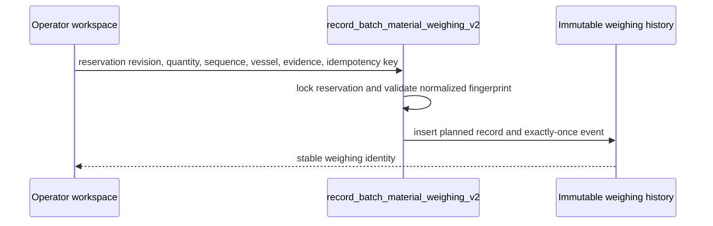
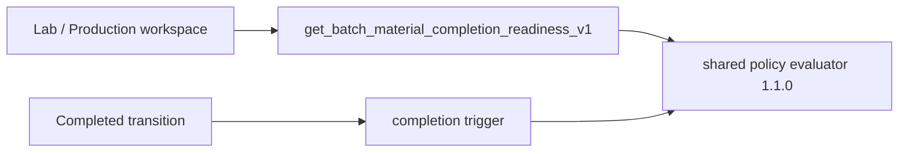
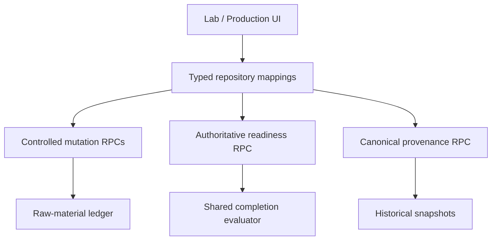

# Production Inventory Control V1

## Status

Production Inventory Control V1 is a server-side control layer for Lab Batch and Production Run raw-material execution. It does not replace Inventory Movements: physical stock truth remains the immutable movement balance grouped by Inventory Lot.

The completion policy version is `1.1.0`. Formula Version intent is snapshotted onto batch requirements. Later Formula edits cannot change the identity, quantity basis, INCI, functions, processing instructions, or material-selection rule used by an existing batch.

## Availability and eligibility

Canonical raw-material availability is:

`released movement balance - active reservation balance`

An eligible lot must belong to the owner workspace and exact requirement Ingredient, use a compatible unit, have a positive available balance, be Active and released, and not be recalled, blocked, expired, or beyond mandatory retest. FEFO ordering is deterministic. The same server functions drive candidate listing and reservation enforcement.

Legacy v9 imports receive release timestamps only while the workspace is in its controlled `importing` lifecycle. Authenticated clients cannot forge release, recall, block, retest, restriction, quarantine, or quality-review fields. Controlled quality release remains the production path for new released inventory.

## Reservation and concurrency

Allocation and reservation are durable, owner-isolated records. Reservation RPCs lock the batch requirement and Inventory Lot, check the expected batch revision, recompute availability inside the transaction, and store the selection and cost snapshots. Idempotency keys reject payload changes.

Concurrent attempts for the final available quantity produce one winner. A stale revision or insufficient availability rejects the loser without leaving an allocation, reservation, event, or movement.

## Weighing, consumption, waste, and returns

Planned weighing records intent, including a positive sequence and optional container or vessel. It creates no Inventory Movement and remains distinct from actual weighing. The versioned mutation fingerprints sequence and vessel, so an uncertain identical retry returns the original record while a changed retry is rejected.

Actual weighing is required before consumption. Consumption and waste remain distinct records and create separate immutable Inventory Movements exactly once. Lot identity cannot change between reservation, weighing, and consumption.

Returns have two meanings:

- `staged_unconsumed` records material that was weighed or staged but never left released inventory. It releases the matching reservation quantity and creates no physical movement.
- `physical_return_after_consumption` references the original consumption, requires condition and evidence, cannot exceed that consumption after prior returns, and appends a positive controlled Adjustment to the same still-eligible released lot. It does not rewrite the original Consumption.

## Reconciliation and completion

Requirement reconciliation preserves target, reserved, weighed, productive consumption, waste, returned, released, remaining reservation, tolerance, and unexplained variance. Physical post-consumption returns remain a subset of gross productive consumption; staged returns participate in the weighing equation.

Variance is never forced to zero. Variance outside tolerance requires a reason and approval state. The versioned readiness RPC returns structured blockers, counts, recommended actions, and policy version. The completion trigger consumes the same internal evaluator, so the UI never recreates completion policy. Completion additionally requires planned and actual weighing plus productive consumption for every requirement. Cancellation releases unused reservations while preserving consumption and waste history.

## Cost and audit provenance

Consumption and waste use the Inventory Lot acquisition-cost snapshot present at commitment time. Unknown cost stays null. Records preserve currency, confidence, provisional/final state, quality-release review, and landed-cost notes. Later supplier prices do not rewrite historical consumption.

Allocation, reservation, release, weighing, consumption, waste, return, variance, and reconciliation events are server-generated and append-only.

The canonical provenance RPC returns a deterministic server-side chain from Formula Version and requirement through allocation, reservation, weighing, movements, Inventory Lot, quality release, quarantine, receipt, shipment, confirmation, Purchase Order, and Purchase Plan. Missing lifecycle nodes are labelled `not_yet_applicable` or `not_applicable`; historical snapshots remain authoritative.

## Packaging boundary

Packaging remains on its separate lot and movement ledger. The existing Finished Goods packaging commitment locks allocations and lots, checks exact requirements and balance, creates exactly-once Consumption movements, snapshots cost, and rolls back atomically on failure.

Production packaging requirements do not yet have a safe reservation/weighing/return/waste model. V1 does not put packaging into raw-material requirement or reservation tables. Release-state parity, durable packaging reservations, controlled packaging returns, and damage/waste provenance remain unsupported follow-up work.

## Repository, UI, and operator boundary

The typed repository uses RPCs for every mutation and for readiness and provenance. Lab and Production reuse one controlled-material workspace. Operator actions remain explicitly separate: release a reservation, return staged material without a positive movement, or return previously consumed material with one controlled positive movement. The UI displays server blockers and provenance without inventing eligibility, policy, or historical joins in the browser. Direct browser lifecycle writes remain prohibited.

## Browser and performance validation

The controlled Production browser proof covers two-lot allocation/reservation, planned sequence and vessels, actual weighing, productive consumption, waste, staged return without a positive movement, explicit release, reconciliation, authoritative readiness, provenance, completion, refresh persistence, and read-only completed state. The same proof runs in desktop Chromium and at a real 390 × 844 mobile viewport. A focused Lab proof verifies the shared reservation and planned-weighing contract plus refresh persistence.

Production material completion is not output completion. The controlled handoff is documented in [Production Output & Yield Reconciliation](PRODUCTION_OUTPUT_AND_YIELD_RECONCILIATION.md); it records measured bulk identity without creating Finished Goods or consuming packaging.

Representative local `EXPLAIN (ANALYZE, BUFFERS)` measurements used a workspace containing one requirement, two reservations, two planned/actual weighing rows, consumption, waste, return, reconciliation, and seven controlled-material reservations across the local database:

- Completion readiness: 10.660 ms, 1,791 shared-buffer hits.
- Provenance retrieval: 20.028 ms, 4,594 shared-buffer hits.
- Planned-weighing history: 0.038 ms, one five-row sequential scan, two matching rows, 25 kB quicksort.

PostgreSQL reports PL/pgSQL JSON evaluators as a `Result` node, so their internal joins are not expanded in the outer plan. At this fixture size, the history scan is cheaper than an index lookup and row estimates are close (estimated one, actual two). No new index was justified by these measurements. The evaluator plans should be repeated at production-like history volume before adding speculative foreign-key indexes.
