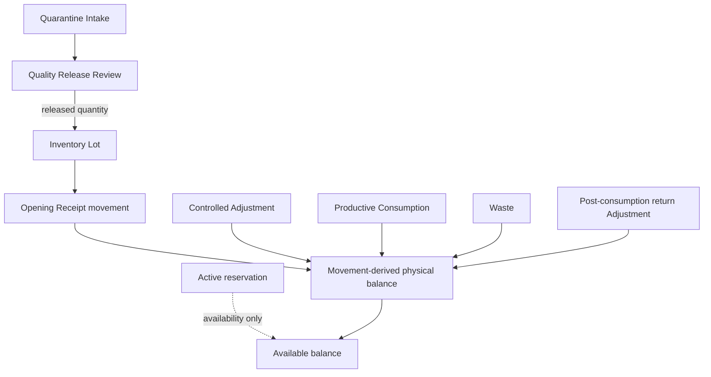
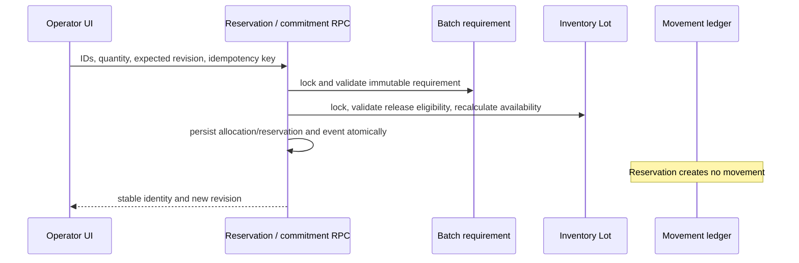
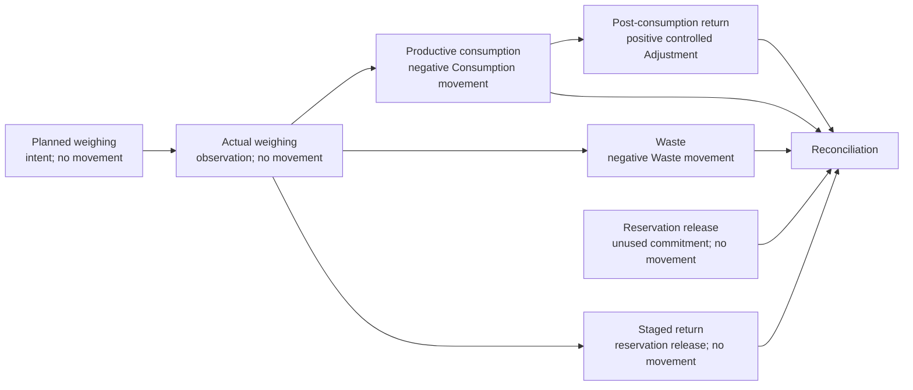
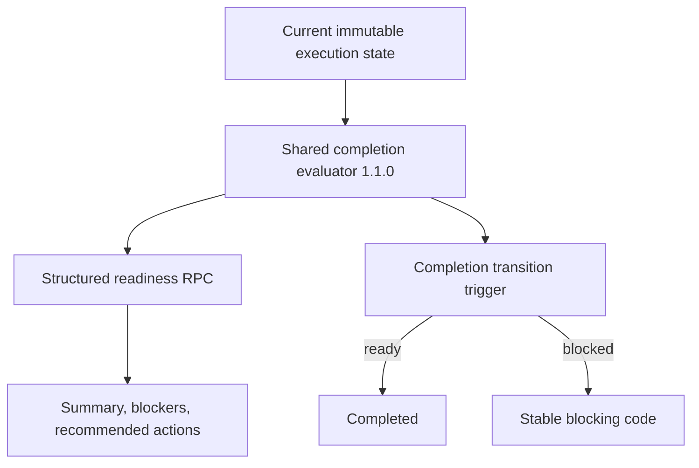
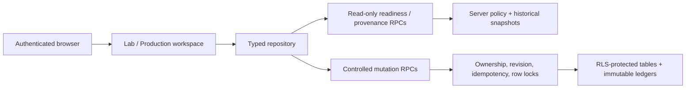

# Production Inventory Control V1 — release closeout

Closeout date: 2026-07-28

## Milestone verdict

Production Inventory Control V1

Milestone Status: COMPLETE

The fresh architecture review found no critical correctness defect. The validated implementation preserves a single movement-derived raw-material stock truth, keeps reservations non-physical, separates planned intent from observed weighing and committed consumption, and makes completion policy and historical provenance server-authoritative.

## Scope delivered

- Immutable Lab and Production material-requirement snapshots.
- Released-lot eligibility and deterministic FEFO recommendation.
- Durable allocation and concurrency-safe reservation.
- Planned weighing with sequence and optional vessel.
- Actual weighing with operator evidence.
- Exactly-once productive consumption and waste.
- Explicit reservation release, staged return, and post-consumption physical return.
- Exact reconciliation with explicit documented variance.
- Versioned authoritative completion readiness.
- Historical procurement-to-production provenance.
- Shared Lab and Production operator UI.
- Desktop and 390 px mobile lifecycle validation.

## Full lifecycle map

Purchase Plans remain internal planning truth. Purchase Orders are external execution truth. Carrier delivery is not physical receipt; physical receipt is not inspection; inspection is not quality release; quality release is the sole controlled bridge into usable inventory.

## Architectural boundaries and system-of-record ownership

| Concern | System of record | Boundary |
|---|---|---|
| Formula intent | Immutable Formula Version | Batch execution never mutates it |
| Batch material intent | Immutable Batch Material Requirement snapshots | Current master-data edits do not rewrite it |
| Physical raw-material stock | Inventory Movements grouped by Inventory Lot | No ingredient-level or reservation stock truth |
| Availability | Released movement balance minus active reservations | Canonical server functions enforce the same rule used for selection |
| Procurement execution | Purchase Order lifecycle and append-only events | Never inferred from a Purchase Plan |
| Quality disposition | Quarantine Intake and Quality Release Review | Unreleased material is unavailable to Production |
| Execution intent | Planned weighing | No movement |
| Execution observation | Actual weighing | No movement |
| Physical deduction | Productive Consumption and Waste movements | Exactly once and lot-bound |
| Completion authority | Versioned server evaluator | UI is a consumer, not a policy engine |
| Historical traceability | Server-built provenance snapshots and immutable IDs | Mutable current labels are advisory only |
| Packaging | Separate Packaging Lot and Movement ledger | No raw-material table crossover |

## Inventory state and movement ownership

The raw-material equations are:

`physical balance = signed immutable movements for the Inventory Lot`

`available balance = released physical balance - active reservation balance`

Unknown acquisition cost remains null/Unknown. Historical consumption cost uses the committed Inventory Lot cost snapshot and is never recalculated from a current Supplier Product price.

## Reservation semantics and transaction boundary

Reservations are durable commitments, not physical movements. Reservation RPCs lock the requirement and Inventory Lot, validate the expected revision, recalculate eligible availability inside the transaction, and preserve lot, supplier-lot, FEFO, restriction, quality-release, and cost snapshots. An identical idempotent retry returns the original identity; a changed payload conflicts.

Concurrent attempts cannot oversubscribe the same lot. A stale revision or insufficient balance aborts the entire statement without orphaned allocation, reservation, event, or movement rows.

## Weighing, consumption, waste, and return distinctions

Planned weighing records intended sequence, quantity, and optional vessel. Actual weighing records observed quantity and evidence. Consumption is a separate irreversible commitment. Productive use and waste remain separate records and movements.

- Reservation release means material was never identified as staged or consumed.
- Staged return means weighed/staged material never left released inventory; it reduces the reservation and cannot create a positive movement.
- Post-consumption physical return references the original consumption, cannot exceed it after prior returns, and appends a positive Adjustment only after controlled condition/evidence checks.
- A physical return therefore cannot fabricate inventory or silently reverse the original movement.

## Reconciliation semantics

Reconciliation preserves target, reserved, actual weighed, productive consumption, waste, staged return, post-consumption return, released reservation, remaining reservation, tolerance, and unexplained variance as distinct facts. It does not force a false zero. Variance beyond tolerance requires reason, evidence, actor, and approval state.

Completed or cancelled lifecycle history is not rewritten. Cancellation releases unused reservations while preserving consumption and waste; corrections use controlled append-only adjustments or versioned records.

## Completion-readiness authority

The completion policy is version `1.1.0`. The static lot-selection subtitle references the separate eligibility policy `1.0.0`; these versions describe different policies.

The evaluator checks the implemented policy, including required allocation, planned and actual weighing, productive consumption, reconciliation, yield, active reservations, and unexplained variance. The UI disables completion from the returned state but the database trigger remains authoritative under concurrency.

## Historical provenance

The authenticated read-only provenance RPC builds the chain inside the database. Nodes are classified as `present`, `not_yet_applicable`, `not_applicable`, or `missing_expected_link`. Historical labels and snapshots are authoritative; `currentMasterDiffers` makes later Ingredient renaming visible without changing history.

## Security, RLS, and authority boundary

All controlled lifecycle tables are owner/workspace scoped and RLS protected. Authenticated table access is read-only where the browser needs history; mutations use narrowly scoped RPCs. Security-definer functions derive the actor from `auth.uid()`, validate the active owner workspace and every referenced identity, use a fixed search path, revoke PUBLIC/anonymous execution, and grant only the required authenticated surface.

The review also considered the 2026 Supabase Data API change: exposed-table grants and RLS are separate controls. The migrations use explicit grants and do not depend on automatic table exposure.

No service-role credential enters the frontend. No browser code forges lifecycle events or constructs authoritative provenance from protected table joins.

## Idempotency and concurrency

Every material mutation receives an explicit idempotency key and normalized payload fingerprint. Exact retry returns the original record; changed retry fails. Row locks and revision predicates protect the Batch Requirement, reservation, and Inventory Lot. PostgreSQL statement rollback prevents partial lifecycle identity, duplicate movements, duplicate events, and over-reservation.

## Application integration and coverage

Lab Batch and Production Run pages reuse one controlled-material workspace through a typed repository. The UI renders server-returned eligibility, readiness, blockers, planned history, reconciliation, and provenance. Release reservation, return staged material, and return previously consumed material are explicit separate actions with non-colour labels and irreversible-action confirmation where applicable.

Validated release-candidate evidence:

- pgTAP: 706/706;
- Supabase integration and concurrency: 38/38;
- unit tests: 892 passed, 38 established skips;
- desktop E2E: 13/13;
- mobile E2E at 390 px: 8/8;
- fresh local database reset, lint, build, secret scan, Cloudflare readiness, migration listing, diff checks, and production preview smoke passed.

The closeout changes documentation only, so Docker-backed validation was not repeated and no new database-validation timestamp is claimed.

## Performance findings

Representative local plans recorded before closeout:

- completion readiness: 10.660 ms and 1,791 shared-buffer hits;
- provenance retrieval: 20.028 ms and 4,594 shared-buffer hits;
- planned-weighing history: 0.038 ms, a five-row sequential scan, two result rows, and 25 kB quicksort.

The PL/pgSQL JSON evaluators appear as outer `Result` nodes. No speculative index was justified at the measured fixture size. Repeat plans at production-like history volume before adding indexes.

## Baseline warnings

These established warnings do not block the milestone:

- legacy text-to-JSONB database lint warning;
- unused `convert_supplier_candidate.idempotency` parameter;
- existing Vite large-chunk warning;
- Supabase CLI update available.

## Accepted V1 limitations

Packaging does not yet have full parity for durable reservation, controlled return, waste/damage, or release-state modelling. Existing Packaging commitment still provides row locking, balance checks, exactly-once consumption, rollback, and cost snapshots. Packaging remains on its own ledger and is never forced into raw-material requirement tables.

The current Finished Goods capability is a lightweight explicit output and packaging-commitment boundary. `Active`, `Completed`, and internal quality states are operational states, not commercial, safety, regulatory, or authority approval.

## Deferred work

- Production-like volume plans and evidence-led index changes.
- Packaging reservation, safe staged return, damage/waste and the control parity required for Packaging Runs are assigned to Finished Goods & Batch Genealogy Slice 2. Unrestricted post-consumption positive returns, a generalized adjustment engine and broad quality-release parity remain later work.
- Finished Goods output genealogy and controlled release hardening.
- Established database-lint and build-warning cleanup as separately scoped maintenance.
- Hosted deployment, remote migrations, and provider/environment configuration.

## Architecture-review findings

| Review area | Finding |
|---|---|
| Duplicate inventory truth | None in controlled Production; physical truth remains Inventory Movements |
| Client-side policy authority | None; readiness and enforcement share the server evaluator |
| Direct lifecycle writes | None in the Production operator workflow; mutations are RPC-only |
| Mutable historical snapshots | None found; current-label drift is reported without rewriting snapshots |
| Quantity equations | Weighed, consumed, wasted, returned, released, and remaining quantities stay distinct |
| Orphaned identities | Composite ownership, transaction rollback, and immutable foreign identities protect the chain |
| Procurement coupling | Provenance is read-only; Production does not mutate procurement history |
| Packaging crossover | None; separate ledgers are preserved |
| Policy duplication | None; completion trigger and readiness RPC share one evaluator |
| Documentation drift | Clarified eligibility policy 1.0.0 versus completion policy 1.1.0 and existing versus next Finished Goods scope |

## Finished Goods & Batch Genealogy V1 — Entry Conditions

The completed foundation provides:

- immutable Formula Version;
- immutable Batch Material Requirements;
- released Inventory Lots;
- allocations and reservations;
- planned and actual weighing;
- exact consumption movements;
- waste and return identities;
- reconciled material usage;
- authoritative completion state;
- historical material-cost provenance;
- upstream procurement provenance.

The next milestone is expected to own:

- actual batch yield and bulk/intermediate output identity;
- Finished Goods Lot creation and lot/serial/batch code generation;
- packaging-component consumption;
- quarantine of newly produced goods;
- finished-product inspection and quality release;
- genealogy from Finished Goods Lot to Production Batch;
- genealogy from Production Batch to every consumed raw-material lot;
- immutable label and packaging snapshots;
- shelf-life and expiry assignment;
- explicit release status;
- Finished Goods inventory movements;
- traceability and recall readiness.

These are entry conditions and responsibilities only. Finished Goods & Batch Genealogy V1 is not started by this closeout.

## Final closeout verdict

Production Inventory Control V1

Milestone Status: COMPLETE
