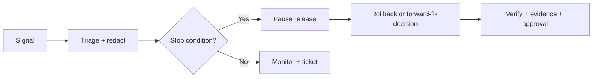

# Production observability and structured logging

No external monitoring vendor is added by local preparation. The future operator must assign an alert channel and retention policy.

| Signal | Source | Severity/threshold | Owner/action |
|---|---|---|---|
| frontend exception/chunk failure | browser/runtime logs | any sustained post-release increase | application operator; correlate build |
| failed RPC/Auth/RLS/permission | Supabase/API logs | repeated or cross-owner-related event | security/database reviewer |
| slow RPC | database/query telemetry | regression beyond rehearsed threshold | database operator; capture plan |
| migration failure/lock/timeout | migration session | any | immediate stop |
| trace/inventory integrity failure | canonical audit/RPC | any blocker or balance mismatch | business + database owner |
| Recall readiness/evidence failure | RPC/event/Storage logs | any privacy or fingerprint failure | security reviewer |
| Storage failure | Storage/API logs | private access, missing object, or rising errors | storage operator |
| background/provider failure | Edge Function/job events | sustained failures or retry exhaustion | service operator |
| uptime/health/version mismatch | HTTP and artifact evidence | unavailable or wrong RC/schema | release owner |

Retain only what is necessary for incident reconstruction. Never log tokens, passwords, service-role keys, signed URLs, raw evidence content, personal data, supplier-sensitive payloads, full cost payloads, raw SQL containing data, or unbounded UUID lists. Redact request bodies by default. Expected authorization denials should be aggregated, while suspicious patterns retain minimal actor/time/route metadata.

Application audit events remain the business-history source; do not duplicate them into verbose operational logs.

Incident flow:

