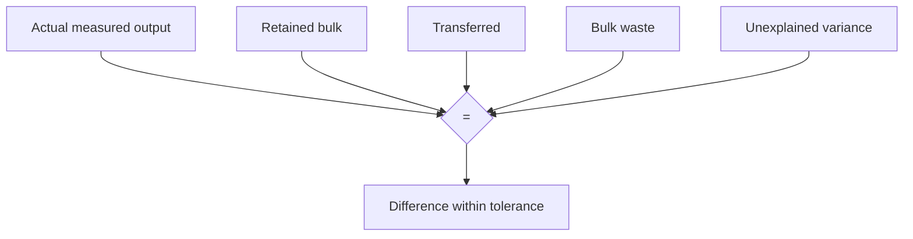
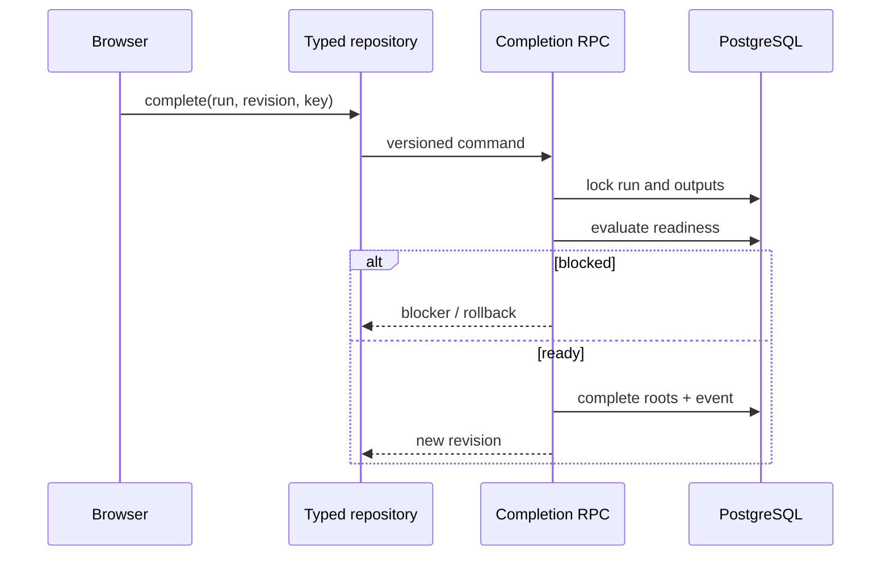
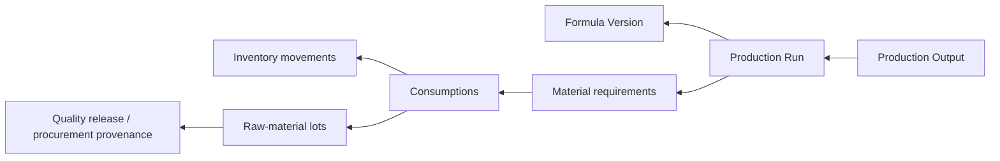

# Production Output & Yield Reconciliation

Status: Finished Goods & Batch Genealogy V1, Slice 1
Policy version: `1.0.0`

## Scope and lifecycle

Slice 1 creates the controlled handoff from completed Production material execution to independently identified bulk or intermediate output. It creates no Packaging Run, Finished Goods Lot, inventory movement, quarantine record or quality release.

Production material completion proves reservations, weighings, consumption, returns, waste and material variances are reconciled. Production Output separately proves what bulk was physically produced and how it is accounted.

## Output identity and theoretical yield

`production_outputs` owns workspace-scoped sequence and code, Production Run/Product/Formula/Formula Version links, type (`bulk` or `intermediate`), label, location and revision. One Production Run may have several outputs; later packaging is not assumed.

The theoretical quantity defaults to the Production Run’s snapshotted batch scale. Quantity, unit, normalized quantity, basis and Product/Formula display facts are copied at creation. A different quantity requires an override reason. Units normalize only within mass (`mg`, `g`, `kg`) or volume (`ml`, `l`); density is never assumed.

## Actual measurement

Measurements are append-only and record quantity/unit, normalized quantity, method, equipment, vessel, optional gross/tare, evidence, actor and time. Corrections point to the superseded measurement and write audit events. Actual quantity is never inferred from material consumption, theory or packaged units.

## Components, variance and reconciliation

Durable component identities are `retained_bulk`, `bulk_waste`, `transferred` and `unexplained_variance`. Each records reason, evidence, actor, time, idempotency and approval state.

The authoritative equation is:

`actual measured = retained + transferred + bulk waste + unexplained variance`

The server separately reports theoretical variance and yield percentage. Variance above tolerance requires reason, evidence and explicit approval. It is never forced to zero.

## Readiness and completion

`get_production_output_completion_readiness_v1` and `complete_production_output_stage_v1` share `kf_production_output_readiness_v1`. Readiness includes the policy version, counts, output summaries and structured blockers.

Completion creates no downstream record.

## Cost provenance

Output creation snapshots productive material cost from committed consumption snapshots, currency, unresolved-cost count and confidence (`complete`, `partial`, `unknown`). Unknown stays unknown. Multiple-output cost allocation remains provisional/unallocated; equal allocation and current supplier prices are not used.

## Genealogy foundation

`get_production_output_genealogy_v1` derives upstream requirements, consumptions, movements, lots and cost snapshots. It does not copy the supply chain into a mutable JSON column.

## Security, idempotency and concurrency

Lifecycle tables have RLS and owner-scoped reads; authenticated DML is revoked. RPCs derive `auth.uid()`, require the active workspace, use a fixed search path, validate revisions, lock roots and bind idempotency UUIDs to fingerprints. Identical retry returns the original result; a changed payload conflicts.

## UI workflow and tests

The Production Run exposes Output & Yield after material completion. Operators create output, record a versioned measurement and each equation operand, inspect server blockers, reconcile, and complete. Completed history is read-only and ends at “Ready for Packaging Planning.” Forms are labelled, keyboard-native and responsive at 390 px.

pgTAP covers schema, RLS, grants, fixed paths and append-only triggers. Integration covers gating, snapshots, retry/conflict, measurement, components, variance, reconciliation, completion, reconstruction, genealogy, isolation, direct-write denial and absence of Finished Goods/packaging movements. The controlled Production E2E runs on desktop and at 390 × 844.

Representative `EXPLAIN (ANALYZE, BUFFERS)` plans cover summary/readiness, components, measurement/reconciliation history, genealogy and events. Indexes follow measured workspace/root/date paths.

The rollback-only fixture in `scripts/performance/production-output-plans.sql` uses 10,000 outputs, 10,000 measurements, 40,000 components, 10,000 reconciliations and 50,000 events. On the 2026-07-28 local Docker database, all plans used indexes: the intentionally broad 10,000-row batch summary completed in 2.660 ms; one-output measurement, component and reconciliation reads completed in 0.020 ms, 0.019 ms and 0.016 ms; the first 100 audit events completed in 0.147 ms. No repeated subplans, explicit sorts or speculative indexes were observed.

## Limitations and next entry condition

- No packaging, Finished Goods, quarantine, inspection or release.
- No density conversion.
- One row per component type per output in V1.
- Multiple-output cost is provisional/unallocated.
- Output types are limited to bulk and intermediate.

Slice 2 starts when output stage is complete and retained bulk is available: [Packaging Run Planning, Bulk Allocation & Packaging Control](PACKAGING_RUN_PLANNING_AND_CONTROL.md). It embeds Minimum safe Packaging Control V1, including locked bulk allocation, durable reservations, reservation-aware availability, release and safe staged return; it does not create or release Finished Goods.
