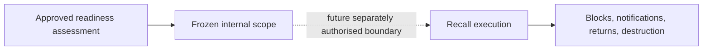
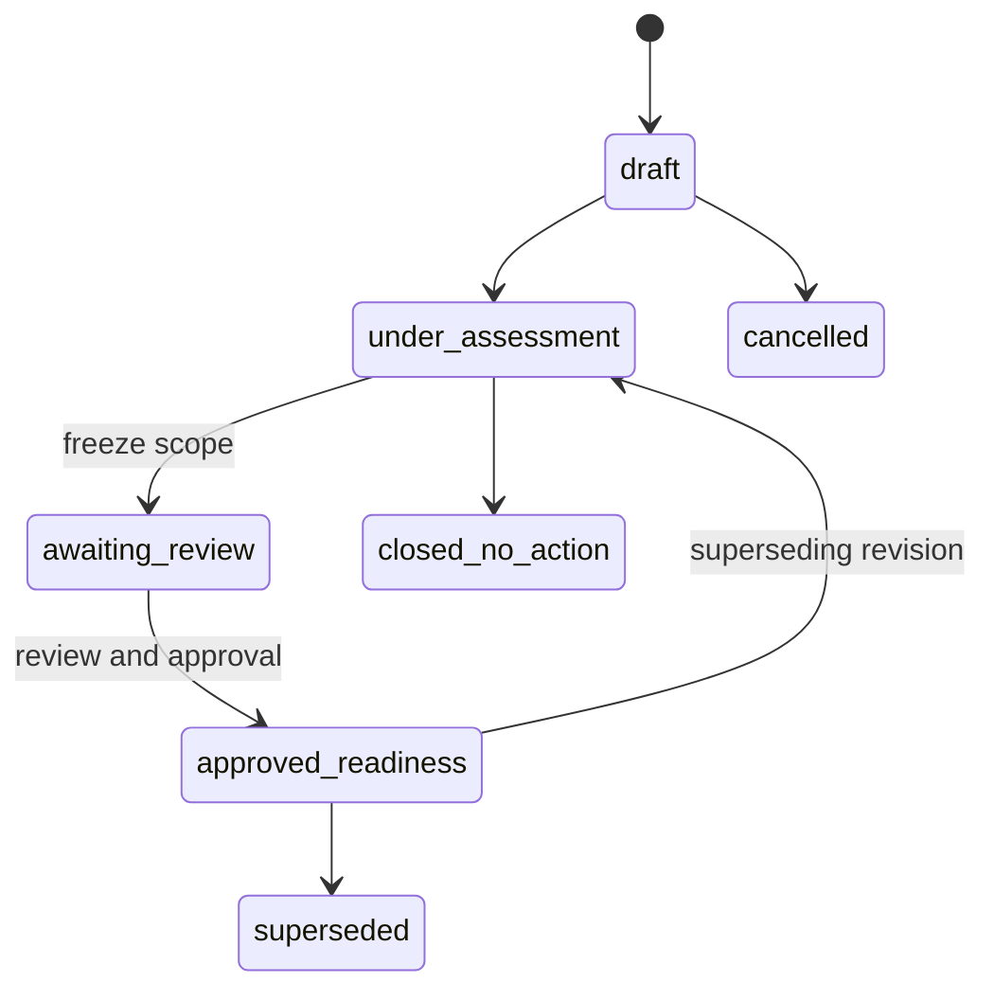
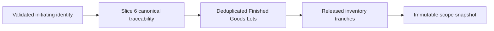
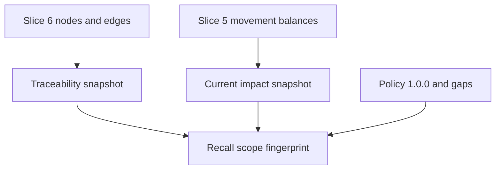
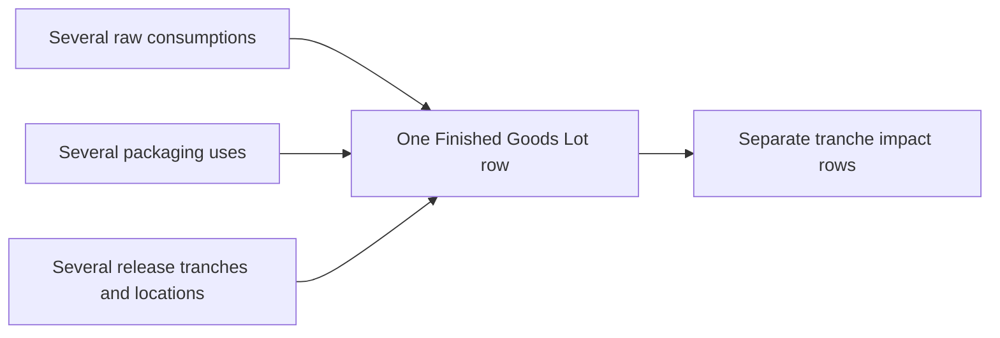
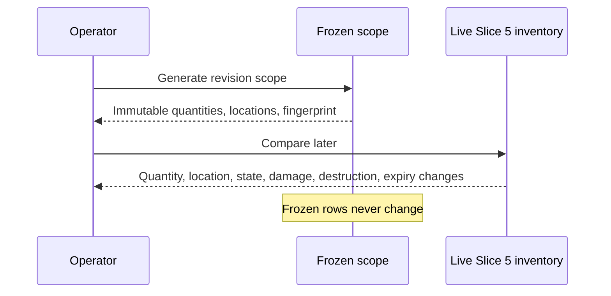
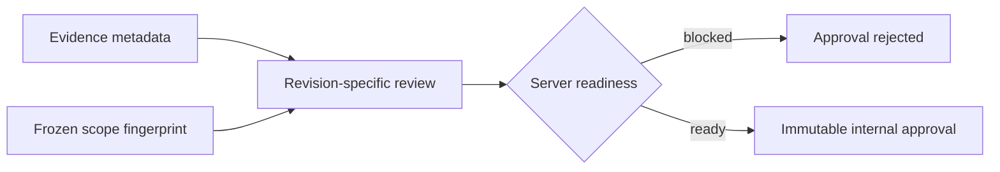
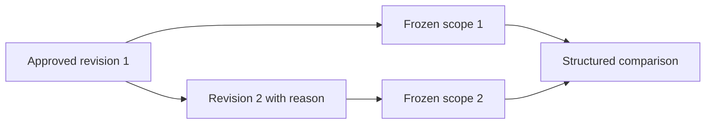
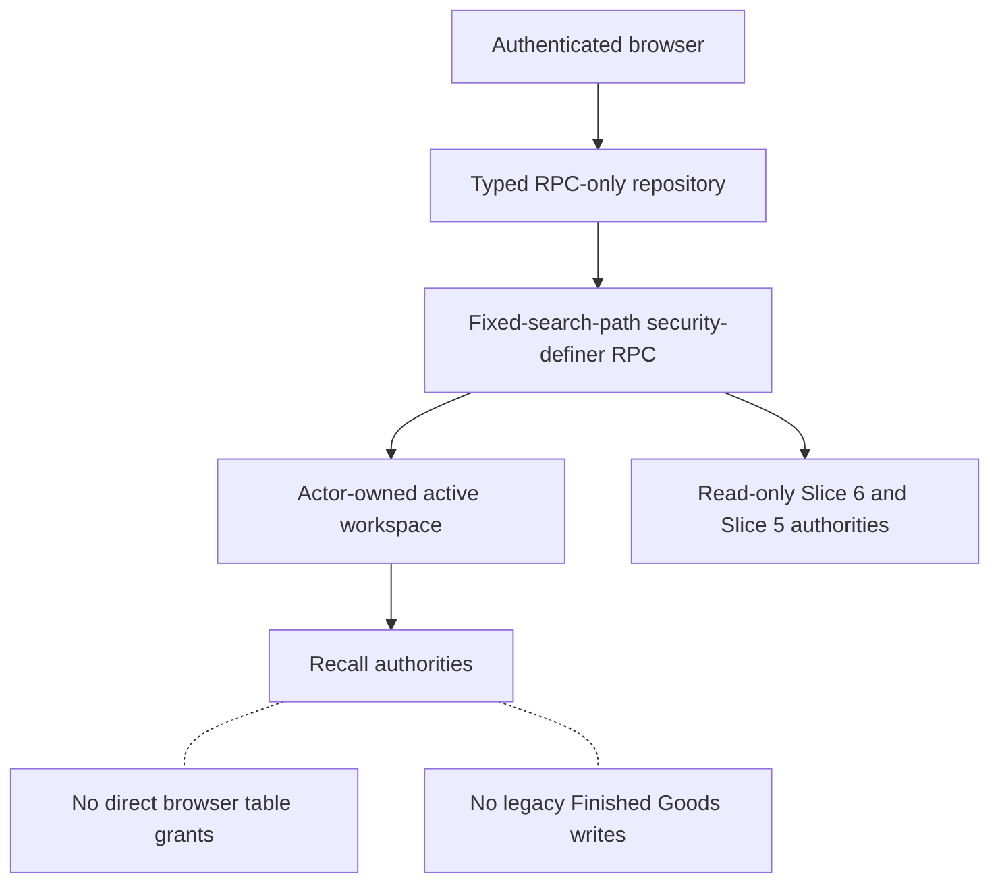
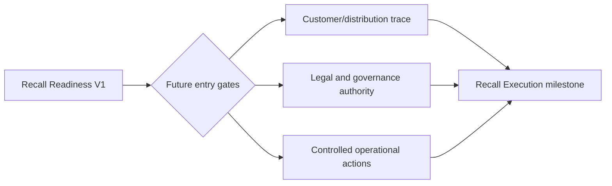

# Recall Readiness V1

## Status and scope

Recall Readiness V1 is the internal authority for assessing whether identified goods may require further investigation, hold, withdrawal assessment, recall assessment, supplier escalation, regulatory review, destruction assessment, or no action. It does not execute any of those actions.

The system provides server-authoritative cases, concurrency-safe `RR-YYYY-NNNN` codes, immutable assessment revisions, canonical traceability scope snapshots, affected Finished Goods identities, frozen current-inventory impact, evidence metadata, review, fingerprint-bound approval, supersession, closure, comparisons, and append-only events.

Excluded are customer, distributor, regulator, and supplier notification; shipment or sales tracing; inventory blocking or transfer; destruction; returns; refunds; complaint/adverse-event processing; accounting; insurance; and legal classification.

## Legal and operational boundary

Approval means only that an exact immutable assessment revision and its frozen internal scope are accepted. It creates no stock movement, inventory overlay, dispatch, shipment, message, public notice, return, destruction, accounting entry, or legal conclusion.

Customer and distribution tracing are not implemented. Every scope records `no_distribution_records_implemented`, exposes a visible warning, and requires explicit acknowledgement. The platform cannot claim that all consumer- or customer-level units have been located.

## System of record

| Concept | Authority |
| --- | --- |
| Case identity and lifecycle | `recall_readiness_cases` |
| Workspace/year case sequence | `recall_readiness_case_sequences` |
| Assessment content | immutable `recall_readiness_case_revisions` |
| Frozen scope | `recall_readiness_scope_snapshots` |
| Affected Finished Goods | `recall_readiness_affected_goods` |
| Frozen released-inventory state | `recall_readiness_inventory_impacts` |
| Structured gaps | `recall_readiness_gaps` |
| Evidence metadata | `recall_readiness_evidence` |
| Review and approval | `recall_readiness_reviews`, `recall_readiness_approvals` |
| Audit | `recall_readiness_events` |
| Genealogy | existing Slice 6 traceability RPCs |
| Live inventory | existing Slice 5 movement-derived snapshot |

All tables deny browser access. Authenticated clients use versioned RPCs only. Security-definer functions use a fixed empty `search_path`, derive the actor from `auth.uid()`, resolve the active owned workspace, and reject identities outside it.

## Case lifecycle

Case codes are generated atomically with a workspace/year sequence. Codes are immutable and never reused after cancellation.

## Initiating identity and scope

Supported canonical roots are raw-material and packaging inventory/supplier lots, Production Batch, Production Output, Packaging Run, Finished Goods Lot, released Finished Goods inventory lot, consumer batch code, finished-product quality review, traceability integrity finding, and documented source. The server resolves all lifecycle identities within the active workspace. A documented source can open an investigation, but a canonical lifecycle root remains necessary for calculated affected goods.

The scope policy is `1.0.0`. Generation is atomic and idempotent. It freezes the traceability contract, traceability fingerprint, affected identities, impact rows, gaps, confidence, quantity semantics, distribution boundary, evaluated time, and deterministic scope fingerprint.

No second genealogy or mutable balance ledger exists.

## Affected goods and quantity semantics

Affected Finished Goods are deduplicated by scope and Finished Goods Lot. Each row preserves product, packaging, label, formula, Production Batch, Production Output, Packaging Run, consumer batch code, release context, locations, state, trace path, attribution, and confidence.

Created, quarantined, released, rejected, active on-hand, available, held, blocked, damaged, lost, destroyed, expired, unavailable, and unknown quantities remain distinct. Cross-unit totals are not produced. Exact lifecycle quantities and unknown cross-level attribution are never conflated.

## Frozen versus live inventory

`compare_recall_scope_to_live_inventory_v1` is read-only. It reports changes without modifying the approved revision. Revision comparison separately reports changed assessment fields, scope fingerprint, and added or removed Finished Goods identities.

## Gaps, confidence, and readiness

Recall scope confidence is distinct from general traceability confidence. States are `complete_for_internal_inventory`, `complete_with_optional_gaps`, `partial`, `blocked`, `legacy_incomplete`, and `distribution_incomplete`.

Readiness is server-authoritative. Blockers cover missing scope/evidence, unknown unacknowledged severity/urgency/exposure, missing recommendation, unacknowledged distribution limitation, blocked traceability, unresolved affected goods, missing review, stale revision, and fingerprint mismatch. The UI lists blockers; disabled controls are not the authority.

## Evidence, review, and approval

Evidence stores immutable private metadata and a private storage or document reference, not binary data or public URLs. Content hashes are preserved when available. Supersession does not delete older evidence.

Reviews preserve actor-derived identity, role, decision, rationale, exact revision fingerprint, blockers, evidence IDs, and timestamp. Approval locks the case row, verifies expected case revision and both fingerprints, reruns readiness, requires distribution and non-execution acknowledgements, writes one approval/event, and changes only readiness lifecycle state.

## Revision supersession

Approved revisions remain immutable and readable. A superseding revision requires a reason and receives a new fingerprint and scope. Earlier approval stays bound to its earlier revision.

## Events and idempotency

Events include case creation, evidence addition, revision creation, scope generation/regeneration, review submission, revision request, readiness approval, closure, and supersession. Events carry identifiers and structured metadata but do not duplicate sensitive evidence content.

Every controlled write uses a workspace-unique idempotency key and payload fingerprint. Conflicting reuse fails. Case/revision rows are locked for concurrent lifecycle transitions; expected revisions and immutable fingerprints reject stale writes. A failed transaction leaves no partial scope, approval, or audit event.

## Security and authority boundary

Anon and `PUBLIC` execution are revoked. Owner/workspace isolation, private evidence, traceability isolation, and direct-write denial are covered by pgTAP and the authenticated two-owner harness. New objects are classified in generated authority, privilege, FK, RPC, module, browser-write, legacy, and event inventories.

## Operator workspace and accessibility

`/recall-readiness` provides case creation/listing, structured assessment, evidence metadata, scope confirmation, affected goods, exact/unknown quantities, gaps, readiness, review, approval, frozen/live comparison, revision comparison, and technical audit. Traceability results offer a prefilled entry point without creating a case.

The workspace uses text in addition to status colour, labelled form fields, keyboard-native controls, status/error focus, explicit confirmations, wrapping technical identifiers, responsive single-column comparison panels, and minimum-size checkbox targets. This is automated accessibility evidence, not a WCAG certification.

## Testing and performance

Validation includes fresh local reset, individual and aggregate pgTAP, authenticated integrations, idempotency and two-owner isolation, repository unit tests, lint, build, unit tests, desktop/mobile E2E, accessibility, authority/drift audits, database lint/advisors, secrets, Cloudflare, documentation, bundle analysis, preview smoke, migration listing, and diff checks.

Representative plans cover case list/detail, revision/event history, affected goods, impact, comparison, and readiness. Composite workspace/time, case/revision, scope/lot, impact/tranche, and event-history indexes follow actual query paths. No speculative full-table index is added.

## Known limitations and future execution

- Customer, distributor, shipment, sales-order, and consumer tracing are unavailable.
- Approval is internal readiness only.
- A documented non-lifecycle source cannot produce calculated goods until linked to a canonical trace root.
- Cross-level mass-to-unit attribution remains unknown.
- No automatic operational action exists.

Future Recall Execution requires separate authorisation, customer/distribution authorities, legal and responsible-person governance, notification/evidence controls, canonical inventory block/return/destruction operations, rollback and concurrency proofs, and its own deployment approval.

